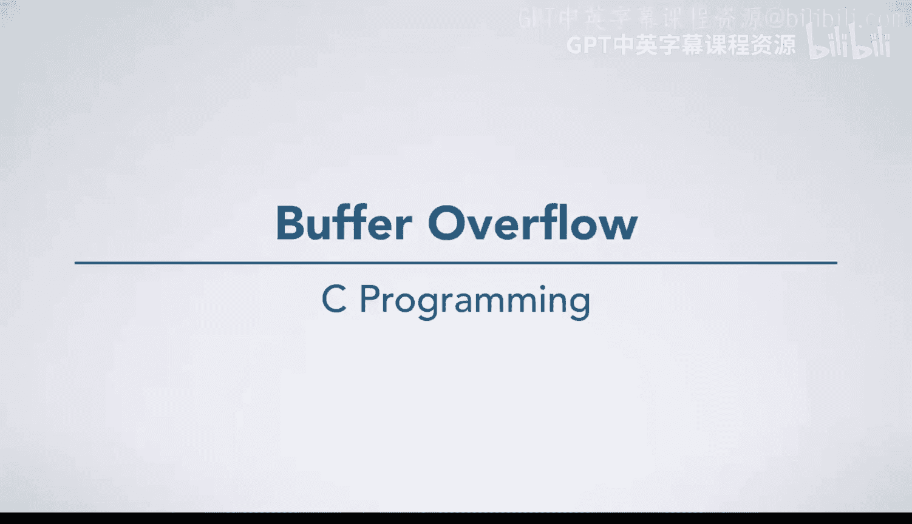

# C语言入门：14.03.01：缓冲区溢出漏洞剖析



在本节课中，我们将深入剖析一个严重且常见的安全漏洞——缓冲区溢出。我们将通过一个具体的代码示例，了解其底层机制、潜在危害以及如何避免此类问题。

上一节我们介绍了程序内存管理的基本概念，本节中我们来看看当程序违反C语言规则时，具体会发生什么。

## 栈内存布局回顾

首先，我们需要快速回顾一下栈内存的布局。下图展示了程序执行时栈帧的典型结构：


栈帧的底层布局与具体平台高度相关，但此处展示的攻击原理可以适配大多数平台。图中横线将底部 `main` 函数的栈帧与顶部其调用者（C库函数）的栈帧分隔开来。

以下是 `main` 函数栈帧中的关键数据：

*   `argv`：一个8字节的指针，指向一个字符串数组（图中未画出）。
*   `argc`：一个4字节的整数，其值为1。
*   **返回地址**：一个8字节的指针，指向C库代码中调用 `main` 函数之后的位置。`main` 函数执行完毕后，程序将跳转到这个地址继续执行，而C库代码通常会调用 `exit` 函数并传入 `main` 的返回值。

## 漏洞代码分析

现在，我们开始执行 `main` 函数。代码中声明了一个字符数组 `input`，它在栈上分配了接下来的12个字节空间。

```c
char input[12];
```

随后，程序调用了 `gets` 函数。

```c
gets(input);
```

程序员期望用户输入的字符数少于12个（例如“hello”），这样数据就能安全地写入 `input` 数组的前一部分。

## 缓冲区溢出原理

然而，`gets` 函数存在一个根本性缺陷：它无法知晓目标缓冲区 `input` 的实际大小。如果用户输入超过12个字符，`gets` 会毫无顾忌地继续向栈上的后续地址写入数据。

请注意，**返回地址**也存储在栈上。如果溢出的数据覆盖了这个返回地址，就会改变 `main` 函数返回后的程序执行流程，这显然非常危险。

## 恶意攻击场景

事实上，如果输入数据是由恶意黑客精心构造的，情况会变得尤为糟糕。攻击数据可能看起来像这样（不可打印字符用 `\x` 加十六进制值表示）：

```
\x90\x90\x90...\x90\xc3\xf4\x7f\xff\xff\x01\x00\x00\x00...
```

不必担心这些数据的细节。它们通常是由攻击者编写并编译他们希望目标程序执行的代码，然后从生成的可执行文件中提取出对应的机器码字节序列。

以下是攻击发生时的具体过程：

1.  **数据写入**：前12个字节被正常写入 `input` 数组。
2.  **溢出覆盖**：由于输入超过12字节，后续的8个字节会覆盖掉**返回地址**。请注意，覆盖进去的新值看起来像一个指向栈内存的有效指针（实际上是 `argc` 的地址）。紧接着，输入数据会继续覆盖 `argc`、`argv` 以及调用者栈帧中的数据。
3.  **输入结束**：`gets` 最终读到一个换行符（`\x0a`）和一个空终止符（`\x00`）后结束。
4.  **程序打印**：`gets` 返回后，`main` 函数打印 `input` 直到遇到空终止符，因此会打印出部分字母和不可见字符。
5.  **劫持控制流**：当 `main` 函数准备返回时，问题出现了。通常程序会正常退出，因为返回地址指向C库的退出代码。但现在，**返回地址已被我们覆盖**。程序将跳转到被覆盖的地址（即 `argc` 的位置）继续执行。
6.  **执行恶意代码**：该地址位于栈上，里面存放的正是黑客精心输入的恶意数据。因此，程序将开始执行这些数据对应的机器指令。在这个特定例子中，这些指令被设计用于启动一个命令行shell。

## 核心危害与教训

试想，如果这段存在漏洞的代码是某个网络服务的一部分，攻击者通过缓冲区溢出获得了该系统上的一个shell，他们就能执行任意命令，后果不堪设想。

这个故事的教训非常明确：

*   **永远不要使用 `gets` 函数。**
*   务必小心，**绝不允许发生缓冲区溢出**。

---

本节课中，我们一起学习了缓冲区溢出漏洞的底层机制。我们看到了粗心使用 `gets` 这类不安全函数如何导致栈上的关键数据（尤其是返回地址）被覆盖，进而可能被攻击者利用来劫持程序控制流并执行恶意代码。理解这一原理是编写安全、健壮C程序的重要基础。