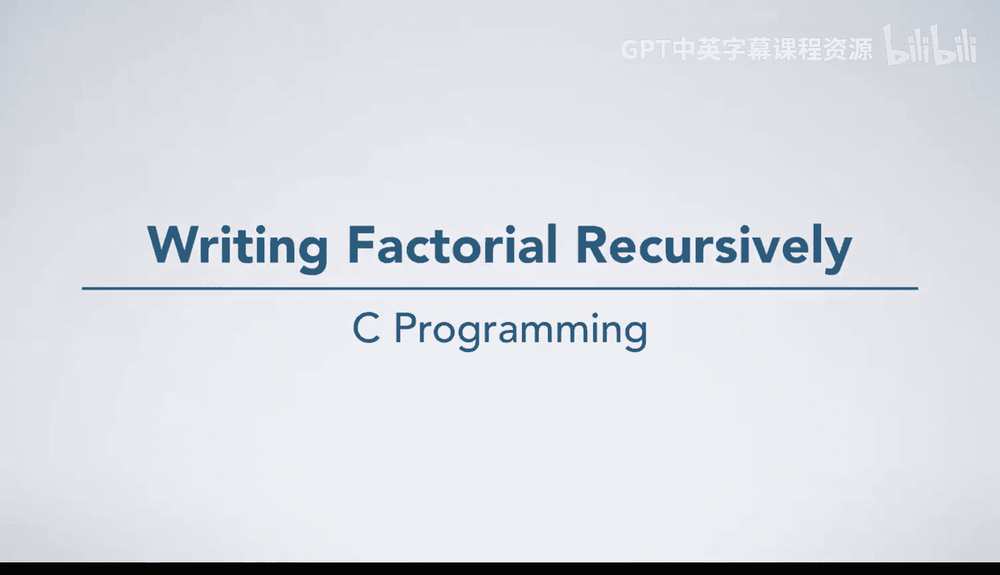
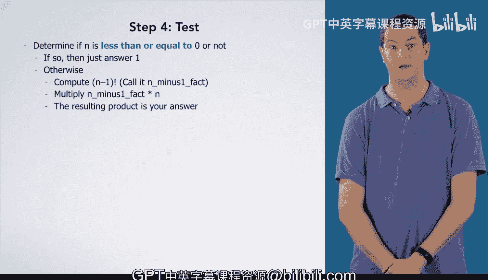

# 杜克大学《C语言入门》课程：第16章第04节第02讲：递归实现阶乘



在本节课中，我们将学习如何通过七个步骤来推导出计算阶乘的递归算法。我们将从手动计算一个实例开始，逐步抽象出通用步骤，并最终形成一个完整的算法。

---

## 第一步：手动计算一个实例

首先，我们手动计算 **4的阶乘**。

根据阶乘的定义，4的阶乘是：
`4! = 4 × 3!`

因此，我们需要先计算 `3!`。
`3! = 3 × 2!`

接着计算 `2!`。
`2! = 2 × 1!`

然后计算 `1!`。
`1! = 1 × 0!`

最后，根据定义，`0! = 1`。

现在，我们可以反向代入计算结果：
`0! = 1`
`1! = 1 × 1 = 1`
`2! = 2 × 1 = 2`
`3! = 3 × 2 = 6`
`4! = 4 × 6 = 24`

因此，`4!` 的最终结果是 **24**。

---

## 第二步：记录操作序列

现在，我们来回顾并记录第一步中的操作序列。

以下是计算每个阶乘值时的具体步骤：
*   计算 `0!`：直接得出结果 `1`。
*   计算 `1!`：先计算 `0!`，然后将结果乘以 `1`。
*   计算 `2!`：先计算 `1!`，然后将结果乘以 `2`。
*   计算 `3!`：先计算 `2!`，然后将结果乘以 `3`。
*   计算 `4!`：先计算 `3!`，然后将结果乘以 `4`。

---

## 第三步：将过程泛化

观察第二步的记录，我们可以发现一个模式。计算 `0!` 是一个直接给出答案的特殊情况，这被称为 **基准情形**。而计算其他正整数的阶乘都遵循相同的模式。

我们可以将这个过程总结为以下通用步骤：
1.  **判断基准情形**：如果 `n` 等于 `0`，那么答案就是 `1`。
2.  **递归步骤**：否则，要计算 `n!`，我们需要：
    *   先计算 `(n-1)!`。
    *   然后将 `(n-1)!` 的结果乘以 `n`。
    *   这个乘积就是 `n!` 的答案。

用伪代码可以表示为：
```
如果 n == 0:
    返回 1
否则:
    返回 n * (n-1的阶乘)
```

---

## 第四步：测试算法

在将算法转化为代码之前，必须用多种输入进行测试。

以下是几个测试用例：
*   `0!`：算法直接返回 `1`，正确。
*   `1!`：算法计算 `1 * 0! = 1 * 1 = 1`，正确。
*   `4!`：如第一步所示，结果为 `24`，正确。

然而，当我们测试负整数时，会发现一个缺陷。例如计算 `-2!`：
*   因为 `-2 != 0`，算法会尝试计算 `-3!`。
*   计算 `-3!` 时，因为 `-3 != 0`，算法会尝试计算 `-4!`。
*   这个过程将无限进行下去，永远无法到达基准情形 `n == 0`，导致无限递归。

---

## 第五步：修正算法

测试暴露了算法的一个错误：它没有正确处理非正整数输入。阶乘通常只对非负整数有定义。

因此，我们需要修正基准情形的判断条件。不应只检查 `n` 是否等于 `0`，而应检查 `n` 是否 **小于或等于 0**。通常，我们将 `0!` 和 `1!` 都作为基准情形处理，两者都等于 `1`。

修正后的算法步骤为：
1.  如果 `n <= 1`，返回 `1`。
2.  否则，返回 `n * (n-1的阶乘)`。

---

## 总结



本节课中，我们一起学习了设计递归算法的七个步骤中的前五步，并以阶乘函数为例进行了实践。我们从一个具体实例出发，记录了操作序列，将其泛化为通用算法，并通过测试发现了算法在处理负数输入时的缺陷，随后对其进行了修正。最终，我们得到了一个健壮的、用于计算非负整数阶乘的递归算法描述。在下一节课中，我们将把这个算法翻译成C语言代码。