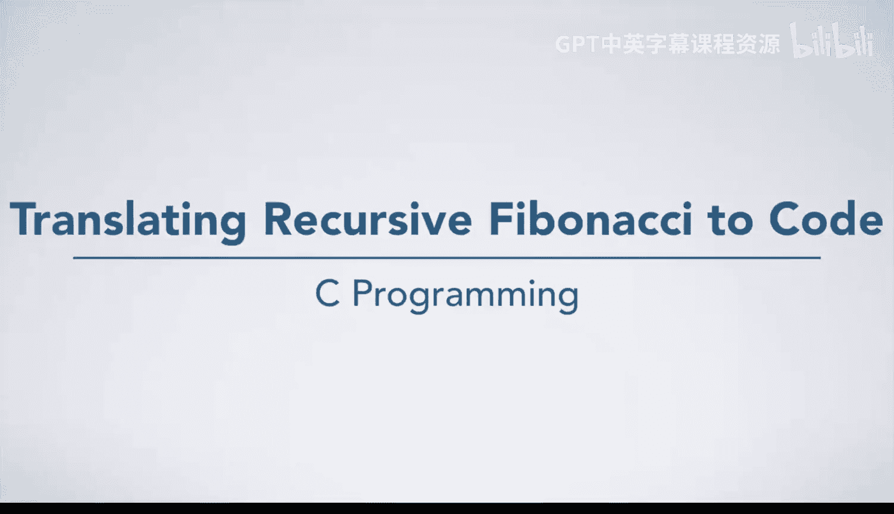
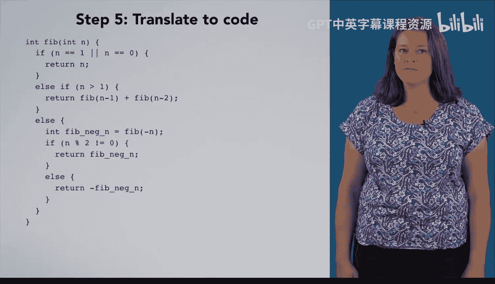

# 杜克大学《C语言入门（编程基础、C代码、指针⧸数组⧸递归、内存）｜Introductory C Programming》 p71 19_04_05_递归斐波那契代码转换.zh_en -BV1Kp42117vh_p71-

Previously， we devised this algorithm to compute the nth Fibonacci number。 Now。

 let's turn that algorithm into code。I've written those steps as comments and put the function declaration around them。

First， we determine if n is1。Which is now our familiar， if else statement。Inside the then clause。

 we give an answer， which is， again familiar。 We will return that answer。Inside the else clause。

 we again compare N to a value and return an answer， which will be similar to what we just did。

 an if statement with a return statement inside of it。

We're just going to move this up to make a little more space and see now that we need to make another decision。

So we're going to have another if statement。Inside of the then clause of this if statement is where things get interesting。

We want to name a quantity， so we want to declare a variable。

But what value are we going to assign to it。Computing fib of n-1 seems like a complicated step。

We've seen complicated steps before where we have abstracted the complexity out into a function。

What would this function look like， Well， it would take an int。

 compute the Fibonacci of that int and return it。That sounds exactly like the function we're writing right now。

 So instead of making a new function， let's just call the Fi function we're currently writing。😊。

This next step in the algorithm is quite similar。 We are going to call the fib function to do all the complicated work of computing fib of n -2。

Our next step calls for us to sum two variables and return them as our answer。

So we can write a return statement for that。 Now we'll just move the code up a little bit more and begin working on this else clause。

We have another if statement， which we are just going to write with the else for brevity。

We are again declaring a variable and want to initialize it with the result of a complicated step where we compute fib of negative n。

So as before， we'll just trust the fib function we are writing to do that work for us。

 We're almost done。One more， if El statement。Here we are going to use mod to see if a number is even or odd。

 Remember that n mod 2 will give us the remainder when we divide n by 2。

 So 0 will mean that n is even， and one will mean that n is odd In the Ven clause。

 We give our answer。 We were a bit imprecise saying that is our answer here。 oops， what did we mean。

 We meant fib Neg N is our answer。😊，Likewise， in the Els clause。

 we want fib Neg n times negative 1 to be our answer。

We've removed all the comments that we had so that we just have code。

Now we might want to clean it up a little bit and make it look a little bit nicer。

The variables are a little bit cluttered。 We were verbose in our steps and separated out each computation。

 giving it a name， but we might just return fib n -1 plus Fb n-2。Likewise。

 instead of writing negative1 times fib negativeg n， we might just write negative fib negativeg n。

These cases are exhaustive。 We have checked if n is 1，0 and greater than one。

 So the only other possibility by the time we get here is less than 0。

 We can and should get rid of this extra。 if。 In fact， if we don't。

 the compiler may complain that we could reach the end of the function without returning a value。

 Most compilers are not smart enough to reason about algebraic properties of numbers and figure out of a set of conditions cover every possible case。

 They do， however， understand that code will always execute either the then clause or the else clause of an if else。

We can also simplify these first few steps by realizing that if n is0 or n is1。

 we're just returning n and write one if statement with an or in its conditional expression。

We could add a comment here to help the reader understand what we were thinking。And then we're done。

 Most of that cleanup was optional， since these two pieces of code are algorithmically equivalent。

 However， this code looks much nicer than the code we started with。

