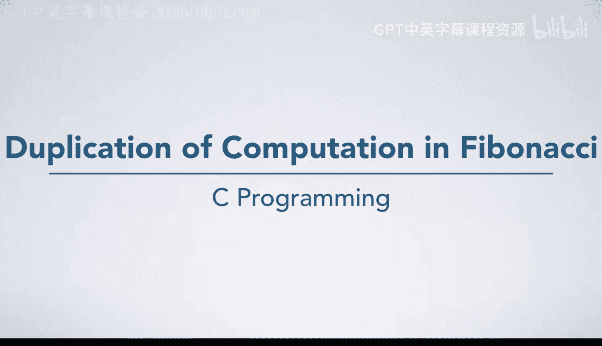
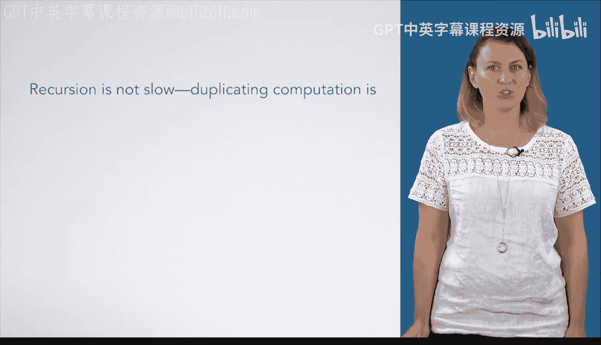

# C语言入门：72：斐波那契数列中的计算重复问题 🐌



在本节课中，我们将通过追踪一个递归函数的调用过程，来学习递归算法中一个常见的问题：重复计算。我们将以计算斐波那契数列为例，分析其递归实现为何效率低下，并探讨可能的解决方案。

## 递归调用过程追踪

上一节我们介绍了递归的基本概念，本节中我们来看看一个具体的递归函数是如何执行的。

斐波那契数列的递归定义如下：对于任意值 `n`，`Fibonacci(n)` 等于 `Fibonacci(n-1)` 与 `Fibonacci(n-2)` 之和。其基础情况是 `Fibonacci(0) = 0` 和 `Fibonacci(1) = 1`。

当我们计算 `Fibonacci(5)` 时，程序会首先尝试计算 `Fibonacci(4)` 和 `Fibonacci(3)`。而为了计算 `Fibonacci(4)`，又需要计算 `Fibonacci(3)` 和 `Fibonacci(2)`。这个过程会一直递归下去，直到遇到基础情况（即 `n` 为 0 或 1 的“叶子节点”）。

以下是这个递归过程的简化表示：
```c
Fibonacci(5) = Fibonacci(4) + Fibonacci(3)
             = (Fibonacci(3) + Fibonacci(2)) + (Fibonacci(2) + Fibonacci(1))
             = ... // 继续展开
```

## 重复计算的分析

通过追踪调用过程，我们可以清晰地看到同一个值被反复计算了多次。

以下是计算 `Fibonacci(5)` 时各子问题的调用次数统计：
*   `Fibonacci(0)` 被计算了 **3** 次。
*   `Fibonacci(1)` 被计算了 **5** 次。
*   `Fibonacci(2)` 被计算了 **3** 次。
*   `Fibonacci(3)` 被计算了 **2** 次。

这个递归定义在数学上是完全正确的，但从计算效率的角度看，它并不高效。问题的根源不在于递归本身速度慢，而在于这种算法会**重复计算大量相同的子问题**，导致了不必要的性能开销。

## 性能影响与解决方案



这种重复计算是否可以被接受，取决于具体的编程场景和性能要求。但作为一名程序员，必须意识到此类问题对程序性能的潜在影响。

如果这种低效的性能是不可接受的，我们可以从以下两个主要方向来优化算法：

以下是两种常见的优化策略：
1.  **重新设计算法**：避免使用这种“自顶向下”的纯递归方法。例如，可以采用“自底向上”的迭代方法，从 `Fibonacci(0)` 和 `Fibonacci(1)` 开始，逐步计算到目标值，确保每个值只计算一次。
2.  **使用记忆化**：这是一种优化递归的经典技术。其核心思想是维护一个已计算值的查找表（例如一个数组）。在每次进行递归计算前，先检查表中是否已有结果；如果有，则直接返回，避免重复计算。

> 记忆化技术在不改变递归算法清晰逻辑的前提下，通过空间换时间，显著提升了效率。

## 总结

本节课中我们一起学习了递归算法中一个关键的性能陷阱——重复计算。我们以斐波那契数列为例，追踪了递归调用的展开过程，并统计了子问题的重复计算次数。我们认识到，低效的根源在于算法设计，而非递归机制本身。最后，我们探讨了通过迭代法或记忆化技术来避免重复计算、提升程序性能的两种思路。理解这一点对于编写高效的递归程序至关重要。