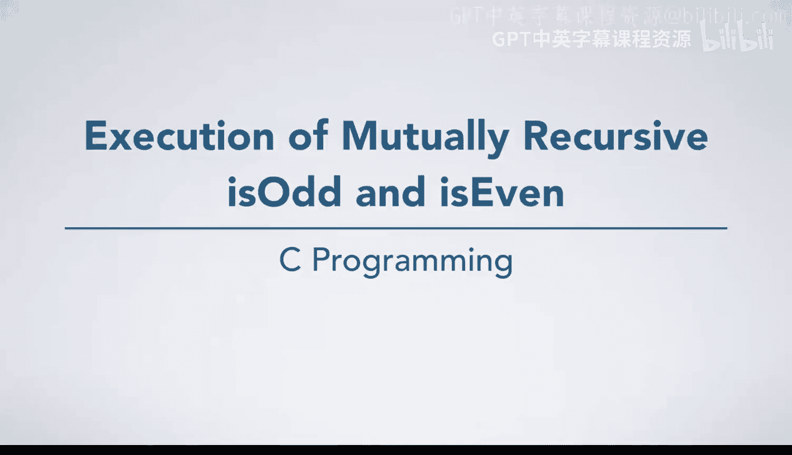
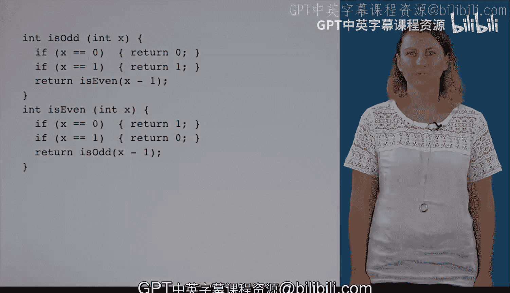

# C语言入门：4：互递归函数isodd与iseven的执行过程分析 🧠

在本节课中，我们将要学习两个互递归函数 `isodd` 和 `iseven` 的执行过程。这两个函数不仅是互递归的，同时也是尾递归的，这意味着编译器可以进行尾递归优化，从而避免为每次函数调用创建新的栈帧。我们将通过一个具体的例子，逐步分析其执行流程。



## 函数定义与初始调用

首先，我们假设调用了函数 `isodd`，并传入参数 `4`。此时，变量 `x` 的值为 `4`。

```c
// 函数定义示例
int isodd(int x);
int iseven(int x);
```

## 执行过程逐步分析

以下是 `isodd(4)` 调用后的详细执行步骤。

### 第一步：进入 `isodd` 函数

在 `isodd` 函数内部，程序会检查两个基本情况。由于 `x` 的值是 `4`，既不等于 `0` 也不等于 `1`，因此我们会跳过这两个 `if` 语句。

### 第二步：执行尾递归调用

接下来，程序到达 `return` 语句，并准备调用 `iseven` 函数。由于这是一个尾递归调用，编译器不会为 `iseven` 创建新的栈帧，而是直接复用当前 `isodd` 的栈帧，并将 `x` 的值更新为 `3`。

### 第三步：进入 `iseven` 函数

现在，我们进入了 `iseven` 函数的逻辑。同样地，程序会检查其基本情况。此时 `x` 的值为 `3`，不满足 `x == 0` 的条件，因此我们继续执行。

### 第四步：再次进行尾递归调用

在 `iseven` 函数中，程序再次到达一个 `return` 语句，需要调用 `isodd` 函数。同理，由于是尾递归，我们复用当前的栈帧（原本属于 `iseven`），并将 `x` 的值更新为 `2`。

### 第五步：第二次进入 `isodd` 函数

我们再次进入 `isodd` 函数。`x` 的当前值是 `2`，仍然不满足两个基本情况，因此程序继续执行。

### 第六步：第三次尾递归调用

在这次的 `isodd` 函数中，程序需要再次调用 `iseven` 函数。我们继续复用栈帧，并将 `x` 的值更新为 `1`。

### 第七步：触发基本情况

这次进入 `iseven` 函数时，`x` 的值是 `1`。程序检查基本情况，发现 `x == 1` 不成立，但 `x == 0` 也不成立。然而，根据函数逻辑（图中未完全展示的 `else` 部分），当 `x` 为 `1` 时，函数会返回一个值。在这个例子中，我们假设它返回了 `0`。

### 第八步：返回值传递

这个返回值 `0` 将返回到最初调用 `isodd(4)` 的地方。执行流程箭头返回到最初的调用点，整个过程结束。

## 核心概念总结

本节课中我们一起学习了互递归函数 `isodd` 和 `iseven` 在尾递归优化下的执行过程。关键点在于：

1.  **互递归**：两个或多个函数相互调用。
2.  **尾递归**：递归调用是函数体中的最后一个操作。
3.  **尾递归消除（优化）**：编译器可以重用当前栈帧进行尾递归调用，避免栈空间过度消耗。其效果类似于一个 `while` 循环：
    ```c
    while (!base_case_reached) {
        update_parameters;
        // 本质上在交替执行 isodd 和 iseven 的逻辑
    }
    ```



通过这个逐步分析，我们清晰地看到了参数 `x` 如何从 `4` 递减到 `1`，以及栈帧如何被复用，最终函数如何返回结果。理解这个过程对于掌握递归和编译器优化行为非常有帮助。