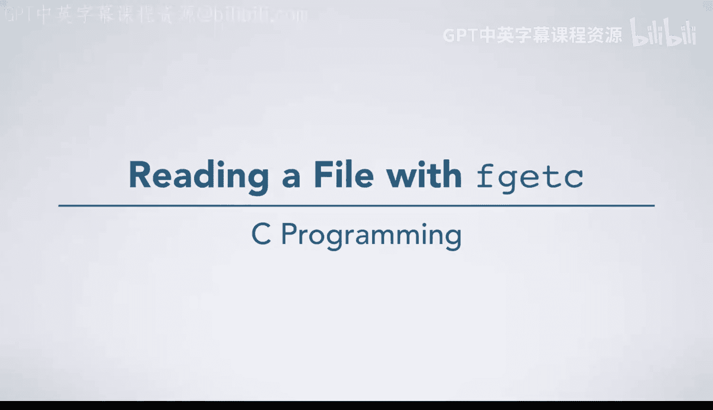
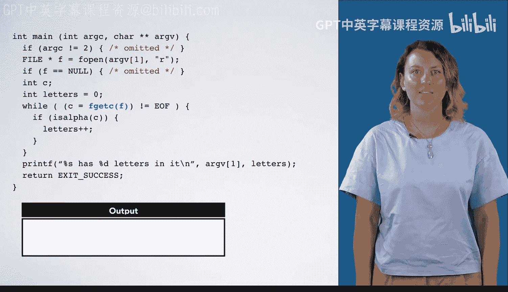

# 杜克大学《C语言入门（编程基础、C代码、指针⧸数组⧸递归、内存）｜Introductory C Programming》 p77 02_01_03_使用fgetc读取文件.zh_en -BV1Kp42117vh_p77-

In this video， we have an example of reading from a file with F Get C。

 which reads characters one by one from a file。 This example is going to count the number of letters in the file and printed out。

As always， our execution arrow begins at the start of main。 Now that we have command line arguments。

 mainframe begins with Arg C and Arg V in it with whatever command line arguments were passed in。

 In this example， we're going to assume that the name of the program is count letters。

 which is Arg V at 0， and that input do T X T was passed in， which is Arg v at1。

 Arg C is 2 and Arg V at 2 is null。We start with some error checking。

 We see if Arg C is not equal to 2。 We've omitted the error code in the interest of brevity here。

 Arg C is2， so nothing special happens there。 Now we're going to f open a file。

 The name of the file is going to be Arg V at1， whatever our command line argument is， In this case。

 input do TXT。We'll make a box for F， and we'll call F open。 We don't have the code for F open。

 So we'll just have to know what it does。 It's going to open a file and return a pointer to that。

 We'll assume it succeeds here。The name of the file is input dot T X T， and it's in read mode。

 and the end of file is false。 We have just a little bit of contrived text in this file。

 and the current position of the file is at the start。 F is not equal to null。

 We've again omitted that error code。 But if we were writing a real program， we'd have it there。Next。

 we declare a variable C。 We declare the variable letters and initialize it to 0。 Now。

 we're ready to make our first call to F get C。 As you saw in a reading。

 we have this programming idiom of C equals F get C of F does not equal E O F。

 We're going to have to evaluate F get C first， because we have an assignment here。

 We need to figure out what this evaluates to to put it into the box named by C。

 F get C is going to advance the position of the file by one character and return the character that it advanced over。

 It just read a。 And the next time we call it， it will read B。 We then do this assignment。

 even though it happens in the context of an expression we're evaluating。

 It still behaves the same way。😊，We take a， and we put it in the box named by C。

Then we're going to compare that result， which evaluates to the value that was assigned。

 The character A to E O， F。 A is not equal to E O F。 So this evaluates to true。

 And we go inside the while loop。 Now， we're going to do if is alpha of C。

 I alpha is a function in C type dot H that determines whether a character is alphabetic。

 A is alphabetic。 So we go inside of this if statement。 We increment letters。

 finish the if and return to the start of the while loop。F Gtsse reads the next character。

 which is B， and we assign that to C。B is not U F is true。 This character is alphabetic。

 so we increment letters， finish the if and return to the start of the while loop。

F Gettsy reads the character 4， which is not alphabetic。

 so we skip over the body of the if and go back to the top of the loop。Now。

 the file position is right before a new line character， so we read the new line character。

 which is still not EOF。New line is not an alphabetic character。

 so we skip the if and go back around the loop。We read a C， which is a letter。

 so we do the if statement， incrementing letters to be3， we're right before a new line。Which we read。

 then go through the loop。Now we actually are at the end of the file。F Gitsy returns EOF。

 which is what we're going to assign to C and the status of the file that indicates InDe file is going to be set true。

 If we were to call F EOF， which is a function that checks that， it would return true now。

Since the loop guard evaluates to false， we're not going to go into the wild loop。

Now we have a print statement， percent S has percent D letters in it， percent S converts Rrgv at1。

 which is input do Txt， and percent D converts letters， which is3。

 So we print out input do TXT has three letters in it。Finally。

 we'll return exit success exiting our program。We've cleared out the stack frame for main。

 You'll notice that these arguments are still around。 That's fine。

 They're actually created somewhere in the C library。 They belong to a different frame。

This file is still around because we haven't closed it， which we'll learn how to do soon。

