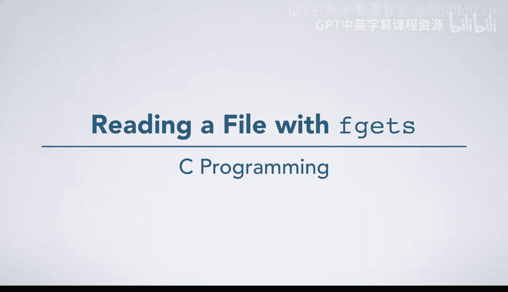
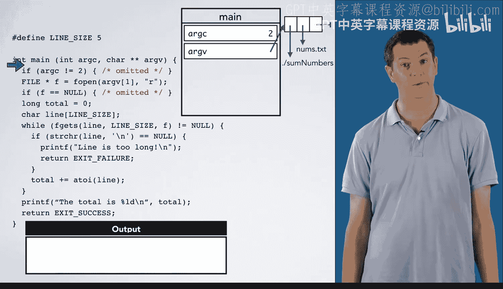

# C语言入门：03_01_05：使用fgets读取文件 📖



在本节中，我们将学习如何使用 `fgets` 函数从文件中读取数据。我们将通过一个具体的例子，演示如何读取文件中的每一行文本，将其转换为整数，并计算这些整数的总和。同时，我们也会探讨当读取的行过长，超出我们预设的缓冲区大小时，程序应如何处理。

---

## 概述

`fgets` 函数用于从文件中读取指定长度的行。在本例中，我们将读取文件中的每一行文本，使用 `atoi` 函数将其转换为整数，然后将这些整数累加求和，并最终打印出总和。为了演示当 `fgets` 无法读取整行时的行为，我们故意将用于存储字符的数组大小设置得相对较小。

---

## 代码结构与初始化

首先，我们定义了一个常量 `LINE_SIZE`，其值为5。这意味着我们将创建一个大小为5的字符数组 `line` 来存储从文件中读取的每一行。同时，我们告诉 `fgets` 最多只能读取5个字符（包括末尾的空字符 `\0`）。

```c
#define LINE_SIZE 5
char line[LINE_SIZE];
```

与之前一样，为了简化示例，我们省略了一些错误检查。在实际应用中，如果遇到错误（如文件打开失败），程序会打印错误信息并退出。

程序从 `main` 函数开始执行。我们假设命令行参数 `argc` 的值为2，`argv[1]` 是输入文件名 `numbers.txt`，该文件包含我们要读取的数字。

```c
int main(int argc, char *argv[]) {
    if (argc != 2) {
        // 错误处理代码
    }
    // ...
}
```

由于 `argc` 等于2，程序不会执行错误处理代码，而是继续执行。

---

## 打开文件与变量初始化



接下来，我们以读取模式打开文件 `numbers.txt`。文件指针 `f` 指向文件的开头。

```c
FILE *f = fopen(argv[1], "r");
if (f == NULL) {
    // 错误处理代码
}
```

我们初始化一个名为 `total` 的整型变量，用于存储累加和，其初始值为0。同时，我们创建了字符数组 `line`，它包含5个“盒子”，每个盒子可以存储一个字符。

```c
int total = 0;
char line[LINE_SIZE];
```

---

## 第一次调用 fgets

现在，我们准备第一次调用 `fgets` 函数。它将从文件 `f` 中读取数据，并填充到 `line` 数组中。我们告诉 `fgets` 最多可以读取5个字符（实际上是4个字符加一个空终止符 `\0`）。

```c
fgets(line, LINE_SIZE, f);
```

此时，文件中的光标位于起始位置。`fgets` 读取了第一行文本 “123\n”，并将其存储到 `line` 数组中。数组的内容变为：`[‘1‘, ‘2‘, ‘3‘, ‘\n‘, ‘\0‘]`。读取后，文件中的光标移动到下一行的开头。

---

## 检查是否读取了整行

为了检查 `fgets` 是否成功读取了整行（即是否读取到了换行符 `\n`），我们使用 `strchr` 函数。

`strchr` 函数接受一个字符串和一个字符作为参数。如果在该字符串中找到了该字符，则返回指向该字符第一次出现位置的指针；如果未找到，则返回 `NULL`。

```c
if (strchr(line, ‘\n‘) == NULL) {
    // 错误处理：行过长
}
```

在本例中，`strchr` 返回了一个指向 `line` 数组中第四个元素（即 `\n`）的指针，该指针不为 `NULL`。这表明 `fgets` 成功读取了整行。

---

## 转换文本并累加

既然成功读取了整行，我们使用 `atoi` 函数将字符串 “123” 转换为整数123，并将其加到 `total` 上。

```c
total += atoi(line); // total 从 0 变为 123
```

然后，程序返回到 `while` 循环的顶部，准备读取下一行。

---

## 第二次调用 fgets

程序第二次调用 `fgets`。这次它读取下一行文本 “14\n”，并将其存储到 `line` 数组中。数组内容更新为：`[‘1‘, ‘4‘, ‘\n‘, ‘\0‘, ‘\0‘]`。注意，最后一个元素保持不变，因为 `fgets` 已经读取了整行。

再次使用 `strchr` 检查换行符，结果不为 `NULL`。然后，我们将整数14加到 `total` 上，`total` 的值从123更新为137。

---

## 处理过长的行

现在，程序进入循环的第三次迭代。下一行文本是 “-56789”，这个数字太长，无法完全存入大小为5的 `line` 数组。

`fgets` 会尽可能多地读取字符，然后停止。在本例中，它读取了 “-567”，然后停止，因为我们已经告诉它数组最多只能容纳5个字符（包括末尾的 `\0`）。此时，文件中的光标停在字符 ‘7‘ 和 ‘8‘ 之间。

如果我们再次调用 `fgets`（或任何其他文件读取函数），将会继续读取 ‘8‘ 和 ‘9‘。但我们的代码没有设置处理这种情况的逻辑，因此我们依靠错误检查来处理未读取整行的情况。

---

## 错误处理

以下是检查行是否过长的代码逻辑：

```c
if (strchr(line, ‘\n‘) == NULL) {
    printf(“Line too long\n“);
    exit(EXIT_FAILURE);
}
```

对于 “-56789” 这一行，`strchr` 函数在 `line` 数组中没有找到换行符 `\n`，因此返回 `NULL`。程序随后执行错误处理代码，打印 “Line too long” 并退出。

请注意，在这个简单的示例中，我们还没有关闭文件。我们将在后续课程中学习如何正确地关闭文件。

---

## 总结

在本节课中，我们一起学习了如何使用 `fgets` 函数从文件中逐行读取数据。我们了解了如何将读取的文本行转换为整数并进行累加求和。更重要的是，我们探讨了当读取的行长度超过预设缓冲区大小时，如何通过检查换行符来发现并处理这种错误情况。通过这个例子，你应该对 `fgets` 的工作方式及其局限性有了更清晰的认识。