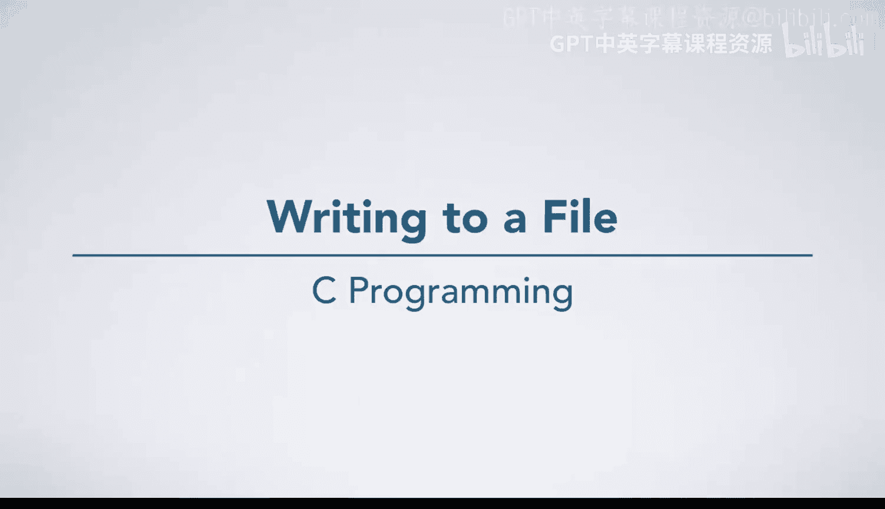
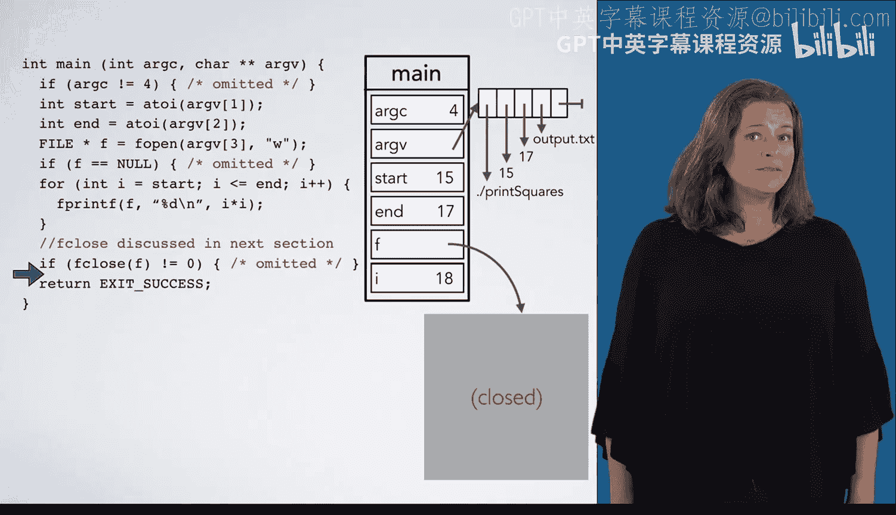

# 杜克大学《C语言入门（编程基础、C代码、指针⧸数组⧸递归、内存）｜Introductory C Programming》 p79 04_01_02_写入文件.zh_en -BV1Kp42117vh_p79-

Now， let's take a look at some code that writes to a file。

 We are starting at the beginning of main with Arg C and Arg V shown in main's frame here。

 the program has been run as dot slash print squares with arguments 15，17 and output dot T X T。First。

 we check for the error condition where the wrong number of arguments have been passed。 Arg C is4。

 so there's no need to execute the error handling code。Next。

 we convert AGV1 from a string to an integer using A to I and store the results in the variable start。

And similarly， for A V2 and end。Now we are ready to use F open to open a file。

 notice that we pass in RV3 for the file name， so the file we will create will be called output do TXT。

We pass in W for the mode， so we will create the file if it does not exist or truncate it to zero length if it does exist。

 then start writing to it from the beginning。We draw the state of F by noting the relevant details of the file。

 as well as its contents and where the next right operation will occur。 Next。

 we check if F open failed， which it did not。Now we have a four loop， So we go into it creating I。

 which is 15。 The next line says to F print F， the value of I squared into F。

 This will work just like print F， except that instead of printing it to the screen。

 it will write it into the file。We have also made the file position marker move to the next line since we printed back slash n2。

 we then go to the next iteration of the loop and write 256 new line into F。

We then do one more iteration and write 2，89 new line into F。 And then we are done with the for loop。

 So now we are going to F close F and check if that succeeded or failed here， F close succeeded。

So the operating system accepted all of our data for writing。

 even if it has not yet physically written it to disk yet。

Finally， our program exits successfully。