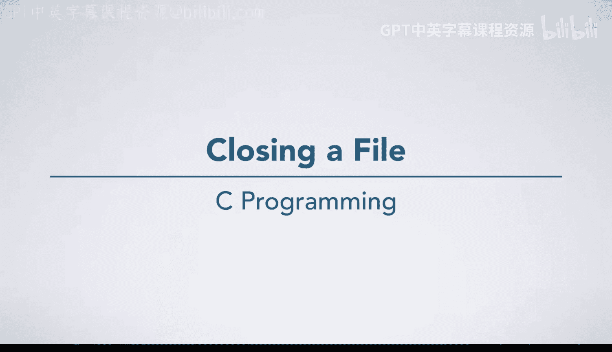
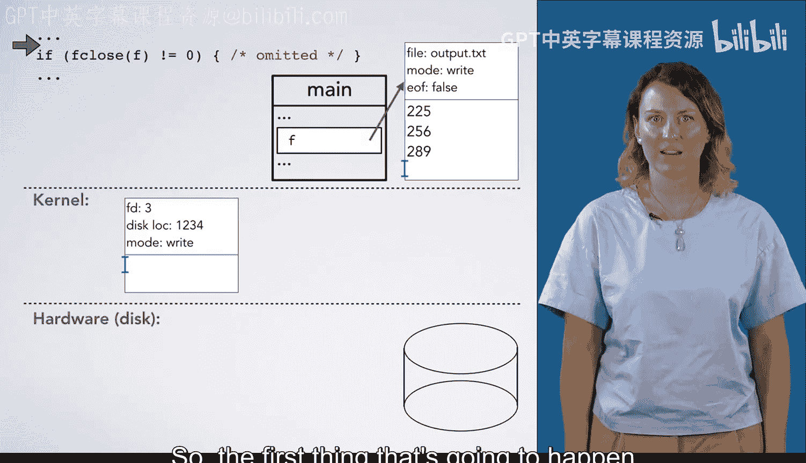

# 杜克大学《C语言入门（编程基础、C代码、指针⧸数组⧸递归、内存）｜Introductory C Programming》 p80 05_01_04_关闭文件.zh_en -BV1Kp42117vh_p80-

In this video， we'll look at what happens when F closed is called。

 A lot of this is conceptualized because we're not actually going to delve into the details of what the kernel does or how it interacts with the hardware。

 The important thing to understand here is that our program may have buffered up these rights。

 It may be holding them in the file structure the C library manages and may not have actually written them down to the operating system yet。

Therefore， they're not actually on the disk。However， when we close the file。

 these rights have to actually be propagated down， so the first thing that's going to happen if the C library has unwritten data is it's going to make a system call to write that into the operating system。

Here we see the right system call， which takes a file descriptor。

 the low level communication mechanism to specify which file between a program and the kernel In this case。

 we're going to assume it's three。We wouldn't really know unless we looked in more detail to figure it out。

 and we don't really care at this point。The right system call also takes a pointer to the data to write。

 as well as how many bytes to write。 In this case， it's 12 because there are three lines。

 each with four bytes。Each of these have three numerical digits， plus the new night line character。

 So this data is going to be written into the operating systems memory。

 You'll notice I've written it over here as the actual numerical values of the bytes。

 rather than the textual representation of the digits。

 just as a reminder that everything is a number。 And because this is really just dealing with raw data。

 We're not really thinking of it as text anymore。 It's just a bunch of bytes going to a disk。Next。

 the C library is going to make the closed system call passing in the file descriptor because that's how it communicates with the operating system。

Then the operating system is going to decide that it should write its buffer data to the disk。

 so it's going to write all of these bytes onto the disk somewhere。

Then the disk is going to tell the operating system that it actually succeeded。

 It's possible that this fails。 Maybe some piece of the disk has gone bad。

 in which case it wouldn't be able to write the data， but let's assume that it succeeds。

 So the kernel is going to recognize that this file is closed and also tell the program that it succeeded in closing the file by returning 0。

 which is going to be the return value of F closed。At this point。

 the file is closed so we can't do anything else with it。

 and our call to F close will finish and well continue executing code。

