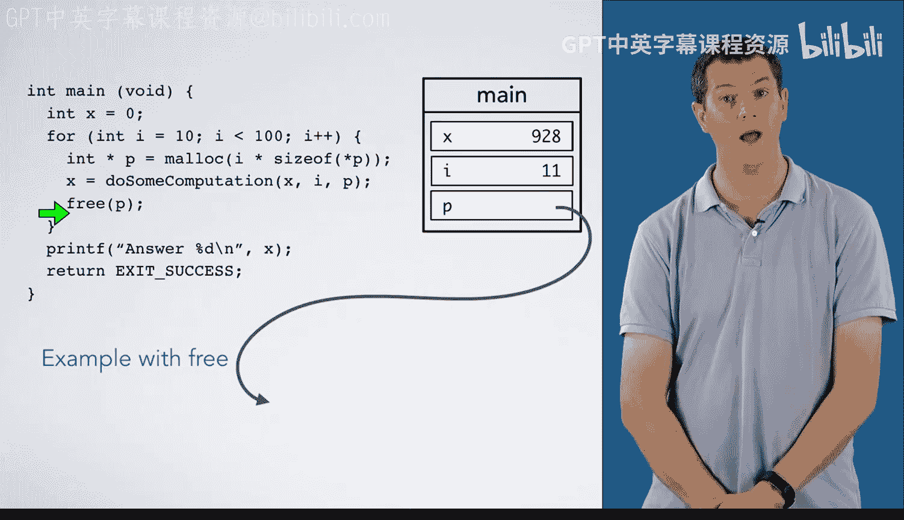

# C语言入门：08_02_04：存在内存泄漏的代码 💾

在本节课程中，我们将学习一个关于内存管理的具体案例：在循环中动态分配内存时，如何避免内存泄漏。我们将通过对比两段代码来理解内存泄漏的产生原因以及正确的释放方法。

---

上一节我们介绍了动态内存分配的基本概念，本节中我们来看看一个在循环中分配内存的常见场景。

我们首先分析第一段代码，这段代码在循环中分配内存但没有释放，会导致内存泄漏。

以下是代码的执行流程：

1.  程序从 `main` 函数开始，初始化变量 `x`，然后进入一个 `for` 循环，循环变量 `i` 的初始值为 10。
2.  在循环体内，第一行代码使用 `malloc` 在堆上为 10 个整数分配内存，指针 `p` 指向这块堆内存。
3.  假设我们调用一个函数 `do_some_computation` 来初始化这个数组并进行某些计算，这可能会改变变量 `x` 的值。
4.  需要记住的是，在这次循环迭代结束时，局部变量 `p` 将不复存在。这意味着当我们回到 `for` 循环的开头时，`p` 消失了。
5.  这也意味着我们丢失了指向堆上已分配内存的指针。这块内存现在泄漏了。我们无法再访问它，也无法释放它。
6.  循环变量 `i` 递增到 11，我们将执行下一次循环迭代。这次，我们将为 11 个整数分配空间。
7.  注意，在循环的每一次迭代中，我们都会分配内存，然后泄漏它，并且每次泄漏的量越来越大。

这不是我们想要的结果。

---

接下来，我们考虑这个代码的第二个版本，其中我们加入了释放堆内存的语句。

以下是修正后代码的执行流程：

1.  同样，程序从 `main` 函数开始，初始化变量 `x` 为 0，然后进入 `for` 循环，`i` 的初始值为 10。
2.  我们为 10 个整数分配内存，然后执行计算函数来初始化数组并改变 `x` 的值。
3.  关键的一步是，在离开本次循环迭代之前，我们将释放 `p` 所指向的内存。
4.  现在，当变量 `p` 消失时，我们没有泄漏任何内存。
5.  `i` 递增到 11，我们回到 `for` 循环。我们将为 11 个整数分配内存。
6.  再次调用计算函数初始化数组并改变 `x`，然后再次释放 `p` 所指向的内存。
7.  我们可以继续下一次循环迭代。注意，每次分配内存后我们都将其释放，因此我们不会像第一个例子那样在堆中积累越来越多的泄漏内存。

---

本节课中我们一起学习了内存泄漏的一个典型例子。通过对比两段代码，我们明确了在动态分配内存后，必须在指针失效前使用 `free` 函数将其释放，尤其是在循环结构中，否则将导致持续的内存泄漏。正确的内存管理是编写健壮 C 程序的关键。