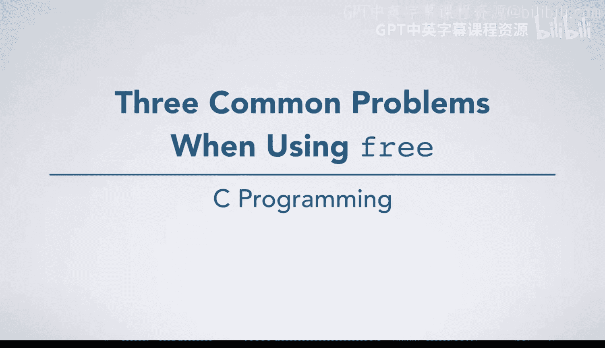
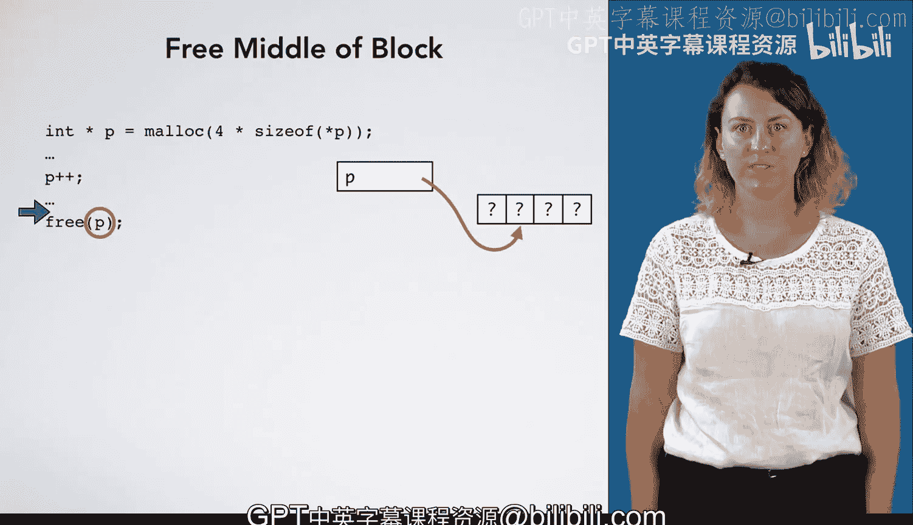

# 杜克大学《C语言入门（编程基础、C代码、指针⧸数组⧸递归、内存）｜Introductory C Programming》 p84 09_02_07_使用free时的三个常见问题.zh_en -BV1Kp42117vh_p84-

There are lots of ways to incorrectly use the function free。

 This video is going to walk you through three of them。

The first one is where you call free twice for the same location on the heap。

For the first line of code in this example， we're going to mal space for four integers。

 and P points to that location on the heap。 Suppose we have another pointer Q。

 and we want Q to also point to that same location on the heap。At some point later on。

 we're going to free the memory pointed to by Q。If at some point later on in our code。

 we also try to free the memory pointed to by P， we have a problem。

P is pointing to the same place that Q is pointing to， and that memory has already been freed。

 Trying to free it again is illegal and will result in undefined behavior。

The second thing you could do wrong is try to free memory that's not actually in the heap。

 Here's an example。 Assume this coat here is inside of some function。We have a local variable X。

 and we initialize our pointer P to point at X。 Now， what if later on in our code。

 we try to free the memory pointed to by P。This location is not on the heap。 It's on the stack。

 This is illegal and will result in early termination of your program。

Another thing you could try to do is free the middle of the block。 Here is an example of that。

 We're allocating an array of size 4 and P points to that location on the heap。 At some point。

 we increment P so that instead of pointing to the zeroth element of the array。

 it points to the first element of the array。 Now， later on。

 if we try to free P we'll be trying to free something not using an address returned to us by Malik。

 Instead， we're trying to free something using an address in the middle of our allocated block。

 This is also illegal and will result in early termination of your program。

