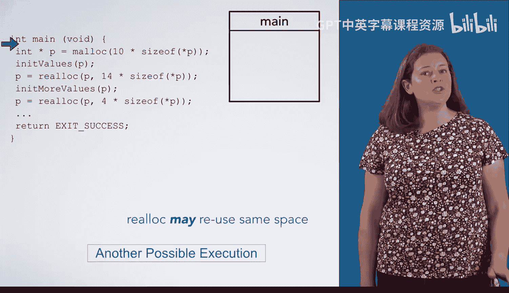

# 杜克大学《C语言入门（编程基础、C代码、指针⧸数组⧸递归、内存）｜Introductory C Programming》 p85 10_02_02_realloc调用.zh_en -BV1Kp42117vh_p85-

Now， let's take a look at the semantics of Reallic。You can think of realalc as malicking new space。

 copying the old data to the new space and freeing the old space。 Let's see that in action。

 We start by declaring a pointer and malicking space for 10 ins for it to point at。 Next。

 we are going to fill these ints with some data。 in the interest of space。

 we have abstracted that out into a function called in knit values， which is not shown here。

 For this example， we don't really care what the values are。

 but we want you to see that they do get copied。So let's initialize this data with some values。

Now that we have numbers in the array， let us suppose that we discover we need to make the array larger。

 Such a thing might happen if you were reading data and did not know how much data you needed to hold。

 In this example， we decide that we need to hold 14" instead of just 10。 So we call reallic。

We pass in P， which points at the memory we want to reallocate and the amount of space we want。

 In this case， space for 14 ins。Now， let's see what Reallic would do。 First。

 it mals space for the newly requested size 14"。 So let's do that。Next。

 Ralick copies the data from the old memory into the newly allocated space。

 Notice that it only copied 10 elements， since that is how many were in the old array。

 The remaining four are uninitialized。 Last， Ralick is going to free the original space。

 which is no longer needed。 Once that is done， Ralc will return a pointer to the newly allocated memory。

Finishing the assignment statement will update P to point at this newly allocated memory since the function call expression evaluates to Reals return value。

Now， let us suppose we were to do some more initialization to fill in these other four values。Again。

 this code is not pictured in the interest of space。

You can also use Relic to reduce the amount of memory allocated to something。

 You might want to do this if you no longer need some of the data and want to reduce the memory you are using。

This will follow the same rules。 Let's see it in action。First， you Malic space for 4"。

 Then you copy the first  four" into the new space。 Finally。

 you free the memory that was allocated for the old space。 As before。

 Ralick returns a pointer to the start of the newly allocated memory。 So after Realc returns。

 the assignment statement updates P to point at this newly allocated memory。😊。

You should always assume that Reallic will move the data to a new location。

 both when you write code and when you execute code by hand。 However。

 you should be aware that Reallic may leave the data in the same place。 Let's see the same example。

 If Reallic keeps the data in the same memory location。

We start out in the same way with a call to Malik and then initializing our data。Next。

 we call Realc to increase the size to 14。However， this time。

 RealEC is going to allocate space immediately after the current data。

 avoiding the need to copy and free the old data。As before， Realc returns a pointer to the new data。

This time， it just happens to be in the same place as before。

Our assignment statement will then update P to point out exactly the same place as before。

 That is perfectly fine。 Next， we initialize these four new values and then call Reallic again to reduce the size to 4。

😊，Realc can choose to just free the unneeded elements at the end。

 reducing the size of this allocation to the newly requested size。

 It will then return a pointer to this smaller array。 And as before。

 P will be updated to point at the same place。Note that whether or not Realallic keeps the data in the same place or moves it around。

 depends on the particular implementation of realallic。

 as well as which memory addresses are allocated and which are free when realallic is called。

 you cannot guess if it will leave the data in place。

 So you must always write code that expects realalic to move the data。 if it leaves it in place。

 that code will work fine。