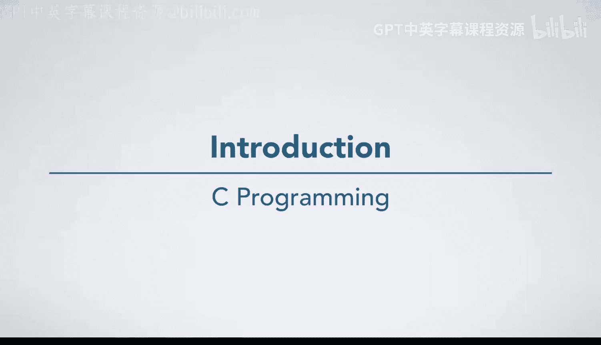
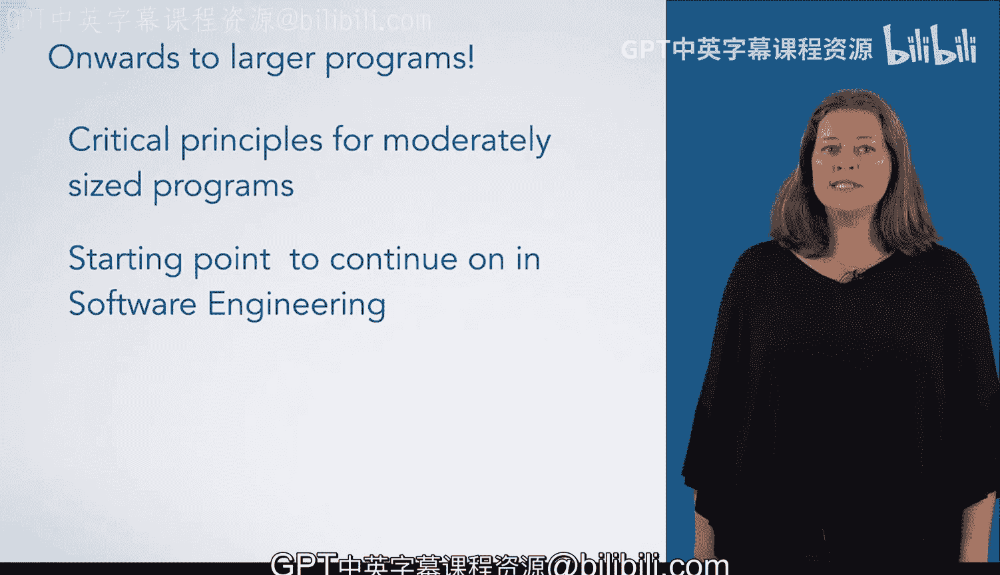

# C语言入门：13：大型程序开发原则 🚀

在本节课中，我们将总结本系列课程，并讨论当你开始编写更大型程序时需要掌握的重要原则。

## 概述



上一节我们完成了对C语言核心语法的学习。本节中，我们将目光转向软件开发实践，探讨构建更可靠、更易维护的大型程序所需遵循的基本原则。无论你的目标是编写中等规模的数据分析程序，还是立志成为一名专业的软件开发人员，这些原则都至关重要。

## 核心原则

以下是构建大型程序时需要关注的几个关键原则。

### 1. 模块化设计

将大型程序分解为多个独立、功能明确的模块。每个模块应具有高内聚性和低耦合性。这可以通过函数和头文件来实现。

**代码示例：**
```c
// math_operations.h
#ifndef MATH_OPERATIONS_H
#define MATH_OPERATIONS_H
int add(int a, int b);
int multiply(int a, int b);
#endif

// math_operations.c
#include “math_operations.h”
int add(int a, int b) {
    return a + b;
}
int multiply(int a, int b) {
    return a * b;
}
```

### 2. 清晰的接口与文档

为每个模块和函数定义清晰的接口，并使用注释说明其用途、参数和返回值。

**代码示例：**
```c
/**
 * 计算两个整数的最大公约数。
 * @param a 第一个整数
 * @param b 第二个整数
 * @return a和b的最大公约数
 */
int gcd(int a, int b) {
    // 使用欧几里得算法
    while (b != 0) {
        int temp = b;
        b = a % b;
        a = temp;
    }
    return a;
}
```

### 3. 防御性编程与错误处理

始终假设输入可能无效，并编写代码来优雅地处理错误情况，例如检查函数参数和返回值。

**代码示例：**
```c
/**
 * 安全分配内存。
 * @param size 需要分配的字节数
 * @return 指向已分配内存的指针；若分配失败则返回NULL
 */
void* safe_malloc(size_t size) {
    void* ptr = malloc(size);
    if (ptr == NULL) {
        fprintf(stderr, “内存分配失败: 无法分配 %zu 字节。\n”, size);
        // 根据程序逻辑，可能在此处退出或抛出错误
    }
    return ptr;
}
```

### 4. 代码复用与抽象

避免重复代码。将通用的功能抽象成函数或库。识别模式并创建通用解决方案。

### 5. 测试与验证

为关键功能编写测试，确保代码在各种情况下都能按预期工作。这包括单元测试和集成测试。

## 学习路径建议

如果你的学习目标只是编写中等规模的数据分析程序，那么掌握上述原则已足够满足需求。

如果你计划成为一名专业的软件开发人员，这些原则是基础，但你还需要进一步学习。本节内容将是一个绝佳的起点，引导你继续学习软件工程的其他课程，更深入地了解更多的设计原则和最佳实践。



## 总结

本节课我们一起学习了构建大型C语言程序的核心原则。我们探讨了模块化设计、接口文档、防御性编程、代码复用以及测试的重要性。记住，编写能运行的代码只是第一步，编写清晰、健壮且易于维护的代码才是优秀程序员的标志。希望这些原则能帮助你在编程道路上走得更远。