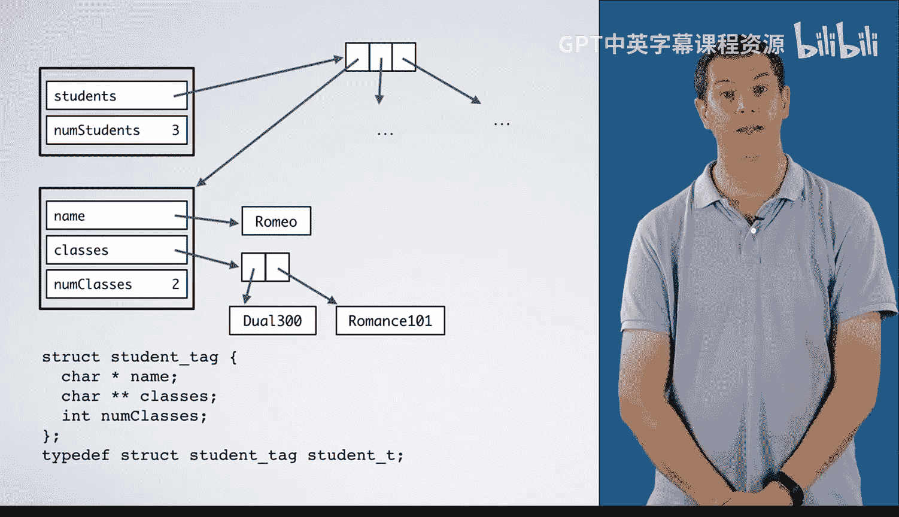
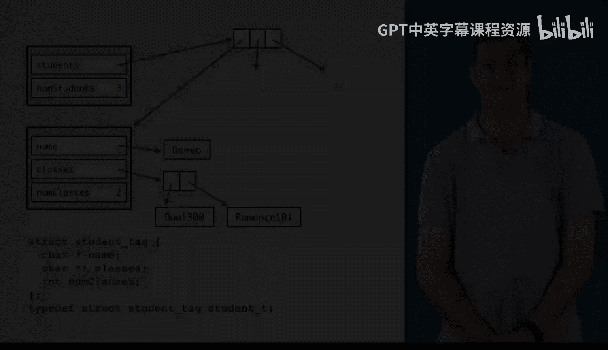

# 杜克大学《C语言入门（编程基础、C代码、指针⧸数组⧸递归、内存）｜Introductory C Programming》 p89 14_03_02_名册规划.zh_en -BV1Kp42117vh_p89-

In this video， we are going to plan the code for the moderately sized roster program。 As always。

 we'll start with step 1， working an example by hand。 For this example。

 my input is in the form of this file with three students。

 Romeo and Juliet and Tt I'm going to go through and read this and see that Romeo has two classes。

 Dual 300 and romanceance 101， Juliet has two classes。

 romanceance 101 and Poison 352 and Td has one class dual 300。Next。

 I'm going to realize that it would be good to have a list of the unique classes that is Du 300。

Romance 101， which appears twice， but I only need to add it once。

Poison 352 and dual 300 appears again， but I don't need to add it。

Then I'm going to go through and make the roster for each of these。

Dule 300 has Romeo and Tibal in it。 Romanmance 101 has Romeo and Juliet。

And poisonison 352 only has Juliet in it。Next is step2， to write down exactly what I just did。

 The first thing I did was I read the input， figuring out what it meant in some of the conceptual units we're going to use in this problem。

I made a list of all of the unique class names that appeared in my input。

 Then I wrote one output file per class。 Now， those steps may sound very high level， but remember。

 we want to work from the high level steps down to low level steps in top down design。

 This allows us to break the larger problem into smaller and smaller problems。

Now I need to generalize these steps， although they're already pretty general。In general。

 I'm going to read the input from the file named by Arrggut1。

 and I'm going to call the result the roster。Next， I'm going to make a unique list of all the classes and give it a name of convenience。

 calling it unique Class L。Then I'm going to write one output file per class from unique class list and the roster。

Since these steps were already pretty general， we didn't need to do the nitty gritty low level algorithms。

 but that's fine。Next， you would test these steps on a different input。

 but we'll leave that as an exercise for you， if you would like。Translating this to code。

 each of these is a complex step， so we want to abstract it into a function。

 These few function calls， plus some error checking make up a good main。

 We don't want to delve into the details of solving each of these problems。

 We'd like to have each one via function such as reading and input。Now to do this。

 we need to be a bit more precise with our drawing to see what types are needed。

 that is if I make a function called read input， which takes a at1 and returns。The input。

 what's its return type？What type should the roster be？Conceptually， read input returns a roster。

 We can name this type roster underscore T， where underscore T is a convention for type names。

 But what would the definition of a roster T look like。

 This is going to be important for working through the details of these functions that we're going to write next。

The conceptual representation of a roster T is this， that is the thing we drew in step one。

Working this example ourself。We have multiple things。

 What kind of thing we'll talk about that in a second， and then suggests an array。 In this example。

 we have three。 in general， we might have 40 or 2 or 3000。Therefore。

 we need to track how many things there are since C does not keep track of the size of an array。

We might think of a roster T as looking like this， that is students pointed at an array。

 each element of which points at one of these things， which we'll talk about in a second。

 and then we have a number of students， which in this case is three。

Now we need to think about what each of these things in the array is。Each represents a student。

 so it makes sense to call it a student T that will let us define this struct for the roster T。

 It has a student T star star that is this pointer points at a pointer to a student T and an int for the number of students We can type def this struct roster T。

Now， what about the details of a student T？It has a name such as Romeo， which would be a string。

 a char star。 It also has classes， which is going to be an array of strings with types。

 char star star and an int to tell us how many there are。 Romeo has two classes。 Tbalt has one。

 This is a fairly small example。 We could imagine any number of classes here。

The result is something like this where I've omitted the other students in the interest of space。

 The variable students points at this array， each element of which points at a student T。

 which has a name which is a string， classes， which is an array of strings and a number of classes。

 so we would define a student T as a cha star name， a cha star star classes and an int nu classes。

Now that we have planned out our program at a high level and decided on some custom types we'll need。

 we are ready to plan the rest of the subprom we've identified and begin writing our program。

