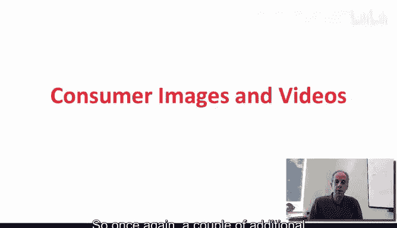
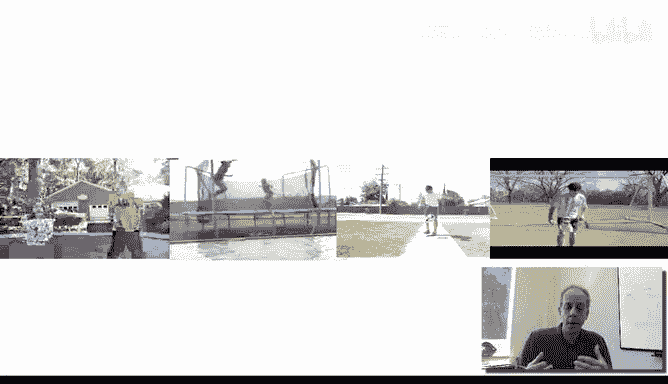
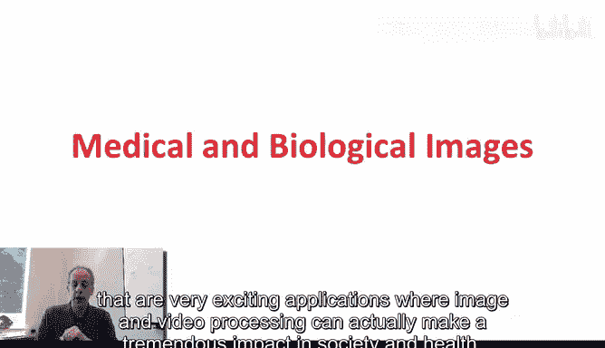
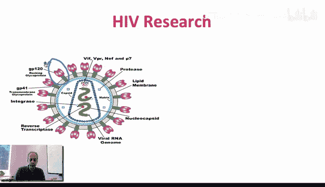

# 003：03_01_03_1-什么是图像与视频处理-第二部分

## 概述
在本节课中，我们将继续探索图像与视频处理的应用实例。我们将从日常的消费级图像开始，然后深入探讨医学成像领域，了解图像处理技术如何在这些关键领域发挥重要作用。

## 从消费级图像到视频分析
上一节我们介绍了图像处理的一些基本应用。本节中，我们来看看更多关于消费级图像和视频处理的例子。

### 视频活动识别
这是一个展示视频处理能力的非常有趣的例子。以下是其核心目标：
*   计算机需要自动识别出，尽管视频中的人物、背景和服装完全不同，但他们的活动（跳跃）是相同的。
*   同时，计算机需要区分“跳跃”与“玩球”这类不同的活动。
*   最终目标是让计算机能够根据视频中发生的活动，自动对视频进行分类。

### 活动分类可视化
让我们看另一个有趣的例子。在这个例子中，计算机会用不同颜色的边框来标识视频中人物活动的变化。
*   **不同颜色的边框**：表示计算机识别出人物正在进行不同的活动。
*   **相同颜色的边框**：表示计算机识别出人物正在进行相同或同类型的活动。

通过观看视频演示，我们可以直观地看到，当人物从一种活动（如跑步）切换到另一种活动（如跳跃）时，边框的颜色会随之改变。这正是我们希望计算机为我们做的事情：识别图像中正在发生什么。

## 图像增强与计算机视觉
有时，我们实际上想要更简单的东西。例如，我们可能希望将一张质量很差的图像，通过处理变成一张清晰美观的图像。这种情况在我们日常生活中经常发生。我们拍了一张效果不理想的照片，但无法返回重拍。这时，我们希望计算机能自动为我们处理，生成一张高质量的照片。

以上都是我们熟悉的例子。一个更复杂的例子是让计算机识别视频中发生的一切。这有时被称为**计算机视觉**，虽然它与图像处理领域紧密相关，我们将在接下来的几周里讨论这一点。

## 医学成像中的应用
以上都是关于消费级成像的应用。图像与视频处理，特别是图像处理，在医学和生物图像领域也极其重要。近年来，视频处理在该领域的重要性也日益凸显。让我给你举几个激动人心的应用例子，展示图像与视频处理如何对社会和健康产生巨大影响。

### 神经外科手术导航
这是一个特定的应用，我们将在课程的最后一周详细讨论。这个应用与神经外科手术相关。

基本概念是，神经外科医生需要在大脑中植入电极并发送刺激，这对于治疗帕金森症、震颤、抑郁症等许多问题至关重要。但一个根本性的问题是，神经外科医生需要“看到”大脑内部，需要知道电极植入的精确路径和位置。

为了实现这一点，外科医生会通过**MRI**（磁共振成像）或**CT**（计算机断层扫描）等技术获取大脑内部的图像，并试图构建一张“地图”。他们希望像使用谷歌地图一样，获得大脑内部的结构图。他们想要能够绘制大脑中发生的一切。

你所看到的这些色彩绚丽、精美的图像，是多种成像模态的结合。我们将在课程中讨论将这些模态图像整合在一起的技术。通过这些技术创建的图像，不仅能精确定位，还能展示大脑不同部分是如何连接的。

完成这些后，就可以像前面提到的那样绘制大脑地图，并理解电极的植入位置。这相当于真正地“看”到了我们的大脑内部，而这背后需要大量的图像处理技术才能实现。这是一个非常激动人心的领域，因为图像处理在此做出的贡献是巨大的。

### HIV病毒研究
同样，我们可以在HIV研究中应用图像处理。我们将在课程最后一周更详细地讨论这个问题，并有一整节关于此特定挑战的课程。

这基本上是一个病毒，这是HIV病毒的示意图。出于我们稍后将讨论的原因，我们需要识别出病毒包膜（envelope）的实际三维形状。你可能会说，从示意图看这并不难，但我马上会展示为什么这实际上非常困难。

基本概念是，我们需要能够识别出图中标记的部分（Gp120和GP41，即病毒包膜）的三维结构。这是病毒用来侵入下一个细胞的关键部分，识别其形状非常重要。

那么，为什么这如此困难？因为实际上，研究人员得到的是像下面这样的图像。这些图像中包含了之前示意图里展示的那些微小的病毒包膜结构。

**核心挑战**：从这样模糊、嘈杂的原始图像中，我们需要能够重建出清晰的三维结构模型。

这是具有巨大潜在贡献的基础科学研究，有助于疫苗开发或对不同病毒的理解。

### 辅助外科手术
最后，正如我们所想的，图像处理可以帮助神经外科手术，也能帮助其他类型的手术使其更安全。这是一个特定的应用，在心脏消融手术（一种常见手术）中，重要的是要理解食道的位置，以避免在手术中触碰甚至损伤它。

这再次体现了图像处理在特定领域的应用。本周我们将讨论不同类型的应用，我们会涉及其中一些。虽然无法涵盖所有医学成像应用，但我们会提供足够的信息，让你理解为什么图像处理在医学和生物成像领域如此重要。

## 总结
在本节课中，我们一起学习了大量图像与视频处理的应用实例。从火星传回的科学数据，到电影或我们用自己的相机拍摄的消费级视频和图像，再到医学成像，其应用范围非常广泛。

在接下来的九周里，我们将从本周开始，讨论实现我们所看到的各种图像处理目标所需的基本技术。

我们下个视频再见。