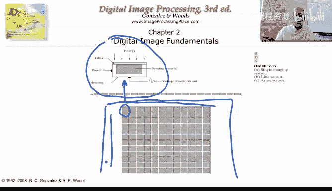
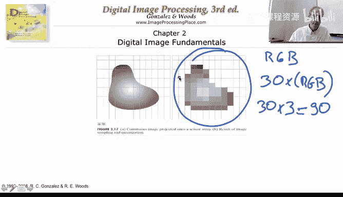
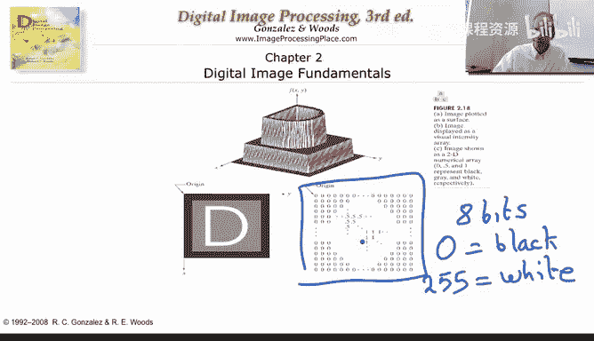
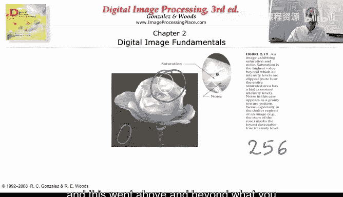
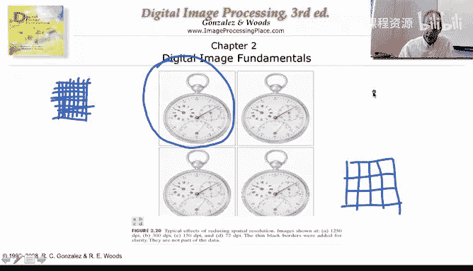
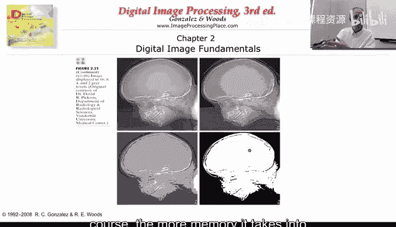

# 007：图像形成-采样与量化 📸

在本节课中，我们将学习图像、彩色图像以及视频在计算机中是如何表示的。我们将深入探讨两个核心概念：**采样**与**量化**。理解这些概念是理解所有数字图像处理技术的基础。

---

## 图像如何进入计算机

我们首先需要理解图像是如何被计算机捕捉和表示的。我们通常用相机拍摄的图像，只是我们能在不同波长和模式下获取的整个图像光谱中非常小的一部分。然而，采样和量化的概念适用于所有这些模式。

基本过程如下：光线从物体上反射，进入相机。相机内部有传感器，类似于我们眼睛中的视网膜和视杆/视锥细胞。这些传感器负责接收光能。

在普通相机中，这些传感器以二维阵列的形式排列，通常是正方形或矩形。例如，我们说一个相机是“1000 x 1000像素”，意思就是它在水平和垂直方向上各有1000个传感器，总计一百万个传感器。

然而，从连续的现实世界到数字图像的整个过程，包含一个**数字化**的步骤。

---

## 数字化的两个维度

数字化在两个不同的方向上发生：**空间离散化**（采样）和**幅度离散化**（量化）。

让我们想象一个物体，它从白色渐变到灰色。如果我们观察它的一条线，其灰度值会形成一个连续的轮廓。

*   **采样**：我们不会在空间的每一点都记录值，而只会在某些离散的间隔点进行记录。这就是空间上的离散化。
*   **量化**：我们无法记录每一个可能的灰度值。我们会将测量到的连续值四舍五入到一组有限的离散级别上。这就是幅度上的离散化。

**量化示例**：
假设传感器接收到的值是 `17.5`。
*   一种方法是直接截断，表示为 `17`。
*   另一种方法是除以2，取整，再乘以2。即 `round(17.5 / 2) * 2 = 18`。

量化有更复杂的方法，我们将在后续关于量化的章节详细讨论。

总结来说，我们从空间和灰度值都连续的物体开始，最终得到一个在空间域和灰度值上都离散的对象。优秀数码相机的目标就是拥有足够密集的采样和非常精细的量化级别，让我们察觉不到这种离散性。

---

## 像素：图像的基本单元

上述离散化过程的结果就是**像素**。像素（Pixel）一词来源于“Picture Element”。每个像素在空间上是离散的，其代表的灰度值也是离散的。

图像质量取决于两点：
1.  **空间分辨率**：像素的数量。例如 `256 x 256` 或 `512 x 512`。像素越多，图像越清晰。
2.  **灰度级数**：每个像素可以表示的不同灰度值的数量。通常用比特数表示，例如 `8 bits` 可以表示 `2^8 = 256` 个灰度级（从0到255，0代表黑，255代表白）。

所以，一个图像在计算机中就是一个二维的离散数值数组。

---

## 彩色图像的表示 🎨

黑白（灰度）图像只有一个通道。彩色图像则由三个这样的图像通道组成，分别代表**红色（R）**、**绿色（G）** 和**蓝色（B）**。这就是常说的RGB图像。

理想情况下，相机会为每种颜色捕获一个完整的二维传感器阵列。但大多数消费级相机为了降低成本，采用了一种叫做**马赛克（Bayer Filter）** 的传感器排列方式。每个像素点只捕获一种颜色（红、绿或蓝），然后通过其周围像素的信息**插值**计算出该点缺失的另外两种颜色，从而合成完整的RGB图像。

因此，一个彩色图像在计算机中就是三个二维离散数组（R, G, B）。

---

## 视频的表示 🎥

视频本质上是静态图像在时间上的序列。

*   每一幅静态图像称为一**帧（Frame）**。
*   常见的视频格式每秒包含30帧（30 fps）。
*   每一帧都是一个RGB彩色图像。

所以，一秒钟的视频数据量是：
`30 帧/秒 × 3 个颜色通道/帧 = 90 个二维数组`

如果每帧分辨率是 `512 x 512`，每个像素用8比特（即每个通道8比特，共24比特）表示，那么一秒钟视频的数据量就非常可观。这引出了对视频压缩技术的需求。

---

## 采样与量化的效果对比

现在，我们来看看空间采样率和灰度量化级数如何影响图像质量。

### 空间采样率的影响

以下两组图像拥有相同的灰度级数（256级），但空间分辨率（像素数量）不同。

*   **高分辨率（像素多）**：图像清晰，细节丰富，边缘平滑。
*   **低分辨率（像素少）**：图像出现“锯齿”和块状感，细节丢失，文字和线条变得模糊不清。

**原因**：当空间采样过于粗糙时，无法捕捉到灰度值的快速或平滑变化。

### 灰度量化级数的影响

以下图像拥有相同的空间分辨率（`452 x 374`），但使用的灰度级数不同。

以下是不同比特数对应的量化效果：
*   **8比特（256级）**：图像平滑，过渡自然。
*   **7比特（128级）**：质量开始轻微下降。
*   **6比特（64级）**：出现明显的**伪轮廓（False Contouring）**，即本应平滑的渐变区域出现了像等高线一样的带状条纹。
*   **更低比特（32, 16, 8, 4, 2级）**：图像质量急剧恶化。在极端情况下（如1比特，2级），图像会退化为只有黑白两色的二值图，所有中间信息全部丢失。

**原因**：量化级数太少时，一段连续的灰度值范围会被“四舍五入”到同一个离散值上，导致平滑的明暗变化变成阶梯状的跳跃，从而产生伪轮廓。

**饱和现象**：当场景中某个区域过于明亮，其亮度值超过了传感器能表示的最大值（如255）时，该区域所有像素都会显示为纯白色，细节完全丢失。这就是我们拍照时高光区域“过曝”的原因。

---

## 总结 📝

本节课中，我们一起学习了数字图像和视频在计算机中的表示原理：

1.  **核心过程**：通过**采样**（空间离散化）和**量化**（幅度离散化）将连续的现实世界转换为离散的数字数据。
2.  **图像表示**：
    *   灰度图像：一个二维离散数组。
    *   彩色图像：三个二维离散数组（R, G, B），可能由马赛克传感器插值得到。
    *   视频：一系列按时间排列的帧（图像），每秒通常包含24或30帧。
3.  **关键参数**：
    *   **空间分辨率**（像素数量）决定了图像的清晰度和细节保留程度。
    *   **量化深度**（比特数/灰度级数）决定了图像色彩和明暗过渡的平滑程度。
4.  **质量与存储的权衡**：更高的分辨率（更多像素）和更深的量化（更多灰度级）能带来更好的图像质量，但也会占用更多的存储空间和带宽，这自然引出了对图像和视频压缩技术的需求。

总之，计算机中的图像，本质上就是**二维的离散数值数组**。理解这一点是进行一切图像处理操作的基础。

