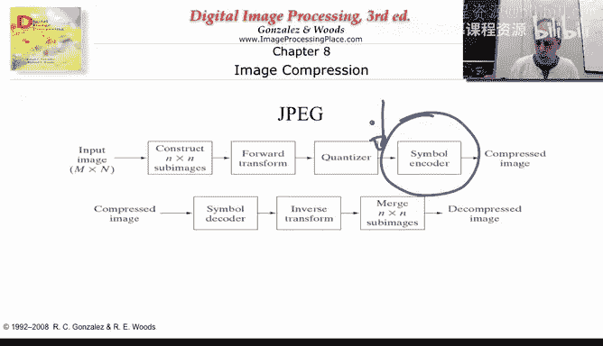
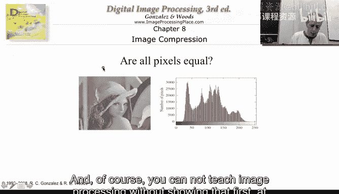
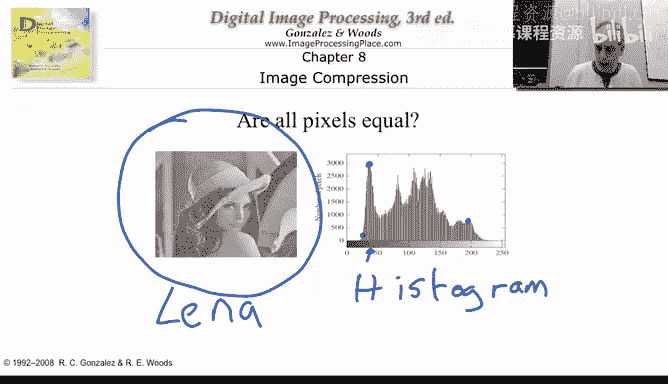
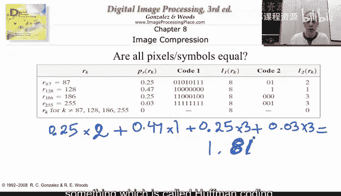
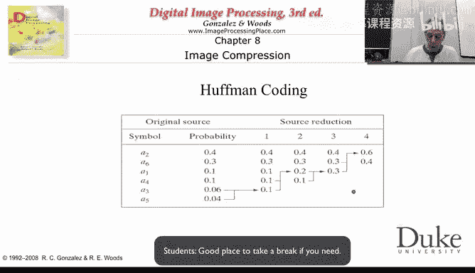
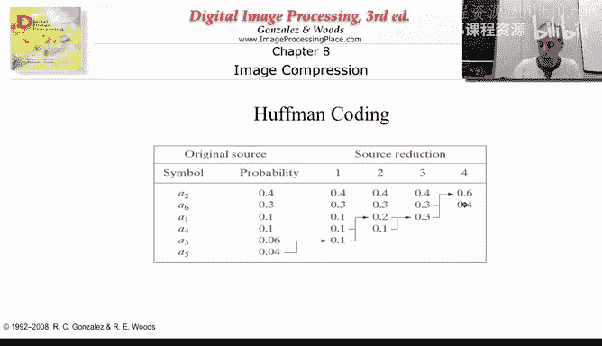
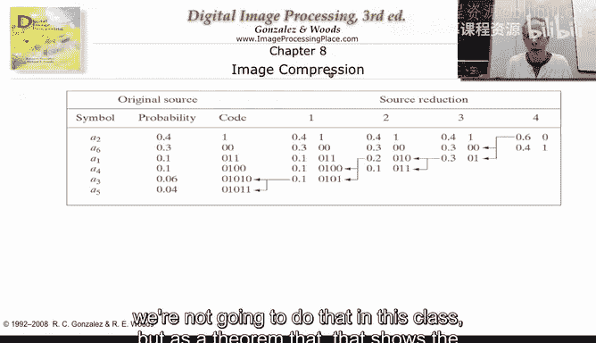
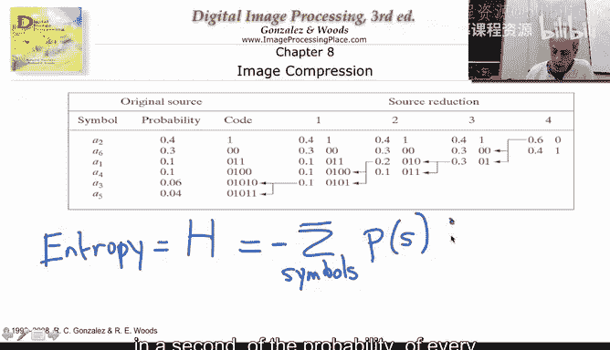

# 010：霍夫曼编码

在本节课中，我们将学习图像压缩算法中的一个核心模块——符号编码器。具体来说，我们将深入探讨JPEG压缩标准中使用的霍夫曼编码。在完成变换和量化（后续会详细解释）之后，我们希望进一步压缩数据。量化本身能提供一定的压缩效果，但我们仍需要无损地保存量化后的结果，并寻求进一步的压缩方法。本节将解释如何以及为何能做到这一点。

## 压缩的基本原理

上一节我们介绍了图像压缩的整体流程，本节中我们来看看符号编码的核心思想。其基本原理非常简单：图像中某些灰度值出现的频率远高于其他值。如果我们能为高频出现的值分配较短的二进制码，为低频值分配较长的码，就能在整体上减少表示图像所需的比特数。

当然，讲解图像处理不能不展示至少一次著名的“Lena”测试图像。它曾被广泛使用，如今由于图像版权问题，我们更多地使用其他图像，但在此九周课程中，我仍希望至少展示它一次，并且我们可能还会多次见到这张图像。

我们可以通过直方图来观察灰度值的分布。直方图统计了图像中每个特定灰度值出现的次数。例如，灰度值大约为47的像素出现了这么多次。我们遍历整个图像，统计看到数字47的次数，就得到了这个数量。再比如，灰度值200在图像中出现了大约700次。

因此，我们看到有些像素值出现得非常频繁，而有些值（例如0或1）则根本不出现。我们将要利用的基本思想是：尝试为出现频率高的像素值分配非常短的代码，而为出现频率不高的像素值分配较长或非常长的代码。让我们看看具体如何操作。

## 一个编码示例

以下是应用此原理的一个具体例子。

这里有一幅图像，实际上就是我们在上一个视频中看到的几何图像。这幅图像的特殊之处在于，它只包含四种不同的灰度值。它们的出现概率如下：灰度值87的像素约占图像的25%（概率0.25）；灰度值128的像素约占图像的一半（概率0.47）；而灰度值186和255出现的次数非常少。其他灰度值在图像中根本不出现。

表示这幅图像的标准方法是使用一个数组，为每个像素分配一个8位的二进制码。因此，我们将用87的二进制表示来代表87，用128的二进制表示来代表128，依此类推。最终，如果不进行压缩，我们基本上每个像素要花费8比特。

但假设我设法构建了如下所示的编码：87用二进制码`01`表示，128用`1`表示，186用`000`表示，255用`001`表示。这意味着，如果我想存储或发送像素序列“87, 87, 255, 128”，我不再需要写四次8位码（总共32比特），而是可以这样写：87 -> `01`，87 -> `01`，255 -> `001`，128 -> `1`。最终得到的比特流是`01 01 001 1`，只用了8比特，而不是原来的32比特，来表示相同的灰度值序列。

解码器拥有这个编码表。当它看到`01`时，会在相应的像素位置放入87；再次看到`01`，再放入一个87；看到`001`，就知道要放入255，依此类推。这样我们就实现了压缩。

让我们精确计算一下能实现多少压缩。我们进行一个简单的计算：对于概率为0.25的灰度值87，其码长为2比特；对于概率为0.47的灰度值128，其码长为1比特；对于概率各为0.25的灰度值186和255，其码长均为3比特。计算平均码长：`0.25*2 + 0.47*1 + 0.25*3 + 0.03*3 ≈ 1.81`比特。

因此，平均每个像素从8比特减少到了约1.81比特，压缩率超过四倍。我们所做的就是利用了某些像素值比其他值出现更频繁的事实，然后为高频值分配了更短的代码。我们通过一种称为“霍夫曼编码”的方法来实现这一点，接下来我将解释其具体步骤。

## 霍夫曼编码详解

让我们再次审视这个特定例子。解释霍夫曼编码的最佳方式就是通过实例，我接下来就演示这个过程。

假设我们有六个不同的符号（例如，代表不同的像素值），并且我们已知它们出现的概率。以下是构建霍夫曼编码的步骤：

首先，必须根据概率从高到低对符号进行排序。如果某些概率相等，谁在前谁在后无关紧要。例如，符号a2可能代表像素值100，符号a6可能代表像素值77，等等。我将在这里列出符号及其概率。

构建过程从列表底部开始：
1.  取出概率最低的两个符号。
2.  将它们的概率相加，形成一个新节点，其概率为两者之和。
3.  将这个新节点放回列表中，并重新按概率从高到低排序。
4.  重复步骤1-3，直到列表中只剩下一个节点（概率和为1）。

在这个过程中，每次合并两个最低概率的节点，我们实际上是在构建一棵二叉树。当最终只剩下一个根节点时，树就构建完成了。

现在，是时候分配代码了。我们从构建过程的最后一步（根节点）开始，反向遍历这棵树，为每个分支分配比特值（例如，向左分支分配`0`，向右分支分配`1`，反之亦可，只要一致）。

具体操作如下：我们从根节点开始，沿着路径回到每个原始符号。路径上经过的所有分支的比特值（`0`或`1`）连接起来，就构成了该符号的霍夫曼编码。

通过这个过程，我们得到了一个变长编码：并非每个符号都由相同长度的代码表示，其长度取决于概率。概率越高，代码越短。这很容易理解，因为低概率的符号在构建过程中被反复合并，当反向分配代码时，它们需要经过更多的分支，每经过一个分支就增加一位，因此代码变得越来越长。

我们可以再次计算这个编码的平均长度，验证其压缩效果。

## 前缀码与最优性

重复一下整个过程：我们首先根据概率对符号排序；然后递归地合并两个概率最低的节点，每次合并后重新排序；最后反向遍历构建的树以分配代码。

这里有几个非常重要的观察点：
通过这种方式得到的编码被称为“前缀码”，这一点至关重要。观察生成的代码：没有任何一个代码是另一个代码的前缀。这意味着，当解码器读取比特流时，它可以即时地、无歧义地识别出每个符号。例如，当看到`1`时，解码器立即知道这是符号a2；当看到`0`时，它知道需要等待下一位，因为有几个代码以`0`开头。接着如果看到`0`，它知道是符号a6；如果看到`01`，它知道需要继续等待；如果看到`011`，则识别出是符号a1。这种构造方法保证了编码是前缀自由的。

为什么前缀码如此重要？让我们举一个非前缀码的例子：假设符号a1的代码是`1`，a2是`0`，a3是`01`。当解码器看到`01`时，会产生歧义：这到底是代表一个a3，还是代表一个a2后紧跟一个a1（`0`后跟`1`）？这种歧义使得解码无法正确进行。而在霍夫曼编码中，通过构造避免了这种情况。

此外，霍夫曼编码被证明是一种最优的前缀码。对于给定的概率集合，霍夫曼编码过程能够实现平均码长的理论下限（在只使用整数比特的前提下）。这是一个定理，我们在此课程中不进行证明，但它保证了霍夫曼编码在同类编码中的最优性。

## 压缩极限：熵

你可能会想，霍夫曼编码（或这类编码器）能达到的压缩极限是什么？在构建霍夫曼编码之前，我想知道压缩是否值得付出努力，我能压缩多少。

评估的方法是计算所谓的“熵”。熵用H表示，计算公式为：

**H = - Σ [ p_i * log₂(p_i) ]**

其中，求和遍历所有符号，p_i是每个符号出现的概率。

这个公式计算出一个正数（因为概率小于1，其对数为负，再取负号即为正）。香农的信源编码定理指出，使用像霍夫曼编码这样的方法，我们平均可以接近（但通常无法低于）这个熵值作为平均码长。因此，熵给出了这类编码可达到的平均码长的理论下限。

这个公式的直观理解与我们之前的计算类似：平均码长基于符号出现的概率，而-log₂(p_i)可以理解为表示该符号“所需的信息量”。期望的平均码长就是这些信息量的加权平均。之所以是“期望”和“下限”，是因为我们无法发送分数个比特，必须发送整数位，所以实际霍夫曼编码的平均码长会略高于熵值，但非常接近。

熵的计算为我们提供了一个基准，让我们了解对于给定的概率分布，编码器（如霍夫曼编码）能够达到的大致压缩水平。

## 总结

本节课中，我们一起学习了图像压缩中的关键步骤——符号编码，并重点掌握了霍夫曼编码。
*   我们理解了压缩的基本原理：为高频符号分配短码，为低频符号分配长码。
*   我们通过一个具体例子，逐步演练了霍夫曼编码的构建过程：排序、递归合并最低概率节点、反向分配比特。
*   我们认识了**前缀码**的重要性，它保证了解码的无歧义性，并且了解到霍夫曼编码是一种**最优的前缀码**。
*   最后，我们引入了**熵**的概念，它从信息论角度定义了无损压缩的理论极限，帮助我们评估压缩算法的潜力。

现在，我们已经知道如何对产生的比特进行高效编码，为进入图像压缩的下一个模块做好了准备。