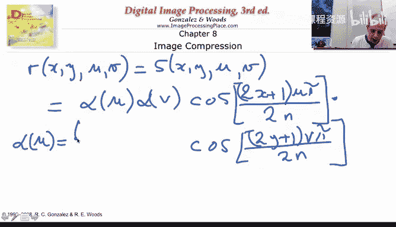
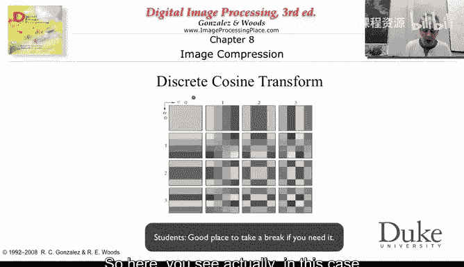
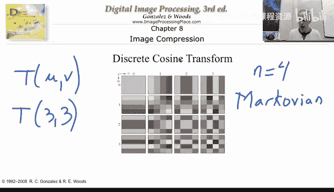
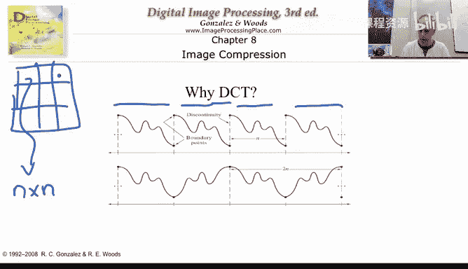
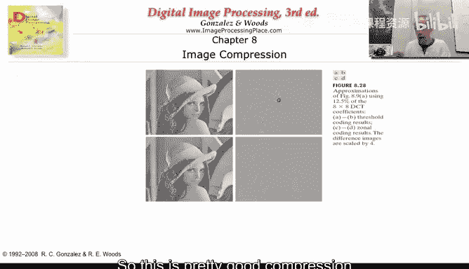

# 012：12_02_04_4-离散余弦变换(DCT) 🎨

在本节课中，我们将要学习图像压缩中的一个核心步骤：离散余弦变换（DCT）。我们将了解为什么需要变换、如何衡量压缩误差，以及DCT如何作为卡洛变换（KLT）的实用替代方案，在JPEG等标准中发挥关键作用。

## 为什么需要变换？🤔

上一节我们介绍了将图像分割为8x8的YCbCr块。本节中我们来看看为什么需要对每个块进行变换。

首先，我们需要理解在压缩过程中如何衡量产生的误差。对于有损压缩，误差通常用**均方误差**（MSE）或**均方根误差**（RMSE）来衡量。

**均方误差（MSE）公式**：
`MSE = (1/N) * Σ (F_original(x,y) - F_reconstructed(x,y))^2`
其中，N是像素总数。我们计算原始图像`F_original`与重建图像`F_reconstructed`在每个像素点差值的平方和，然后除以像素总数进行归一化。

**均方根误差（RMSE）公式**：
`RMSE = sqrt(MSE)`
通常我们使用RMSE，因为它与像素值的量纲一致。

现在，假设我们有一个8x8的像素块（共64个像素）。如果我们只能传输其中一个像素值来重建整个块，误差会非常大。然而，如果我们先对块进行一个**可逆的数学变换**，得到一个由64个新系数组成的8x8块，也许在变换后的域中，我们只传输第一个系数就能获得合理的重建效果。

## 理想的变换：卡洛变换（KLT）✨

存在一种称为**卡洛变换**（Karhunen-Loève Transform, KLT）的变换，它能实现上述目标。KLT能将图像转换到一个新的域，使得信息高度集中在前面几个系数中。

以下是KLT的关键特性：
*   如果只使用第一个变换系数进行重建，它能给出所有可能变换中**最小的均方误差**。
*   如果允许使用三个系数，那么选择前三个系数就是最优的。
*   系数按重要性排序：第一个系数包含最多信息，第二个包含次多且独立于第一个的信息，依此类推。

然而，KLT有一个主要缺点：它是**图像依赖的**。变换矩阵的系数需要根据输入图像的具体统计特性计算得出，这非常耗时且不适用于实时或通用处理。

## 实用的替代：离散余弦变换（DCT）🔧

为了替代KLT，我们使用**离散余弦变换**。DCT具有固定的变换基，可以用于任何图像，无需重新计算，虽然它是次优的，但非常高效和通用。

一个变换包含正变换和逆变换。对于一幅N x N的图像`F(x, y)`：

**正变换公式**：
`T(u, v) = Σ_x Σ_y F(x, y) * S(x, y, u, v)`
其中，`(u, v)`是变换域的坐标，`S`是变换核函数。求和范围`x, y`从0到N-1。

**逆变换公式**：
`F(x, y) = Σ_u Σ_v T(u, v) * R(x, y, u, v)`
`R`是逆变换核函数。一个有用的变换必须可逆。

对于二维DCT，其正变换和逆变换的核函数是相同的：

**DCT核函数公式**：
`S(x, y, u, v) = R(x, y, u, v) = α(u) * α(v) * cos[(2x+1)uπ/(2N)] * cos[(2y+1)vπ/(2N)]`

其中，归一化系数`α`定义为：
`α(0) = sqrt(1/N)`
`α(k) = sqrt(2/N)`，当 `k ≠ 0`

这意味着只需一套算法或硬件即可实现正反变换，非常方便。

## 理解DCT基图像 🧩

DCT的核函数可以看作是一组**基图像**。对于8x8的DCT，共有64个这样的基图像。每个`T(u, v)`系数告诉我们，原始的小块图像中包含多少“分量”的对应基图像。

以下是基图像的特性（以4x4为例）：
*   `T(0,0)`对应左上角的基图像，它代表块的平均亮度（直流分量）。
*   随着`u`和`v`增大，对应的基图像在水平和垂直方向上的变化频率也增加。
*   因此，DCT实际上是将图像块分解为不同频率分量的线性组合。

## 为什么选择DCT？ ✅

我们选择DCT而非其他变换（如傅里叶变换）主要有两个原因：

1.  **对特定图像的近似最优性**：对于满足**马尔可夫性**的图像（即像素值主要与邻近像素相关），DCT在理论上非常接近最优的KLT。
2.  **更合理的周期性假设**：傅里叶变换隐含着图像块会周期性重复的假设，这会导致块边界处出现不连续。而DCT隐含着**镜像对称**的周期性假设，即块边界处的像素值与邻近内部像素值相似，这个假设对自然图像更为合理，能减少“块效应”。

## 为什么是8x8分块？ 🔲

我们通过实验来理解分块大小的影响。对同一图像用不同大小的块进行DCT，并仅保留25%的系数进行重建：
*   **2x2分块**：重建图像出现严重的**块状伪影**。
*   **4x4分块**：块效应减轻，但依然可见。
*   **8x8分块**：图像质量很好，块效应不明显。
*   **更大分块（如整图）**：计算量增大，且图像大范围可能不满足马尔可夫假设，效果提升有限。

因此，8x8是一个很好的折衷：
*   **计算效率**：多个小DCT比单个大DCT计算更快。
*   **假设有效性**：在小区域内，像素间相关性高，近似马尔可夫的条件更可能成立。
*   **信息量**：块足够大，能包含足够的空间信息供DCT有效去相关。

## DCT的压缩效果演示 📊

让我们看一个例子。对Lena图像进行8x8分块的DCT变换，然后仅保留12.5%的系数（将其他系数设为零），再进行逆DCT重建。

结果如下：
*   重建图像视觉上与原图非常接近。
*   误差图像（原图与重建图的差值）显示误差相对较小。
*   我们仅用12.5%的数据量就获得了高质量的近似，这证明了在DCT域进行压缩的有效性。如果直接在像素域丢弃87.5%的像素，结果将不可用。

## 总结与展望 🚀

本节课中我们一起学习了：
1.  衡量压缩误差的**均方误差（MSE）**和**均方根误差（RMSE）**。
2.  理想的**卡洛变换（KLT）**及其图像依赖的局限性。
3.  **离散余弦变换（DCT）**的公式、基图像含义及其作为通用、固定变换的优势。
4.  选择DCT和8x8分块大小的关键原因。
5.  DCT在压缩中的实际效果演示，仅保留少量系数即可获得良好重建。

现在，我们已经完成了压缩系统的“前端”（色彩转换、分块、DCT）和“后端”（逆DCT、合并、色彩逆转换）。中间缺失的关键环节是：在DCT域，我们能否通过**智能的量化**来获得更高的压缩率？这将是下一个视频章节的主题。