# 014：14_02_06_6-JPEG-LS与MPEG

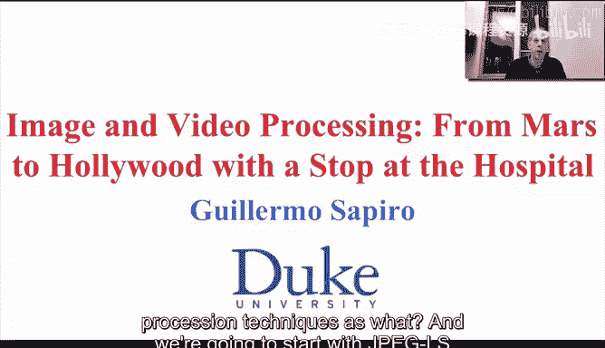

## 概述
在本节课中，我们将要学习两种重要的图像与视频压缩技术：**JPEG-LS** 和 **MPEG**。JPEG-LS 是一种无损图像压缩算法，而 MPEG 是视频压缩的标准。我们将探讨它们背后的核心概念——预测编码，并了解其工作原理。

---

## 预测编码的基本概念
上一节我们介绍了JPEG，本节中我们来看看预测编码。预测编码是JPEG-LS和MPEG等无损或低损压缩技术的核心思想。其基本理念非常简单：通过已编码的像素来预测下一个像素的值，然后只编码预测值与实际值之间的误差。

以下是预测编码的基本流程：
1.  **定义编码顺序**：例如，按光栅顺序（从左到右，从上到下）逐个像素编码。
2.  **进行预测**：根据已编码的像素（“过去”的像素）来预测当前像素的值。
3.  **计算误差**：计算预测值与实际像素值之间的差值。
4.  **编码误差**：使用如霍夫曼编码等方法对误差进行编码和传输。

解码器会使用完全相同的预测策略，根据已解码的像素预测出当前值，然后加上接收到的误差值，即可无损地重建原始像素。

**核心公式**：误差 `e(x, y) = f(x, y) - p(x, y)`，其中 `f(x, y)` 是实际像素值，`p(x, y)` 是预测值。

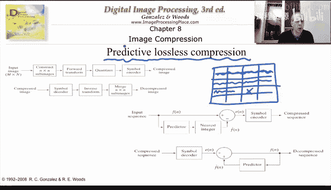

---

## JPEG-LS：无损图像压缩
JPEG-LS 是一种无损图像压缩标准，其核心就是预测编码。关键在于设计一个“聪明”的预测器，使预测误差尽可能小且集中在0附近。

以下是几种可能的预测器示例（假设当前待编码像素为 `f(x, y)`）：
*   **左侧像素预测器**：`p(x, y) = f(x-1, y)`
*   **上方像素预测器**：`p(x, y) = f(x, y-1)`
*   **左侧与上方像素的平均**：`p(x, y) = (f(x-1, y) + f(x, y-1)) / 2`
*   **更复杂的预测器**：JPEG-LS 会考察左上、左、上三个像素，并尝试检测图像边缘，从而选择更优的预测策略。

预测器通常只使用邻近的少量像素（如前一行或两行），以避免算法过于复杂和占用过多内存。

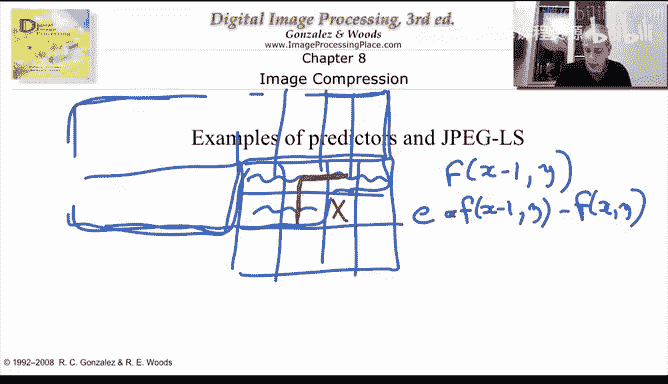

---

## 预测编码的效果
通过一个地球图像的示例，我们可以看到预测编码的效果。原始图像的像素值分布（直方图）较广。而使用一个简单的预测器后，预测误差的分布高度集中在0附近。这意味着大多数误差值都很小，非常适合霍夫曼编码进行高效压缩。只有在图像发生剧烈变化（如边缘）的区域，才会产生较大的预测误差，但这些情况并不频繁。

---

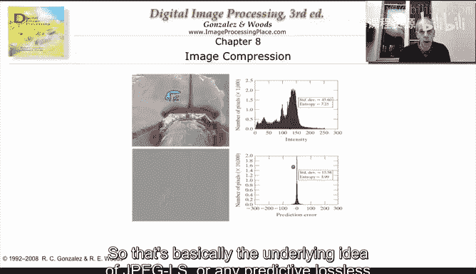

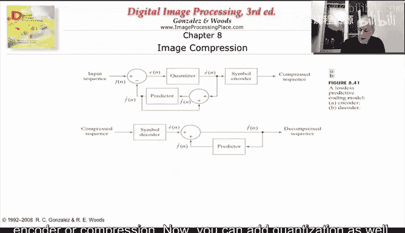

## 引入量化：从无损到有损
预测编码也可以引入量化，从而实现有损压缩，并精确控制压缩带来的误差。

**核心思想**：对预测误差进行量化，而不是直接编码原始误差。例如，将误差量化为 `±1` 的整数倍。这样，重建图像与原始图像的最大差异就是 `±1` 个灰度级。

**重要注意事项**：在引入量化后，编码器和解码器的预测必须基于**量化重建后的像素值**，而不能基于原始像素值。这是因为解码器无法获得原始像素，只能获得量化后的版本。这确保了编解码系统的对称性。

**代码概念**：
```python
# 编码端
quantized_error = quantize(original_pixel - predicted_pixel)
# 解码端
reconstructed_pixel = predicted_pixel + dequantize(quantized_error)
# 下一轮预测必须基于 reconstructed_pixel
```

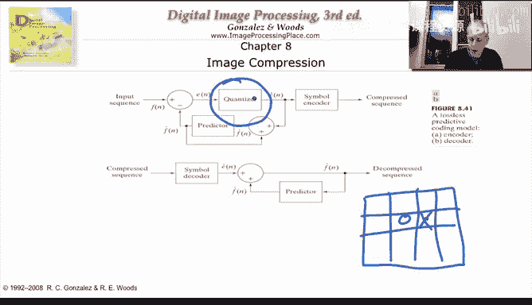

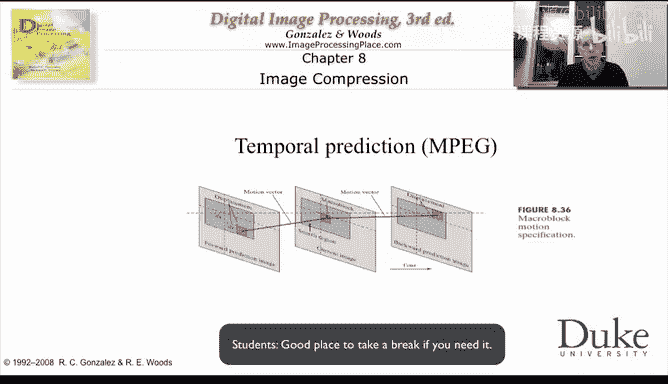

---

## MPEG：视频压缩中的预测
MPEG 是视频压缩标准，它也基于预测思想，但将预测从单幅图像内部（空间预测）扩展到了多帧图像之间（时间预测）。

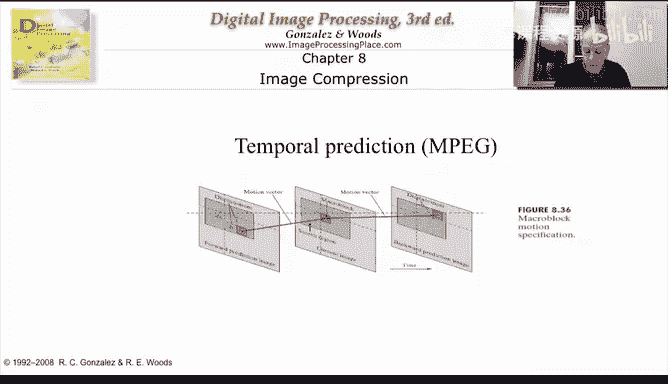

视频由一系列连续帧组成。MPEG 利用相邻帧之间的高度相似性进行压缩。其基本思想是：对于当前帧中的某个区域，在之前的已编码帧中寻找一个相似的区域（运动估计），然后只编码当前区域与参考区域之间的差异（运动补偿误差）。

**简单示例**：如果拍摄一个静态场景，那么每一帧都几乎完全相同。此时，将后续帧预测为前一帧，预测误差将几乎为零，压缩效率极高。即使存在运动，只要在参考帧的邻近区域能找到匹配块，误差图像也会比原始帧数据简单得多，从而易于压缩。

MPEG 的编解码框图与 JPEG 类似，但增加了一个关键模块来处理**时间预测**（运动估计与补偿）。它结合了变换编码（如JPEG）和预测编码的技术。

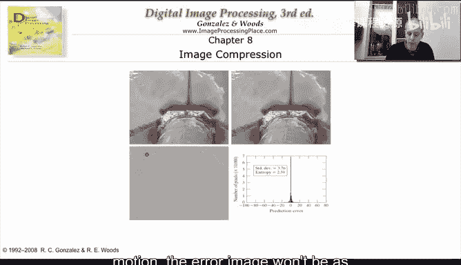

---

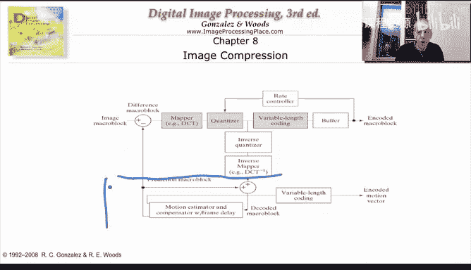

## 总结
本节课中我们一起学习了图像与视频压缩中两个重要的技术：JPEG-LS 和 MPEG。
*   **JPEG-LS** 采用**预测编码**实现无损图像压缩，通过设计好的预测器使误差集中，再使用熵编码压缩。
*   **MPEG** 将预测扩展到时间维度，利用视频帧间的冗余进行**运动补偿预测**，大幅提高了视频压缩效率。
*   两者都可以通过引入**量化**来控制压缩损失，实现从无损到有损的灵活压缩。

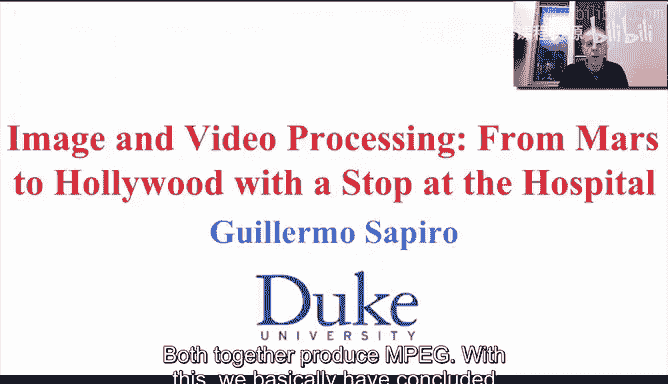

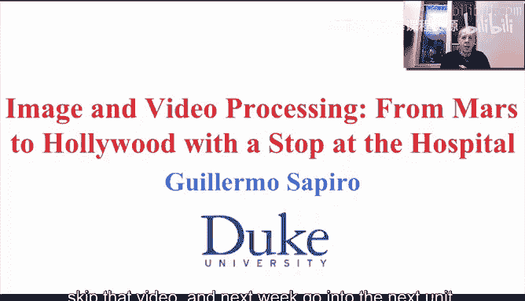

这些技术结合了变换、量化、熵编码和预测等基本模块，构成了我们日常图像与视频处理的基础。