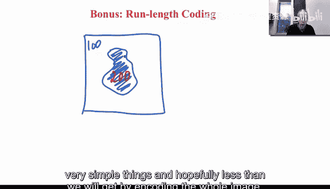
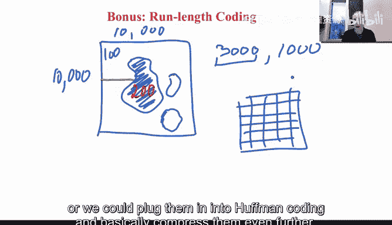
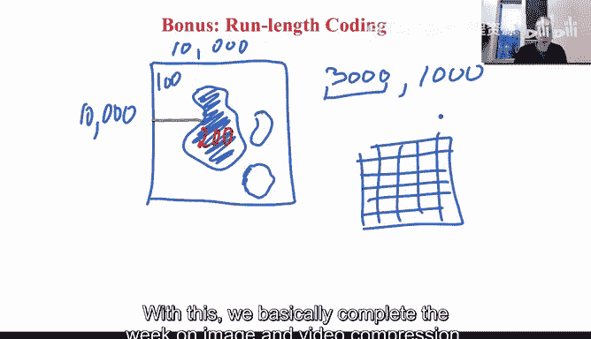

# 015：行程长度压缩 📊

## 概述
在本节课中，我们将学习一种名为“行程长度编码”的图像压缩技术。这种技术特别适用于处理二值图像，通过简洁地表示连续出现的相同像素值，可以显著减少存储图像所需的数据量。

---

## 行程长度编码的基本原理
上一节我们介绍了图像压缩的重要性，本节中我们来看看一种针对特定类型图像的高效压缩方法——行程长度编码。

行程长度编码对于编码二值图像非常有用。我们首先绘制一幅二值图像来帮助说明。

假设图中有一个物体，它具有特定的灰度值。我们只使用两种灰度值，例如背景是100，物体是200。

我们已经知道，如果采用一种智能的图像表示方法，就能实现大幅压缩。智能表示意味着为霍夫曼编码提供良好的概率分布和简单的数据，从而有望获得比编码整幅图像更小的数据量。

当然，我们可以通过逐行描述像素值来编码这幅图像。例如，第一行有很多个100，第二行也是如此，依此类推。假设这是一幅100x100的图像，我们就需要说一万次100，并持续这个过程。

## 行程长度编码的智能方法
更智能的方法如下所述。

我们只需统计数值100连续出现了多少次，然后统计数值200连续出现了多少次，之后再统计数值100又出现了多少次。如果我们知道只有一次数值转换，就不需要重复统计。

例如，假设数值100连续出现了3000次。那么，我们不需要编码3000次“100”，而是编码这个计数值。接着，假设数值200连续出现了1000次。我们就记录“3000, 1000”，这样就完成了对这一行的编码。如果假设只有一个物体、一次转换，编码就结束了。否则，我们可以继续这个过程。

通过两个数字，我们就编码了整行像素。然后对下一行重复此操作。

这被称为行程长度编码，因为它编码的是连续相等数字的“行程”。我们实际上已经在JPEG的变换域中间接见过这种思想。

## 在JPEG中的应用与扩展
在JPEG中，对于一个8x8的块，当所有后续系数都变为0时，会使用一个表示“块结束”的代码。这本质上就是用一个数字编码了之后发生的所有情况，这也是行程长度编码的基本思想。

这种编码对于图像，特别是几何图像和二值图像非常有用。它间接应用于JPEG，但在此类图像中尤为流行。

即使图像中有多个物体，例如这里还有另一个物体，我们基本上还是编码这些连续行程。我们会说明数值100出现了多少次，数值200出现了多少次，数值100再次出现了多少次，数值200或其他所需数值又出现了多少次。我们编码这个数值以及它出现的次数。

通过这种方法，我们可以大幅压缩这些原本需要很长代码来表示的、非常简单的图像。和之前一样，我们可以直接编码这些数字，也可以将它们输入霍夫曼编码器以进一步压缩。

## 总结与展望
本节课中我们一起学习了行程长度编码的原理与应用。通过这种方法，我们基本上完成了关于图像和视频压缩这一周的学习内容。现在，我们能够从任何地方接收图像并进行压缩存储。

下周，我们将开始学习如何处理图像。当我们的图像效果不理想、看起来不如预期时该怎么办，这正是下周课程的开始。下周见。谢谢。

