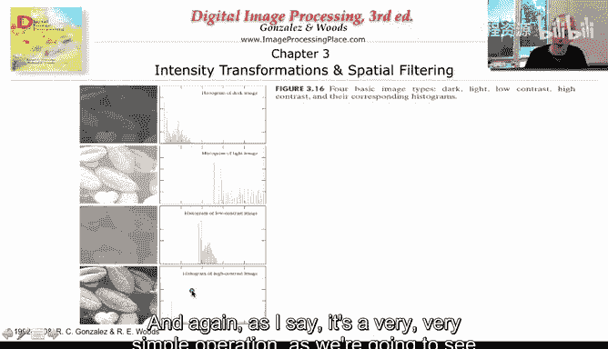
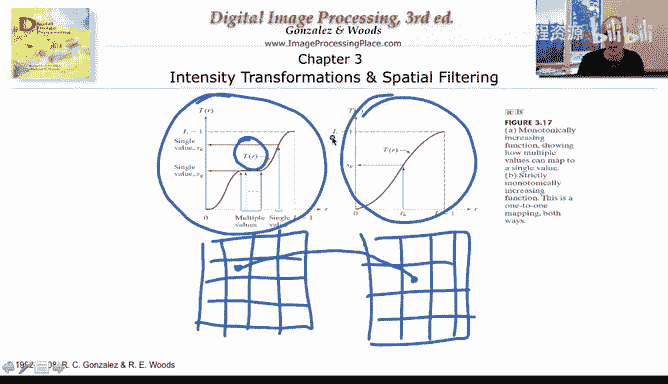
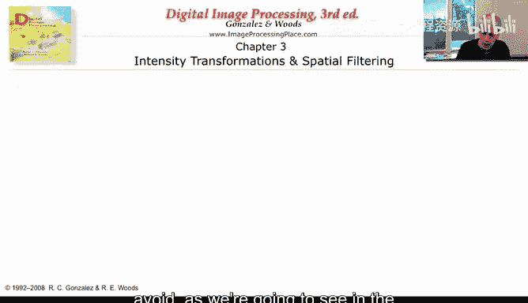
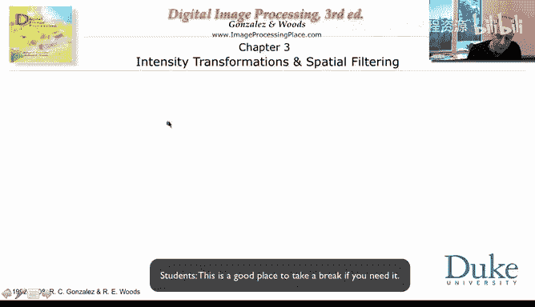
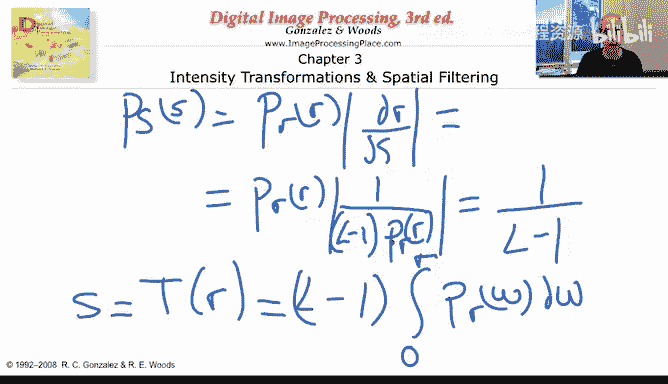
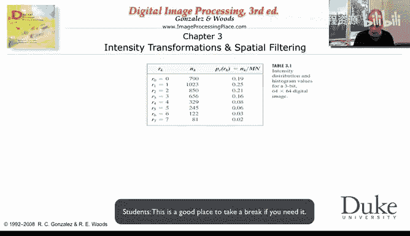
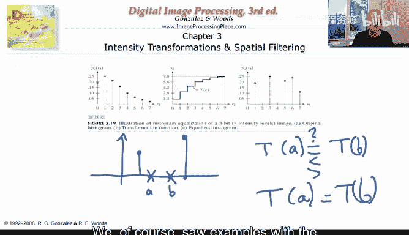

# 018：直方图均衡化详解

## 概述
在本节课中，我们将深入学习直方图均衡化的数学原理与实现方法。我们将从直方图的基本概念出发，推导出将任意分布转换为均匀分布的变换公式，并通过实例理解其效果。

## 从直方图到均匀分布
上一节我们介绍了实时直方图均衡化的效果，本节中我们来看看其背后的数学原理。

直方图直观地展示了图像中像素值的分布情况。例如：
*   在很暗的图像中，像素值大多集中在直方图的低端（左侧）。
*   在很亮的图像中，像素值大多集中在直方图的高端（右侧）。
*   在低对比度图像中，像素值集中在中间一个狭窄的范围内。

我们的目标是将一个给定的像素值分布，转换为一个在范围 `[0, L-1]`（通常 `L=256`）上的**均匀分布**。这意味着变换后，每个灰度级出现的概率应大致相等，即概率为 `1/(L-1)`。

为了实现这个目标，我们需要找到一个**变换函数**。这个函数将输入图像的每个像素值 `r`，映射为一个新的像素值 `s`。此变换需要满足一个关键要求：它必须是**单调递增**的。这意味着如果 `r1 < r2`，则必须有 `s1 ≤ s2`。这样可以避免像素值的顺序被颠倒，从而保持图像的基本结构。

## 核心变换公式的推导
以下是实现直方图均衡化的核心步骤。

首先，我们将原始图像的直方图视为一个概率分布函数 `p_r(r)`。我们的目标是找到一个变换 `s = T(r)`，使得变换后的像素值 `s` 服从均匀分布 `p_s(s) = 1/(L-1)`。

在概率论中，已知一个随机变量 `r` 的分布 `p_r(r)`，以及一个变换 `s = T(r)`，则变换后变量 `s` 的分布 `p_s(s)` 由以下公式给出：
`p_s(s) = p_r(r) * |dr/ds|`

现在，我们假设变换函数为：
`s = T(r) = (L-1) * ∫_0^r p_r(w) dw`

这个公式的含义是：对于原始像素值 `r`，其映射值 `s` 等于 `(L-1)` 乘以从 `0` 到 `r` 的累积概率分布。直观上，就是计算原始图像中所有灰度值小于等于 `r` 的像素所占的比例，并将这个比例拉伸到整个灰度范围 `[0, L-1]`。

接下来，我们证明这个变换能产生均匀分布。计算 `s` 对 `r` 的导数：
`ds/dr = d/dr [(L-1) * ∫_0^r p_r(w) dw] = (L-1) * p_r(r)`

因此，`dr/ds = 1 / [(L-1) * p_r(r)]`。

将 `dr/ds` 代入 `p_s(s)` 的公式中：
`p_s(s) = p_r(r) * |dr/ds| = p_r(r) * |1 / [(L-1) * p_r(r)]| = 1/(L-1)`

这正是我们期望的均匀分布。由此证明，变换 `s = T(r) = (L-1) * ∫_0^r p_r(w) dw` 能够实现直方图均衡化。

## 离散情况下的处理与实例
在数字图像处理中，像素值是离散的。因此，我们需要对连续公式进行离散化处理。

对于一幅数字图像，其变换公式为：
`s_k = T(r_k) = (L-1) * Σ_{j=0}^{k} p_r(r_j)`
其中，`p_r(r_j) = n_j / n`，`n_j` 是灰度级为 `r_j` 的像素个数，`n` 是图像总像素数。

由于计算结果 `s_k` 可能是小数，而像素值必须是整数，因此通常需要将其四舍五入到最接近的整数。这会导致一个现象：多个不同的原始灰度级可能被映射到同一个新的灰度级，从而使变换后的直方图并非完全平坦，但整体上会变得更加均匀。

让我们通过一个简单例子来理解这个过程。

假设有一幅图像的灰度级只有8级（0到7），其像素统计如下：

| 灰度级 (r_k) | 像素数 (n_k) | 概率 (p_r(r_k)) |
| :----------- | :----------- | :-------------- |
| 0            | 790          | 0.19            |
| 1            | 1023         | 0.25            |
| 2            | 850          | 0.21            |
| 3            | 656          | 0.16            |
| 4            | 329          | 0.08            |
| 5            | 245          | 0.06            |
| 6            | 122          | 0.03            |
| 7            | 81           | 0.02            |

以下是计算均衡化变换的步骤：
1.  计算累积分布：`Σ_{j=0}^{k} p_r(r_j)`
2.  乘以 `(L-1)=7` 得到 `s_k`
3.  将 `s_k` 四舍五入到最近的整数

经过计算，我们可能得到类似以下的映射关系：`{0->1, 1->3, 2->4, 3->5, 4->6, 5->6, 6->7, 7->7}`。可以看到，原始灰度级5和6都被映射到了新的灰度级6，这体现了离散化带来的“合并”效应。

一个极端的例子是二值图像（只有两个灰度级a和b）。根据变换公式，`T(a)` 和 `T(b)` 会相等吗？答案是：**相等**。因为从a积分到b的区间内，概率质量为零（没有像素），所以累积概率在a点和b点相同，导致映射值相同。这再次说明，在离散情况下，变换是单调非减的，但不一定是严格单调的。

## 变换映射图与效果分析
变换映射图 `s = T(r)` 的曲线形状直观地揭示了均衡化是如何调整图像的。

*   **对于暗图像**：映射曲线在低灰度区域斜率很大，迅速将暗像素映射到更亮的区域，以拉伸集中在低端的直方图。
*   **对于亮图像**：映射曲线在高灰度区域斜率很大，迅速将亮像素映射到更暗的区域。
*   **对于低对比度图像**：映射曲线在中部灰度区域斜率最大，将聚集在中部的像素值向两端拉伸，以覆盖整个灰度范围。
*   **对于已经均衡的图像**：映射曲线接近对角线 `s = r`，说明像素值几乎不需要改变。

直方图均衡化是一个强大的工具，它不仅能增强图像的视觉对比度，还能使在不同条件下拍摄的、具有不同亮度/对比度特征的图像看起来更相似，从而便于后续的比较和分析。

## 总结
本节课我们一起学习了直方图均衡化的核心原理。我们推导了将任意像素分布转换为均匀分布的关键变换公式 `s = T(r) = (L-1) * ∫_0^r p_r(w) dw`，并讨论了其在离散数字图像中的实现方式及特点。通过分析变换映射图，我们理解了均衡化如何针对不同类型的图像（过暗、过亮、低对比度）进行自适应调整。直方图均衡化是一种基于像素点自身灰度值的全局性变换，计算简单且效果显著，是图像增强中的基础而重要的技术。