# 021：平均操作的数学性质 🔢

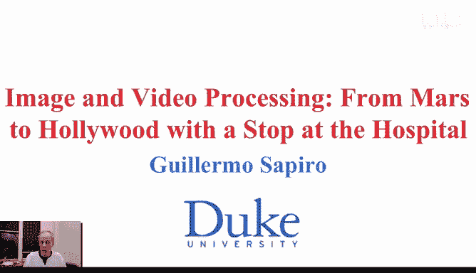

在本节课中，我们将要学习局部平均滤波操作的两个非常有趣且简单的数学性质。这些性质将帮助我们更深入地理解为什么平均操作会使图像变得模糊，以及它背后蕴含的数学原理。

## 最小化平方误差的性质 📉

上一节我们介绍了局部平均滤波的基本概念。本节中我们来看看它的第一个数学性质：平均操作实际上是在最小化局部区域的平方误差。

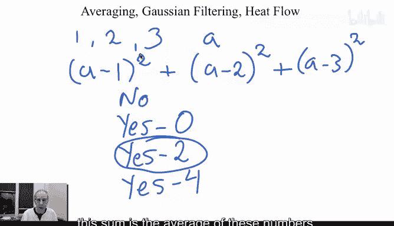

让我们从一个简单的练习开始。假设给你三个数字：1、2 和 3。现在，请你找到一个数字 `a`，使得以下表达式的值尽可能小：

`(a - 1)² + (a - 2)² + (a - 3)²`

这个数字 `a` 是多少？答案是 **2**。因为 2 是这三个数字的平均值。这个性质可以推广到一般情况。

如果给定一组数字 `Aᵢ`，那么使以下平方误差总和最小的数字 `a`，正是这组数字的平均值：

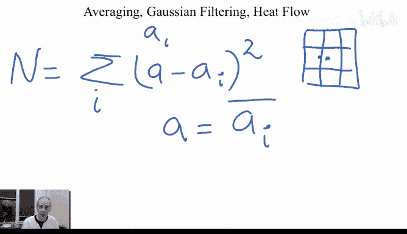

`min Σᵢ (a - Aᵢ)²`

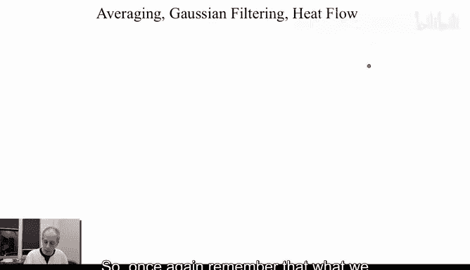

这个 `a` 就是所有 `Aᵢ` 的平均值。证明方法是对表达式关于 `a` 求导，并令导数等于零。

当我们对图像进行一个 3x3 的局部平均操作时，我们实际上是用中心像素周围 9 个像素值的平均值来替换它。根据上述性质，这个平均值正是最小化该 3x3 窗口内所有像素值与新值之间平方误差的那个数字。这是一种最小均方误差（MSE）的思想。

## 与热流方程的等价性 🔥

接下来，我们探讨平均操作的第二个深刻性质：它与物理学中的热扩散（热流）过程是等价的。

我们之前所做的局部平均，在数学上可以看作是一种卷积操作。具体来说，我们可以使用一个高斯滤波器（一种加权平均）对图像 `I(x, y)` 进行卷积。高斯函数具有均值 0 和某个方差 `σ²`。

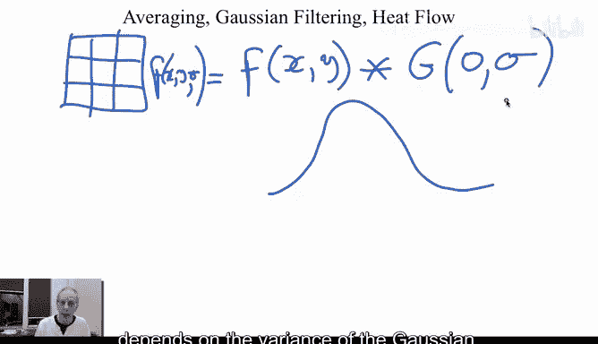

卷积的结果是一个新图像 `I(x, y, σ)`，其模糊程度取决于高斯函数的方差 `σ`。方差越大，图像越模糊。

现在，引入热流方程。它描述的是热量如何随时间在空间中扩散：

`∂F/∂t = ∂²F/∂x² + ∂²F/∂y²`

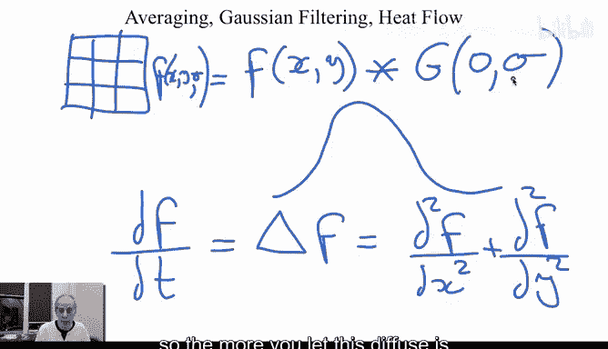

这个方程表示，函数 `F`（在这里可以想象为温度）随时间 `t` 的变化率，等于其在 `x` 方向和 `y` 方向上的二阶导数之和（这被称为拉普拉斯算子）。

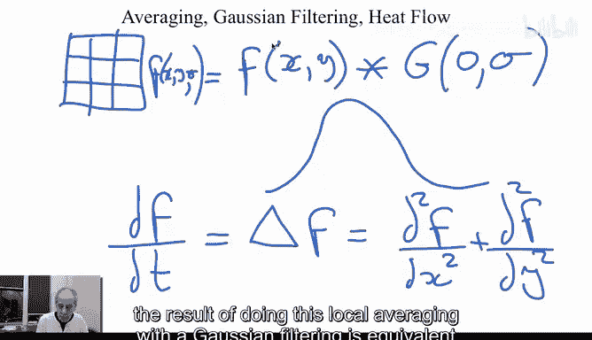

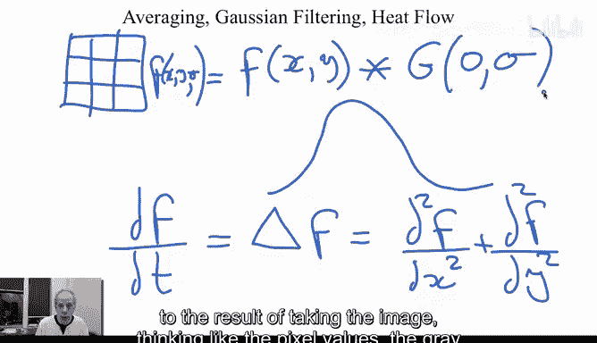

一个非常有趣的事实是：**用高斯滤波器对图像进行模糊，完全等价于将图像的像素灰度值视为“热量”，并让其按照上述热流方程进行扩散。**

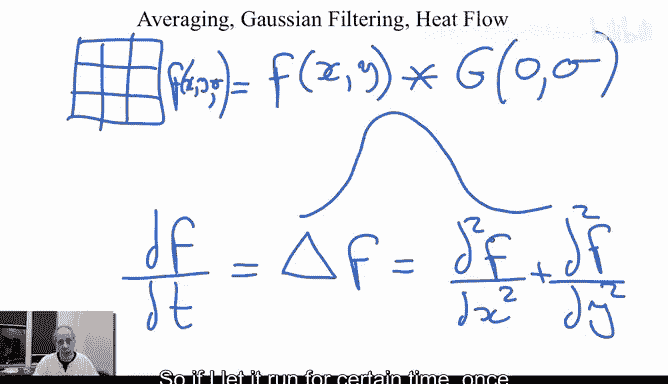

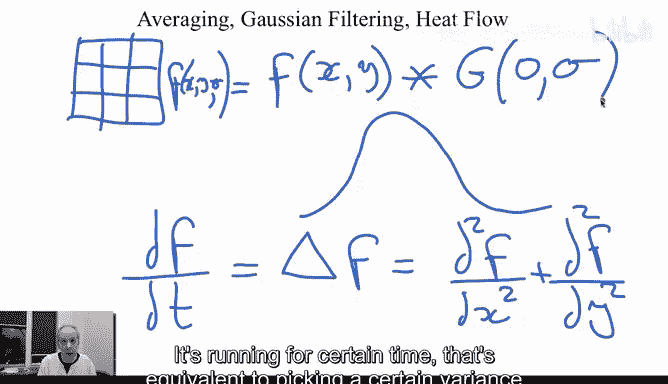

*   扩散的时间 `t` 对应高斯滤波器的方差 `σ²`。时间越长（方差越大），扩散（模糊）得越厉害。
*   这个过程是各向同性的，意味着热量（像素值）均匀地向所有方向扩散。

如果从数学上验证，可以将高斯滤波后的图像表达式 `I(x, y, σ)` 代入热流方程（将 `σ` 视为时间 `t`），你会发现它满足该方程。这是一个线性的扩散过程。

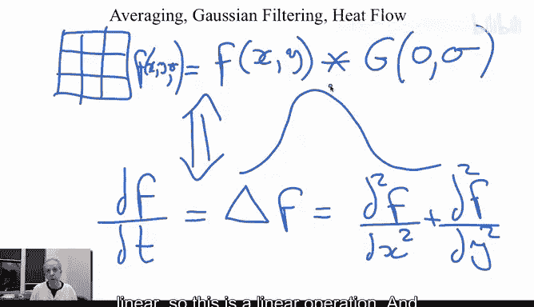

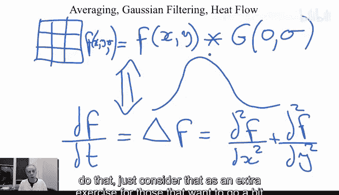

为什么这个性质很重要？因为它为我们打开了新思路。既然标准的平均模糊对应于经典的热扩散方程，那么我们是否可以设计不同的“扩散方程”，来实现更智能的图像处理效果呢？例如，一种能在平滑区域内部的同时，保护图像边缘不被模糊的方程。我们将在后续的课程中探讨这个问题。

## 总结 📝

本节课中我们一起学习了局部平均滤波的两个核心数学性质：

1.  **最小平方误差**：局部平均的结果，是使得该区域内所有像素值与新值之间的平方误差总和最小的那个值。其公式为 `a* = argmin Σ (a - Aᵢ)²`，解为 `a* = mean(Aᵢ)`。
2.  **热扩散等价**：对图像进行高斯滤波（加权平均），在数学上完全等价于将像素灰度视为热量，并让其遵循热流方程 `∂F/∂t = ∇²F` 进行各向同性的扩散。方差 `σ` 控制着扩散的时间或程度。

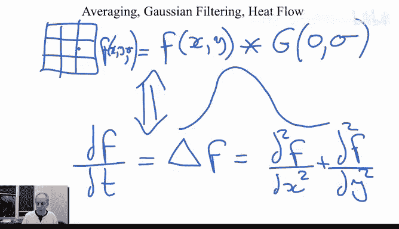

正是由于这种“扩散”特性，平均操作会使得图像中尖锐的细节（如边缘）变得模糊，就像热量从高温点扩散开来，最终使整个区域温度趋于均匀一样。理解了这些原理，将为我们后续学习更高级的、能保持边缘的图像平滑技术打下坚实的基础。