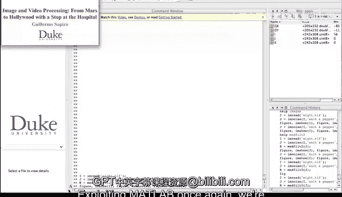
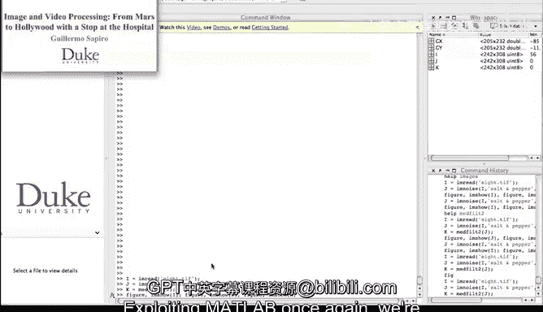
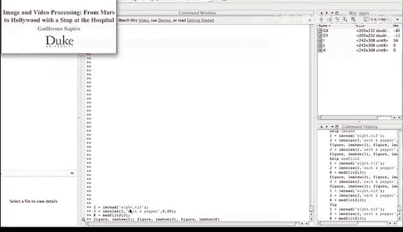
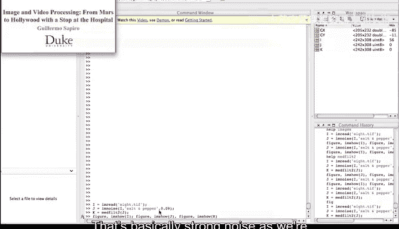
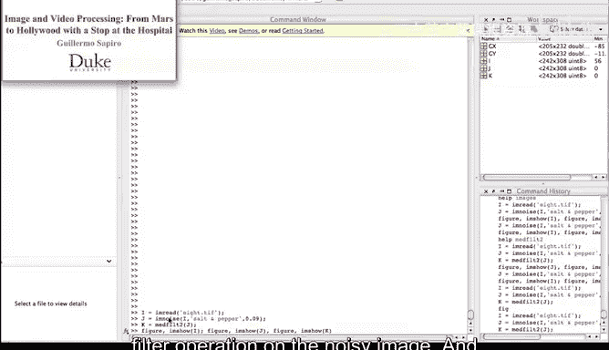
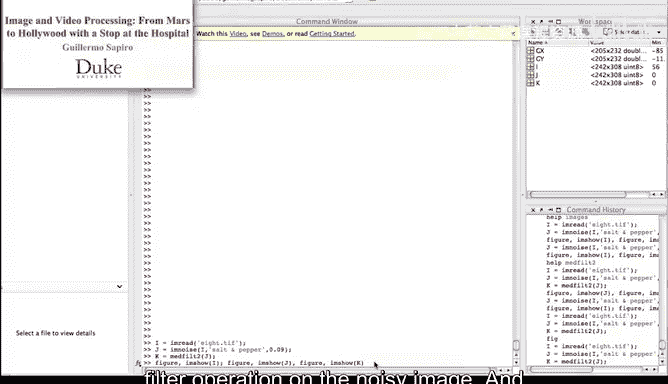

# 025：中值滤波

## 概述
在本节课中，我们将通过一个具体的Matlab演示，学习**中值滤波**如何有效地去除图像中的椒盐噪声。我们将看到原始图像、被噪声污染的图像以及经过中值滤波处理后的图像，并进行对比分析。

## 演示：中值滤波处理椒盐噪声
上一节我们介绍了中值滤波的基本概念，本节中我们来看看它在实际图像处理中的应用效果。我们将利用Matlab创建一个演示，直观展示中值滤波去除椒盐噪声的强大能力。

首先，我们创建三幅图像进行对比。

以下是三幅图像的具体说明：
*   **图像 I**：原始图像。
*   **图像 J**：添加了椒盐噪声的图像。这种噪声表现为随机出现的黑色和白色像素点。
*   **图像 K**：对噪声图像（图像 J）进行中值滤波操作后得到的结果。

现在，让我们来观察这些图像。

（此处为图像展示位置）

我们看到了三幅图像。第一幅图是原始图像。第二幅图是添加了椒盐噪声的图像，我们可以观察到许多黑色的像素点，这些点的像素值从白色被完全改变成了黑色。第三幅图展示了中值滤波的结果。

我认为，对于如此简单的一个滤波器来说，这个效果非常令人印象深刻。它完全去除了我们之前看到的所有噪声。正如我们学习**中值滤波**操作时所知，它的确会使图像变得稍微模糊一些，但它成功地消除了噪声，为我们提供了一幅看起来更加舒适的图像。

## 总结
本节课中，我们一起学习了中值滤波在Matlab环境下的实际应用。通过演示，我们观察到中值滤波能有效去除图像中的椒盐噪声，尽管会带来轻微的模糊效果，但在去噪方面表现优异。这是一个展示简单滤波器强大功能的典型例子。