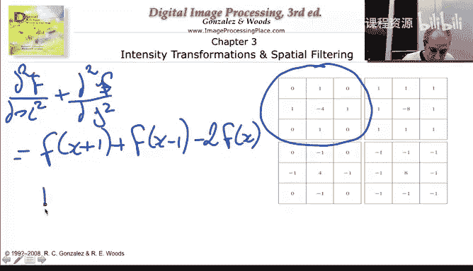
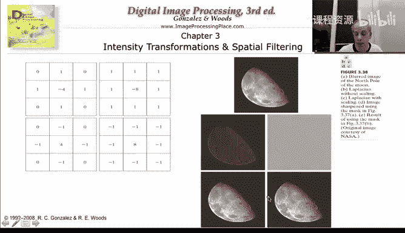
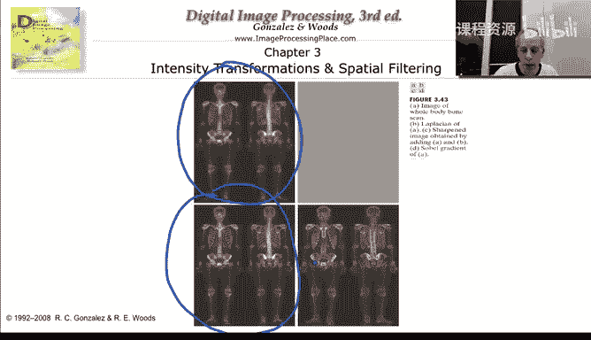
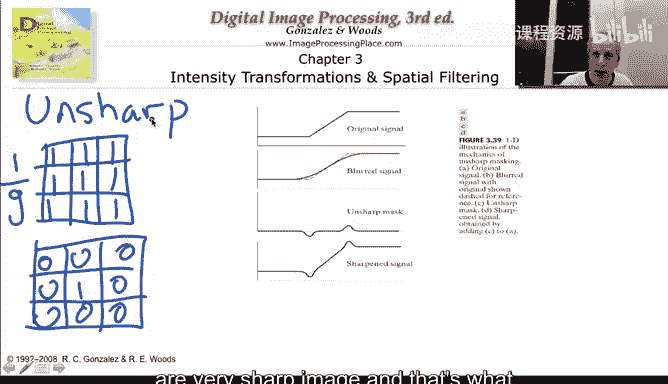

# 026：导数、拉普拉斯算子与反锐化掩模 📐

在本节课中，我们将学习如何通过简单的局部邻域运算来实现图像的导数计算。我们将探讨一阶和二阶导数的概念，了解拉普拉斯算子的作用，并学习一个名为“反锐化掩模”的强大技术，它能显著增强图像的清晰度。这些操作虽然简单，却能产生非常有趣和实用的视觉效果。

## 导数的概念与计算 🧮

上一节我们介绍了局部邻域运算的基本思想。本节中，我们来看看如何利用这些运算来计算图像的导数。导数在连续数学中是一个基本概念，但在数字图像中，我们需要用离散的方法来实现它。

如果我们想计算图像在x方向的一阶导数，可以用一个非常简单的离散公式来表示：

`f(x+1) - f(x)`

这相当于用后一个像素值减去当前像素值。我们可以用一个3x3的卷积核（或掩模）来实现这个操作。在这个核中，我们在对应`f(x+1)`的位置放1，在对应`f(x)`的位置放-1，其余位置为0。y方向的导数可以用类似的方式计算。

为了更直观地理解，让我们看一个一维图像的例子。这个图像包含平坦区域、斜坡和一个尖锐的跳跃。

以下是该图像及其导数的模拟值：
*   **原始图像值**：从平坦的6开始，经过一个递减的斜坡，变为平坦的1，然后发生一个大的跳跃。
*   **一阶导数**：在平坦区域，导数为0。在斜坡区域，导数为负的常数（如-1），表示像素值在均匀下降。在跳跃点，导数出现一个大的正值（如5），然后再次归零。
*   **二阶导数**：它更清晰地标记了图像中发生剧烈变化的位置。在斜坡的起点和终点，以及跳跃点，二阶导数会出现非零值（如1或-1）。

通过导数，我们可以检测图像中的边缘和跳跃，这是图像处理中的一个核心任务。

## 拉普拉斯算子与图像锐化 🔍

我们刚刚看到了一阶和二阶导数。现在，让我们深入探讨一个特殊的二阶导数组合——拉普拉斯算子。

拉普拉斯算子是图像在x方向和y方向的二阶导数之和。它的离散形式可以通过以下公式计算：

`f(x+1, y) + f(x-1, y) + f(x, y+1) + f(x, y-1) - 4 * f(x, y)`

这对应着一个特定的卷积核，中心是-4，上下左右四个邻域是1。还有其他变体，例如使用-8和周围8个1的核，它们增强了差异的对比度。

那么，拉普拉斯算子对图像有什么实际效果呢？一个非常强大的应用是图像锐化。

其过程非常简单：
1.  计算原始图像的拉普拉斯变换。
2.  将得到的拉普拉斯图像（通常经过对比度拉伸）与原始图像相加。

结果令人惊讶：图像的细节变得更加清晰和突出。这是因为拉普拉斯算子突出了图像中快速变化的区域（即边缘），将这些信息加回原图后，边缘就得到了增强。

## 反锐化掩模技术 ✨

理解了拉普拉斯算子的锐化原理后，我们来看一个与之相关且非常著名的技术——反锐化掩模。这是一种实现图像锐化的直观方法。

反锐化掩模的步骤如下：
1.  **平滑图像**：首先，对原始图像进行平滑（模糊）处理。这可以通过一个简单的平均滤波器（例如3x3的全1核，乘以1/9进行归一化）来实现。
2.  **计算掩模**：然后，用原始图像减去模糊后的图像。这个差值图像就是“掩模”，它包含了原始图像中被平滑操作削弱的高频细节（主要是边缘信息）。
3.  **增强图像**：最后，将这个掩模加回到原始图像上。

从卷积核的角度看，原始图像对应中心为1的核，模糊图像对应平均核。它们的差产生了一个类似导数的核（中心为正，周围为负）。将这个结果加回原图，就等效于增强了边界，从而得到更锐利的图像。

## 总结与展望 🎯

本节课中我们一起学习了图像处理中导数的实现与应用。我们了解到：
*   一阶和二阶导数可以通过简单的局部邻域运算（卷积核）来计算。
*   拉普拉斯算子（二阶导数和）能有效检测图像中的变化。
*   将图像的拉普拉斯变换加回原图，可以显著锐化图像，突出细节。
*   反锐化掩模通过“模糊-求差-叠加”的过程，是另一种实现图像锐化的有效方法。

这些操作虽然基础，但它们是许多高级图像处理技术（如边缘检测、特征增强）的基石。在接下来的视频中，我们将通过Matlab演示，直观地观察这些运算如何改变图像，并体验它们带来的有趣效果。