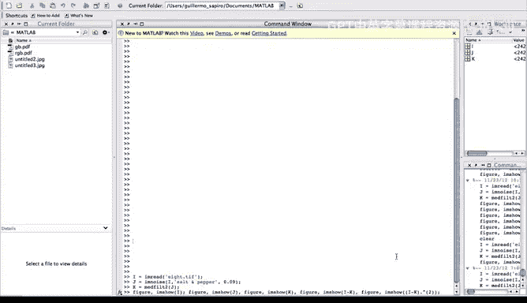
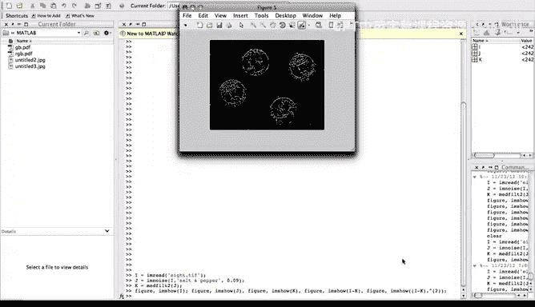
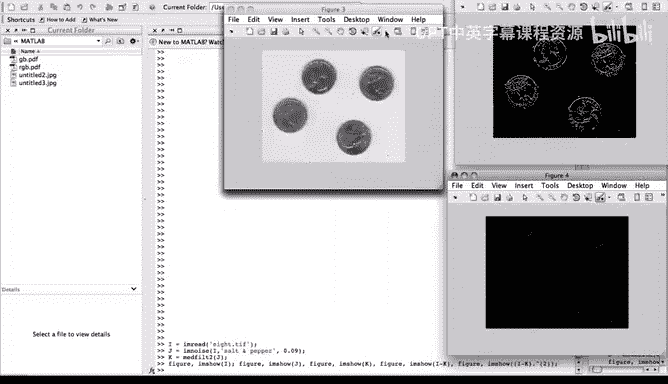

# 027：反锐化掩模演示 🎬

在本节课中，我们将通过一个具体的Matlab演示，来学习如何应用反锐化掩模技术，并回顾中值滤波、椒盐噪声以及直方图拉伸等相关操作。我们将一步步分析代码和结果图像，以理解整个处理流程。

## 概述
我们将使用Matlab演示反锐化掩模的完整过程。首先，我们会读取一张图像并为其添加椒盐噪声。接着，对含噪图像应用中值滤波进行去噪。然后，通过计算原始图像与去噪后图像的差值来获取边缘信息，最后对差值图像进行直方图拉伸以增强视觉效果。

## 图像加载与噪声添加
首先，我们加载Matlab软件包自带的一张图像。随后，我们向这张图像添加椒盐噪声。在代码中，参数`0.09`表示大约有9%的像素会受到噪声污染。“盐”噪声表现为白色像素点，“椒”噪声表现为黑色像素点。

以下是添加椒盐噪声的核心代码描述：
```matlab
noisy_image = imnoise(original_image, 'salt & pepper', 0.09);
```



## 应用中值滤波
接下来，我们对添加了噪声的图像应用中值滤波。这里使用了一个3x3的滤波窗口。中值滤波能有效去除椒盐噪声，但通常会使图像变得略微模糊。





应用中值滤波的核心代码描述：
```matlab
denoised_image = medfilt2(noisy_image, [3 3]);
```

## 计算差值图像
在获得去噪图像后，我们计算原始图像与去噪图像之间的差值。这个差值图像理论上包含了被滤波器平滑掉的细节，主要是图像的边缘和锐利边界。

计算差值图像的核心公式描述为：
**差值图像 = 原始图像 - 去噪图像**

## 直方图拉伸
直接得到的差值图像通常对比度较低，看起来较暗。为了更清晰地观察边缘，我们需要增强其对比度。在本演示中，我们通过对像素值进行平方操作来实现直方图拉伸，这是一种简单的对比度增强方法。

直方图拉伸的核心代码描述：
```matlab
stretched_image = (difference_image).^2;
```

## 结果分析
现在，让我们逐一查看所有生成的图像，并对结果进行分析。

以下是生成的五张图像及其说明：

1.  **原始图像**：未经任何处理的初始图像。
2.  **椒盐噪声图像**：添加噪声后的图像。在明亮背景上可以看到黑色“椒”点，在暗色背景上可以看到白色“盐”点。
3.  **中值滤波结果**：对噪声图像进行3x3中值滤波后的图像。噪声被基本清除，但图像产生了轻微的模糊。
4.  **差值图像**：原始图像与中值滤波结果的差值。它主要包含了图像的边缘信息，但由于直接差值，图像整体较暗。
5.  **拉伸后的差值图像**：对差值图像进行像素值平方（直方图拉伸）后的结果。图像的边缘对比度得到增强，视觉效果更佳。

观察拉伸后的差值图像，我们注意到其中显示的边缘是真实的图像结构边缘，而非噪声产生的伪边缘。这是因为在计算差值前，我们已经应用中值滤博客掉了噪声，从而避免了伪边缘的出现。

## 总结
本节课中，我们一起完成了一个反锐化掩模的完整演示。我们回顾了添加椒盐噪声、使用中值滤波去噪、通过图像差值提取边缘信息，以及利用直方图拉伸增强视觉效果等一系列关键图像处理步骤。这个例子很好地综合了我们所学的多个概念，展示了如何通过组合简单操作来实现有效的图像增强。