# 031：噪声类型

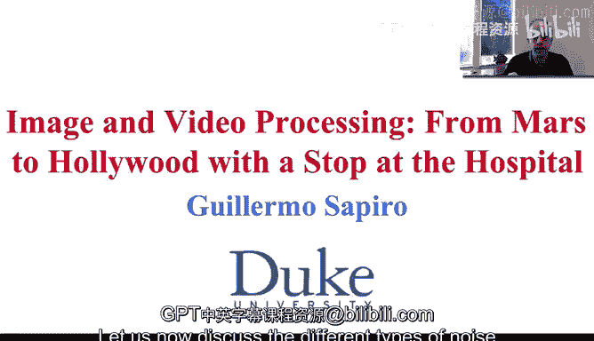

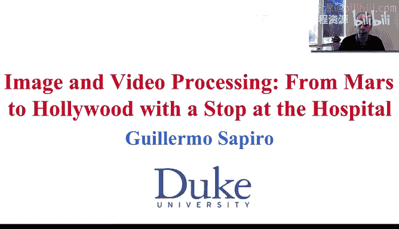

## 概述

在本节课中，我们将学习图像与视频中可能出现的不同噪声类型。我们将通过定义噪声取特定值的概率来理解它们，并探讨每种噪声的数学描述、特性及其在实际系统中的应用场景。

---

## 高斯噪声

上一节我们介绍了噪声的基本概念，本节中我们首先来看看高斯噪声。高斯噪声是最常用的噪声模型之一，其概率密度函数遵循高斯分布。

其概率密度函数的公式如下：

**公式：**
```
p(z) = (1 / (√(2π) * σ)) * exp(-(z - μ)² / (2σ²))
```

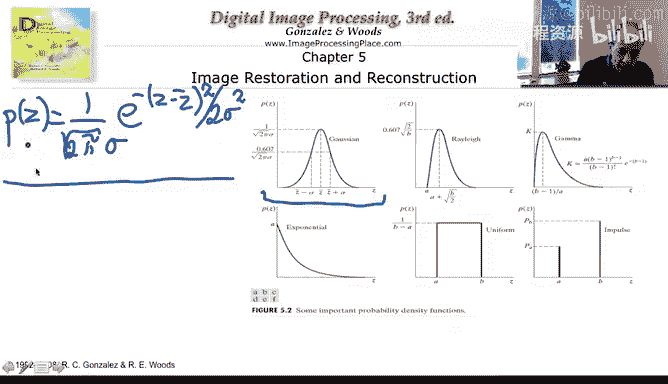

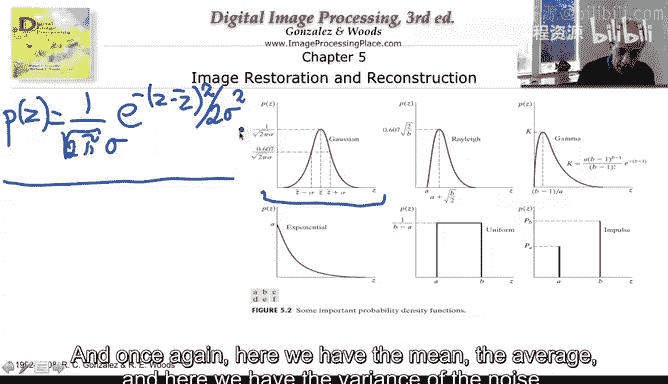

其中，`μ` 是噪声的平均值（均值），`σ` 是噪声的标准差，`σ²` 是方差。

虽然在实际物理系统中很少产生纯粹的高斯噪声，但由于其数学上的易处理性，以及对其他类型噪声（尤其是在观察图像小区域或像素值时）的良好近似能力，它在图像与视频处理领域被广泛使用。

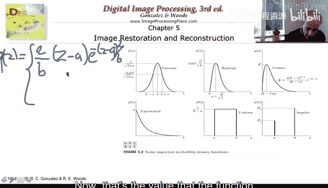

---

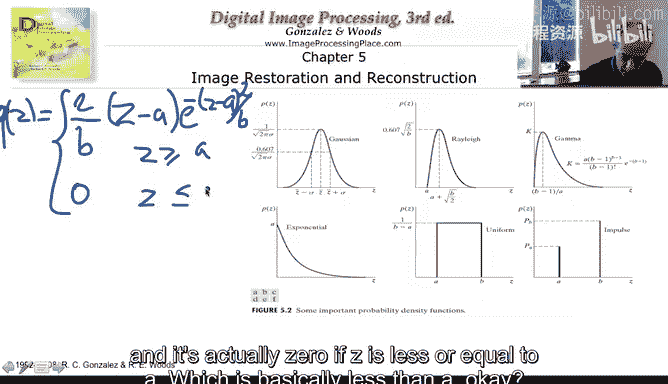

## 瑞利噪声

与高斯噪声不同，瑞利噪声确实会出现在真实的物理系统中。它的概率密度函数公式稍长，但结构清晰。

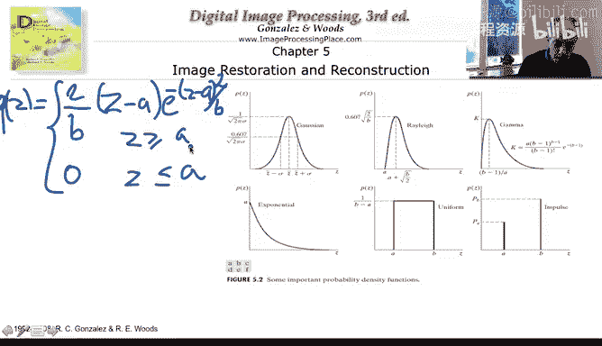

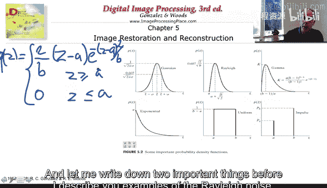

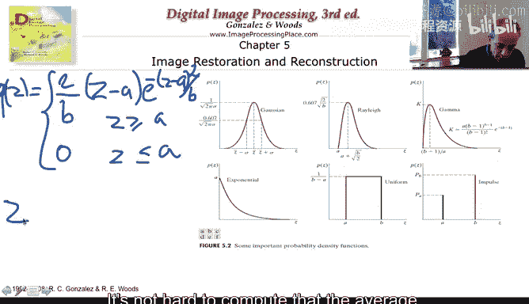

其概率密度函数的公式如下：

**公式：**
```
p(z) = (2/B) * (z - a) * exp(-(z - a)² / B)  当 z ≥ a
p(z) = 0                                      当 z < a
```

该公式包含两个参数 `B` 和 `a`。以下是其重要统计量：

*   **平均值：** `μ = a + √(πB / 4)`
*   **方差：** `σ² = B(4 - π) / 4`

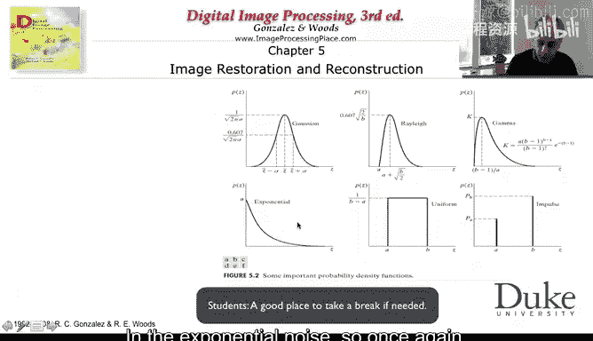

以下是瑞利噪声的一些典型应用场景：
*   用于模拟磁共振成像中某些区域的噪声。
*   也常用于水下成像等领域。

因此，瑞利噪声是描述这些真实物理设备中噪声的优良模型。

---

## 指数噪声与均匀噪声

接下来，我们讨论指数噪声和均匀噪声。这两种噪声模型与图像处理中的特定操作密切相关。

### 指数噪声

指数噪声的概率密度函数定义如下：

**公式：**
```
p(z) = a * exp(-a*z)   当 z ≥ 0
p(z) = 0               当 z < 0
```

其重要特性是噪声值没有负数。其统计量为：
*   **平均值：** `μ = 1 / a`
*   **方差：** `σ² = 1 / a²`

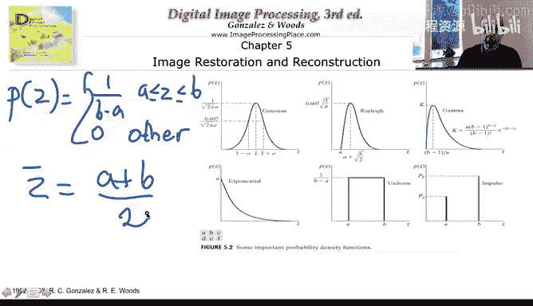

### 均匀噪声

均匀噪声的概率密度函数定义如下：

**公式：**
```
p(z) = 1 / (b - a)   当 a ≤ z ≤ b
p(z) = 0             其他情况
```

其统计量计算如下：
*   **平均值：** `μ = (a + b) / 2`
*   **方差：** `σ² = (b - a)² / 12` （此计算将作为第4周的测验题目之一）

以下是这两种噪声的应用场景：
*   **均匀噪声** 是量化噪声的优良模型。当我们对图像进行量化时，将一个区间内的所有值用一个代表值（如区间中点）表示，所产生的误差常被建模为均匀噪声。
*   **指数噪声** 有时也用于模拟量化噪声，但更常见的是用于模拟**预测编码中的误差**。例如，在用于火星探测车的JPEG标准中，就使用指数模型来描述预测编码的误差。

这引入了一个新概念：噪声不仅可能来自设备（如相机传感器），也可能源于我们对图像进行的操作（如量化或预测编码）。

---

## 脉冲噪声（椒盐噪声）

最后，我们来了解脉冲噪声，它通常用图像来描述比用公式更直观。

脉冲噪声，也称为椒盐噪声，其特点是：以一定的概率将像素值完全改变为某个特定值。

其基本思想如下：
*   以概率 `P_salt` 将像素变为白色（“盐”）。
*   以概率 `P_pepper` 将像素变为黑色（“椒”）。

这与之前讨论的噪声类型有显著不同。高斯噪声会影响图像中的每一个像素，而脉冲噪声只以一定概率影响部分像素，但一旦影响，就会将其彻底变为白色或黑色。

这种噪声可以模拟传感器缺陷。例如，相机中某个像素点损坏，导致始终输出黑色信号，这就形成了“椒”噪声。

---

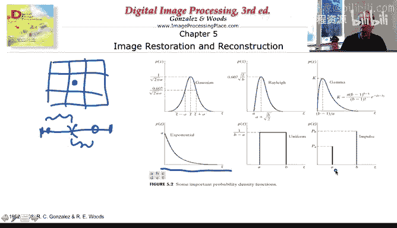

## 总结

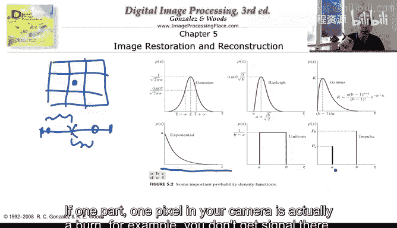

本节课中我们一起学习了图像与视频处理中常见的几种噪声类型：
1.  **高斯噪声**：数学上易于处理，是许多算法的基础模型。
2.  **瑞利噪声**：出现在磁共振成像、水下成像等真实物理系统中。
3.  **指数与均匀噪声**：常用于模拟量化、预测编码等图像处理操作引入的误差。
4.  **脉冲（椒盐）噪声**：模拟传感器缺陷或随机像素值突变。

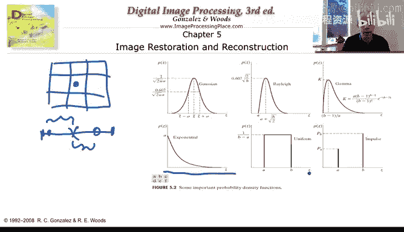

每种噪声模型都有其独特的特性和应用价值。在接下来的课程中，我们将学习如何估计这些噪声的参数，这对于图像恢复等任务至关重要。