# 032：噪声类型

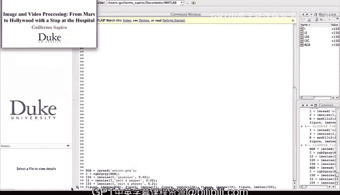

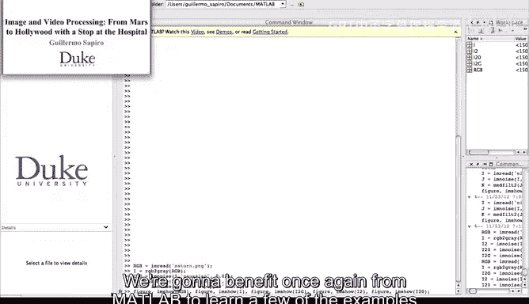

在本节课中，我们将通过Matlab演示，直观地了解上一节视频中介绍的不同类型的图像噪声。我们将加载一张图像，并为其添加高斯噪声和椒盐噪声，以观察它们对图像视觉效果的差异。

## 加载与预处理图像

首先，我们需要加载一张图像。我们将使用Matlab软件包自带的一张彩色RGB图像。

以下是加载图像并将其转换为黑白图像的代码：
```matlab
% 加载Matlab自带的彩色图像
originalImage = imread('peppers.png');
% 将彩色图像转换为灰度图像（仅保留亮度分量）
grayImage = rgb2gray(originalImage);
```
通过上述操作，我们得到了原始彩色图像的黑白版本，后续的噪声添加将基于这张灰度图像进行。

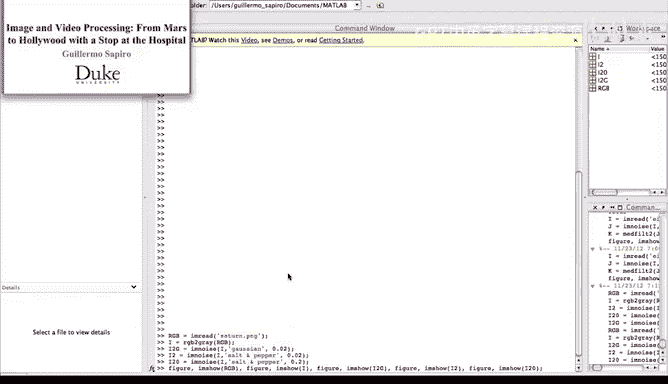

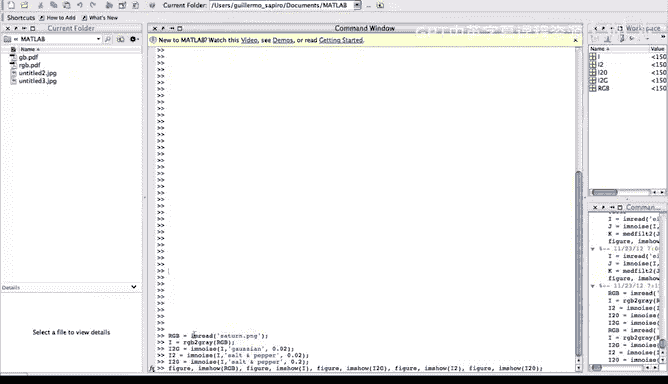

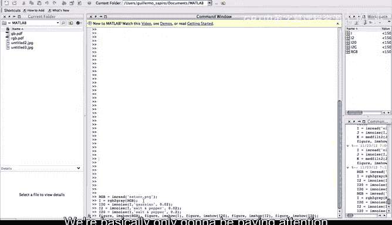

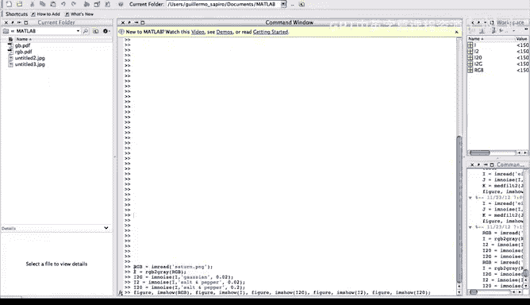

## 添加高斯噪声

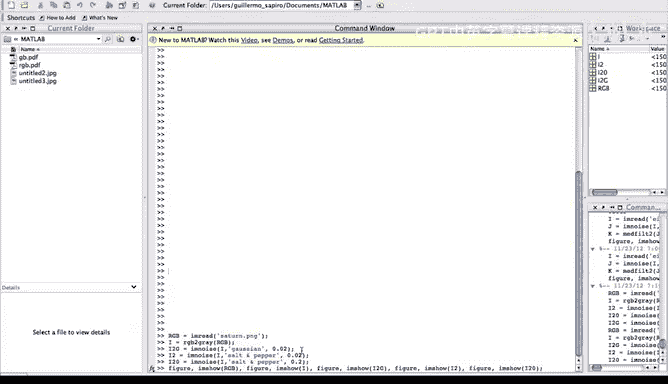

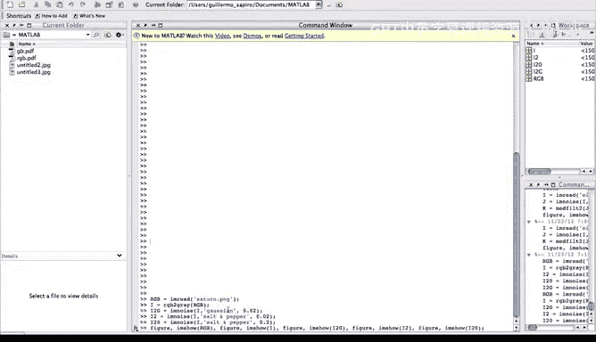

上一节我们介绍了高斯噪声的理论，本节中我们来看看它在图像上的实际表现。高斯噪声的特点是，图像中的**每一个像素**都会受到一个服从高斯分布的随机值的影响。

以下是添加高斯噪声的代码：
```matlab
% 为灰度图像添加方差为2的高斯噪声
gaussianNoiseImage = imnoise(grayImage, 'gaussian', 0, 2);
```
在这行代码中，`0`代表噪声的均值，`2`代表噪声的方差。方差越大，噪声的强度就越高。

## 添加椒盐噪声

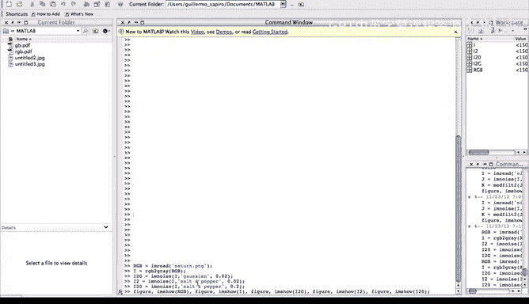

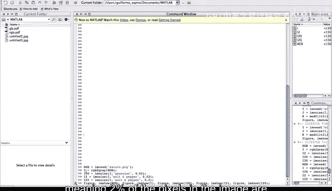

接下来，我们演示椒盐噪声。与影响所有像素的高斯噪声不同，椒盐噪声只随机影响图像中**特定百分比**的像素，并将其值置为纯黑或纯白。

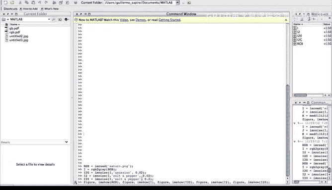

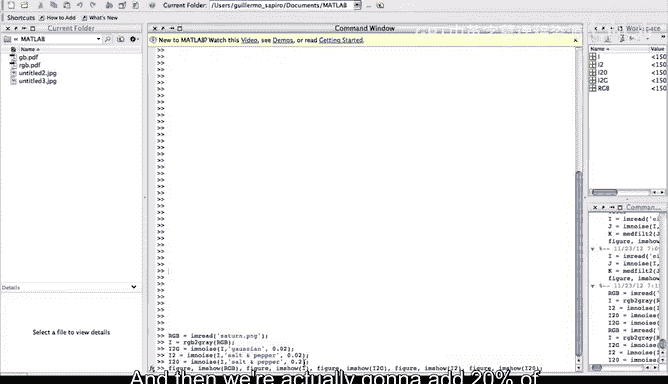

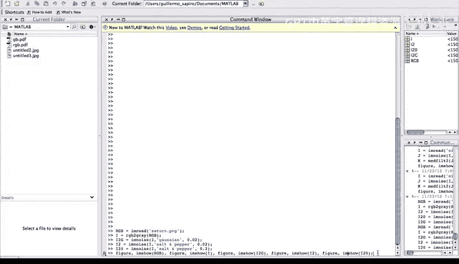

以下是添加不同密度椒盐噪声的代码：
```matlab
% 添加密度为2%的椒盐噪声
saltPepper2Percent = imnoise(grayImage, 'salt & pepper', 0.02);
% 添加密度为20%的椒盐噪声
saltPepper20Percent = imnoise(grayImage, 'salt & pepper', 0.20);
```
参数 `0.02` 和 `0.20` 分别代表2%和20%的像素会受到噪声影响。

## 结果展示与对比分析

现在，我们将所有生成的图像加载并显示出来，以便进行直观对比。

以下是显示所有图像的代码：
```matlab
figure;
subplot(2,3,1), imshow(originalImage), title('原始彩色图像');
subplot(2,3,2), imshow(grayImage), title('灰度图像');
subplot(2,3,3), imshow(gaussianNoiseImage), title('添加高斯噪声');
subplot(2,3,4), imshow(saltPepper2Percent), title('添加2%椒盐噪声');
subplot(2,3,5), imshow(saltPepper20Percent), title('添加20%椒盐噪声');
```

观察这些图像，我们可以得出以下结论：

1.  **高斯噪声图像**：整幅图像都呈现出一种细微的颗粒感或模糊感，因为每个像素都添加了随机扰动。
2.  **2%椒盐噪声图像**：图像中零星散布着一些纯白和纯黑的像素点，但大部分区域保持原状。
3.  **20%椒盐噪声图像**：图像中出现了大量黑白斑点，原始图像内容被严重破坏。

通过对比可以清晰看到，高斯噪声均匀地降低了图像的整体质量，而椒盐噪声则表现为分散的、极端的像素值突变。

## 总结

本节课中我们一起学习了如何用Matlab为图像添加高斯噪声和椒盐噪声，并通过可视化结果对比了它们的特性。高斯噪声由**方差**参数控制强度，影响所有像素；椒盐噪声由**密度**参数控制，只随机改变部分像素为极值。理解这些噪声类型是进行图像去噪和恢复的第一步。