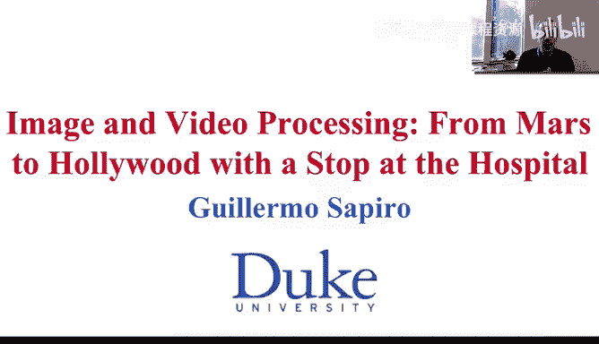
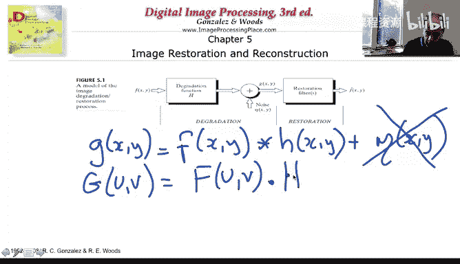
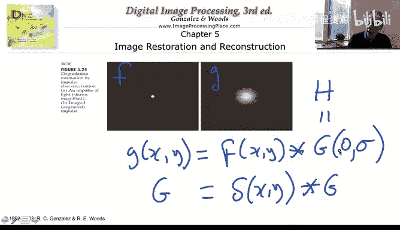
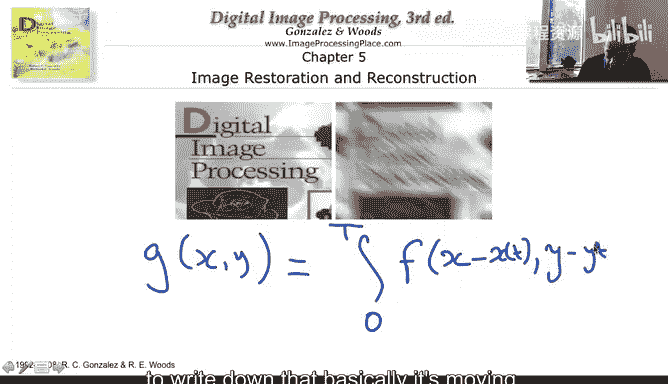
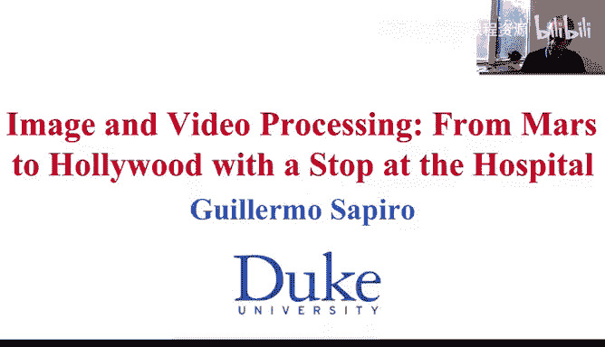

# 035：退化函数



## 概述
在本节课中，我们将学习图像复原中的核心概念——退化函数。我们将了解图像退化的数学模型，探讨如何估计导致图像模糊的滤波函数，并介绍高斯模糊和运动模糊这两种常见的退化类型。

## 图像退化模型回顾
上一节我们重点讨论了噪声。本节中，我们来看看图像退化中的另一个关键部分：滤波。



我们讨论的完整退化模型包含两个步骤：首先对图像进行滤波，然后添加噪声。到目前为止，我们主要考虑了只有噪声的情况。而更一般的情况是，观测到的图像 `G(x, y)` 由原始图像 `F(x, y)` 与一个退化函数 `h(x, y)` 卷积，再加上噪声 `η(x, y)` 构成。

其数学公式表示为：
```
G(x, y) = F(x, y) * h(x, y) + η(x, y)
```
其中，`*` 表示卷积运算，`η(x, y)` 是我们之前讨论过的随机噪声变量。

## 估计退化函数的重要性
我们已经了解了如何估计噪声。现在让我们讨论如何估计这个模糊函数 `h`。这比估计噪声要困难得多。

为什么估计 `h` 如此重要？让我们通过一个非常简单的公式来说明。为此，我们暂时假设图像中没有噪声。

我们对上述无噪声的退化模型进行傅里叶变换。在傅里叶域中，卷积运算会转变为乘法运算。因此，我们得到：
```
G(u, v) = F(u, v) · H(u, v)
```
其中，`G(u, v)`、`F(u, v)` 和 `H(u, v)` 分别是 `G(x, y)`、`F(x, y)` 和 `h(x, y)` 的傅里叶变换。

观察这个公式，如果我们想复原原始图像，我们可以进行除法运算：
```
F(u, v) = G(u, v) / H(u, v)
```
如果我们能够估计出退化函数 `H(u, v)`，那么理论上，我们只需对观测图像进行傅里叶变换，除以估计出的 `H(u, v)`，再进行逆傅里叶变换，就能得到原始图像。这种方法被称为**逆滤波**。

逆滤波存在一些根本性问题，特别是在现实场景中，`H(u, v)` 在某些频率 `(u, v)` 上可能为零或非常接近零，导致除法运算不稳定。但核心思想非常明确：如果我们掌握了退化函数的知识，就可以尝试逆转它。因此，估计退化函数至关重要。

## 退化函数的估计挑战
如前所述，估计退化函数 `h` 非常困难，比估计噪声要难得多。卷积运算具有交换性，即 `F * h = h * F`。这带来了一个基本的模糊性：我们无法确定观测到的模糊，究竟是由于原始图像是一个点（δ函数）被一个高斯函数模糊了，还是原始图像本身就是一个高斯函数被一个点（无模糊）卷积的结果。这种模糊性是我们估计滤波函数时面临的另一个挑战。

通常，我们需要为图像和滤波函数假设特定的模型。下面我们来看两个可以实际估计退化函数的例子，以及现实中常见的 `h` 函数类型。

## 常见退化类型：高斯模糊
第一种常见的退化是**模糊**。模糊意味着观测到的图像 `G` 是原始图像 `F` 与一个高斯函数卷积的结果。



高斯函数的一般形式是一个二次指数函数，我们在讨论噪声时已经见过。它会模糊我们的图像。

如果你知道影响观测的高斯函数，并且知道原始图像 `F` 实际上是一个点（即δ函数），那么在这个非常特殊的情况下，你可以估计出模糊函数。因为卷积的一个简单性质是：如果 `F` 是δ函数，那么 `G` 就等于 `h`，即高斯函数本身。

这听起来可能有点不切实际：我们怎么知道原始图像中有一个点（δ函数）呢？实际上，这在系统校准时非常有用。如果我们知道相机存在模糊，我们可以人为地拍摄一张包含点光源（近似δ函数）的图像，然后根据观测到的模糊来估计相机的模糊函数。这对于校准和了解相机行为非常重要。

高斯模糊也是一个常用于模拟**大气湍流**的模型。例如，NASA提供的图像展示了同一场景在不同湍流强度下的效果，从湍流较强（更模糊）到湍流较弱（更清晰），可以清楚地观察到模糊效应。



## 常见退化类型：运动模糊
另一种常见的模糊是**运动模糊**。运动模糊的基本原理是：当你拍摄照片时，相机传感器会在一段积分时间内收集光线。如果物体在这段时间内移动，你就会得到一张模糊的照片。

从数学上看，观测到的图像 `G` 是原始图像 `F` 在运动轨迹上的积分。假设物体在曝光时间 `T` 内沿路径 `(x(t), y(t))` 运动，那么：
```
G(x, y) = ∫_0^T F(x - x(t), y - y(t)) dt
```
这相当于将原始图像沿运动路径进行多次平移并叠加起来。

如果我们对上述方程两边进行傅里叶变换，并利用傅里叶变换的平移性质，我们同样可以将运动模糊表示成 `G = F * h` 的卷积形式。这里的滤波函数 `h` 取决于物体的运动速度。物体不动，则没有模糊；运动越快，模糊越严重。

同样，这引出了估计的难题：如何从一堆图像的叠加（观测结果 `G`）中，分离出原始图像 `F` 和运动模糊效应 `h`？这绝非易事。就像我给你一个数字5，并告诉你它是两个数字的和，你无法确定原始的两个数字是什么，除非我给你更多信息。我们将在后续几周讨论更高级的图像复原主题（如稀疏建模）时，再回到这个问题。

## 总结
本节课我们一起学习了图像复原中的退化函数。

*   我们回顾了包含滤波和噪声的完整图像退化模型。
*   我们理解了估计退化函数 `h` 对于逆转模糊、复原图像至关重要，其核心思想是逆滤波。
*   我们认识到估计 `h` 非常困难，部分原因在于卷积运算的模糊性。
*   我们探讨了两种常见且重要的退化类型：**高斯模糊**（常用于模拟光学模糊或湍流）和**运动模糊**（由物体与相机相对运动导致）。
*   我们了解到，尽管估计困难，但通过系统校准（如使用点光源）可以为特定情况估计退化函数。



高斯去模糊和运动去模糊（即逆转这些模糊的过程）是图像处理中极其重要的问题。接下来，我们将学习一种同时处理模糊和噪声的复原方法——**维纳滤波**，这将是下节课的内容。