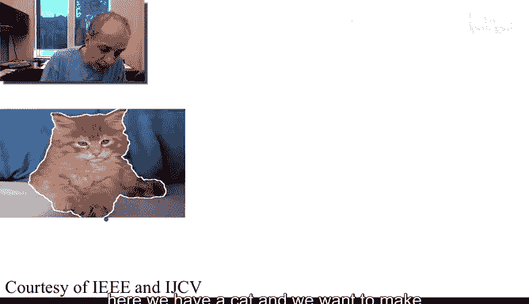
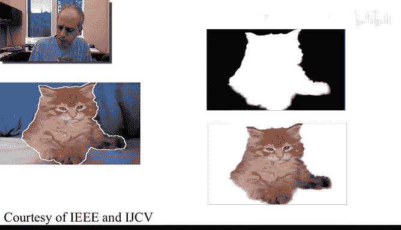
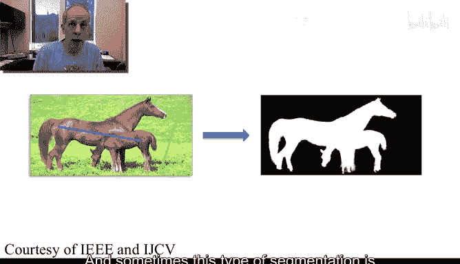
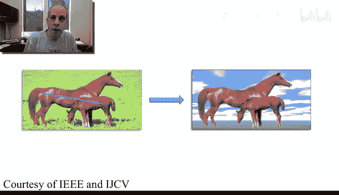
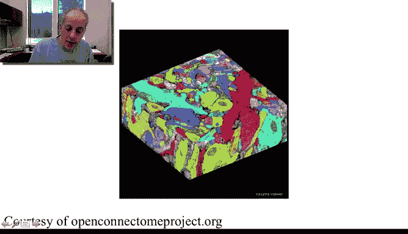

# 039：图像分割导论

在本节课中，我们将要学习图像分割的基本概念。图像分割是图像处理中一个非常有趣且重要的领域，它旨在将图像中的不同对象或区域分离开来。

## 概述

欢迎来到我们图像与视频处理课程的第五周。本周的内容非常有趣且令人兴奋。首先，图像与视频分割本身就是一个充满乐趣的主题。其次，从本周开始，我们将从基础内容过渡到更高级的内容。基础内容是指日常处理中不可或缺的核心知识，而高级内容则是近年来发展起来、同样极其有用，并且常常构成当今工业界图像与视频后处理重要产品组成部分的技术。

现在，让我们开始学习图像分割。正如之前所说，这会非常有趣。

## 什么是图像分割？

我们首先需要回答这个问题：什么是图像分割？我们将通过几个例子来阐述。

图像分割的基本思想是分离对象。我们希望根据对象的某些属性，用不同的名称来标识不同的对象。

例如，这里有一只猫，我们的目标是找到这只猫的边界，从而将猫从背景中分离出来。这里，我们成功地将图像中的对象（猫）与背景分离开。

## 用户交互式分割

有时，用户会帮助我们进行分割。例如，用户可以标记出前景（我关心的对象）和背景（我不关心的对象），只需两个非常简单的标记。

基于此，我们需要开发一种技术来将对象（例如马）从背景中提取出来。这种类型的分割有时被称为**前景-背景分离**。

一旦完成分离，我们就可以做很多事情，比如更换背景——这在电影工业中非常常见，用于改变不同场景的背景。

## 全图像素标注

有时，我们需要的是对图像中发生的所有内容进行标注。例如，在这张使用电子显微镜技术（我们将在课程最后一周讨论）拍摄的神经元图像中，我们的目标是为每个像素分配一个标签，标明它属于哪个类别。

本质上，我们是在为图像着色，表明所有具有相同标签的区域属于同一类别、同一类型的对象或组织。这里我们不是简单地从背景中减去前景，而是对图像的每一个区域进行标注，从而得到所有这些分割区域，以便进行后续分析。

## 视频分割

同样的问题也存在于视频处理中。这里有一个我们在课程最开始就已经看过的视频示例。

让我们播放它。我们有一个原始视频，以及另一个具有不同背景的相似视频。为了实现这种效果，我们必须从视频中提取出主要对象。这样，我们就能为该视频生成一个不同的背景。

这背后正是Adobe公司一款重要产品 **After Effects** 中一个核心组件所采用的技术。我们将在后续课程中学习这项用于After Effects视频分割的底层技术。

## 总结

本节课中，我们一起学习了图像分割的基本概念。我们通过几个例子了解了图像分割的目标：分离对象、进行前景-背景分离、对全图进行像素级标注，以及在视频中的应用。这些只是图像与视频分割问题的一些示例。

现在，我们需要学习如何解决所有这些非常有趣的图像与视频分割问题。我们将在下一个视频中正式开始学习具体的技术方法。