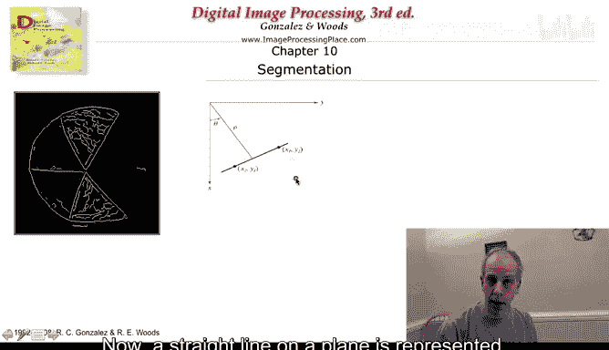
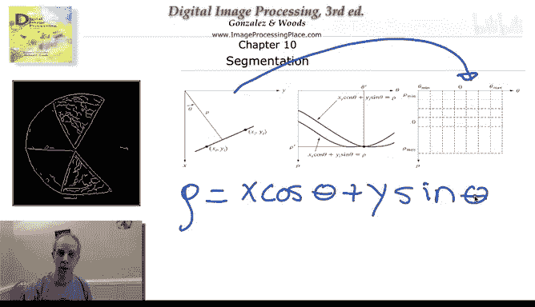
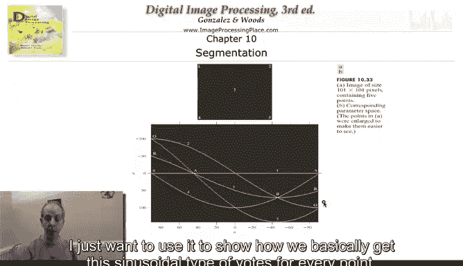
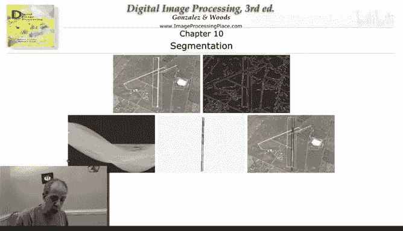
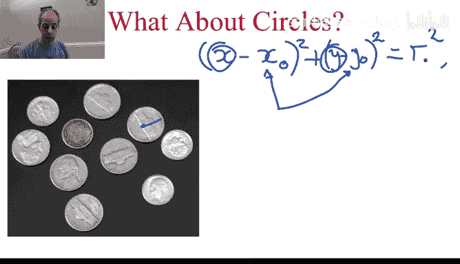

# 041：霍夫变换与MATLAB演示 🎯

在本节课中，我们将要学习一种强大的图像处理技术——霍夫变换。它是一种用于检测图像中特定形状（如直线、圆等）的经典方法。我们将从基本原理开始，逐步理解其工作机制，并通过MATLAB演示来直观地感受其应用效果。

## 霍夫变换的基本思想

上一节我们介绍了边缘检测，本节中我们来看看如何利用形状的先验知识来检测目标。霍夫变换允许我们将已知形状（例如直线或圆形）的信息整合到检测和分割技术中。

霍夫变换的基本思想相当简单。我们将从如何检测直线开始讲解，然后再扩展到圆形检测，因为从直线开始理解会容易得多。

### 直线的参数化表示

在平面几何中，我们学过如何表示平面上的直线。图像平面是XY坐标系，直线上的点满足以下方程：

**ρ = x cosθ + y sinθ**

其中：
*   **ρ** 是坐标系原点到直线的垂直距离。
*   **θ** 是原点到直线的垂线与X轴之间的夹角。

直线上的每一个点都满足这个方程。

### 投票机制：从点到线

霍夫变换的核心思想是“投票”。以下是其工作原理：

1.  **边缘点作为输入**：首先对图像进行边缘检测，得到一系列边缘点。
2.  **点的无限可能性**：对于每一个边缘点，理论上都有无数条直线可以穿过它。每一条可能的直线都对应一组特定的 **(ρ, θ)** 参数。
3.  **离散化参数空间**：在计算机中，我们将连续的 **(ρ, θ)** 参数空间进行离散化（例如，θ 每1度一个间隔，ρ 每1像素一个间隔），形成一个称为“累加器”的二维数组。
4.  **投票过程**：对于每一个边缘点 (x, y)，我们遍历所有离散的 θ 值。对于每一个 θ，根据公式 **ρ = x cosθ + y sinθ** 计算出一个 ρ 值。然后，在累加器中对应的 **(ρ, θ)** 单元格投上一票。
5.  **寻找峰值**：如果多个边缘点位于同一条实际存在的直线上，那么它们都会为这条直线对应的 **(ρ, θ)** 参数组投票。因此，在累加器中，真实直线对应的单元格会获得很高的票数（形成一个峰值）。
6.  **检测直线**：最后，我们在累加器中寻找票数超过一定阈值的峰值。每一个峰值就对应图像中的一条检测到的直线，其参数由峰值的坐标 **(ρ, θ)** 给出。

通过这种方式，霍夫变换将图像空间中的直线检测问题，转化为了参数空间中的峰值寻找问题。

## MATLAB 演示：直线检测 🖥️

现在，让我们通过一个MATLAB示例来直观地理解整个流程。以下是核心步骤的概述：

1.  **读取与预处理图像**：首先读入图像，可能进行旋转以证明算法能检测任意角度的直线。
2.  **边缘检测**：使用Canny等边缘检测器获取图像的边缘点。
3.  **霍夫变换**：调用MATLAB的 `hough` 函数，根据边缘点生成 **(ρ, θ)** 累加器。
4.  **寻找峰值**：在累加器中寻找局部最大值，这些就是候选直线的参数。
5.  **提取并绘制直线**：根据找到的 **(ρ, θ)** 参数，在原始图像上绘制出检测到的直线。为了得到线段而非无限长的直线，可以沿检测到的直线搜索，只保留那些附近有实际边缘点的部分。

运行演示后，我们可以看到：
*   原始图像和边缘检测结果。
*   生成的累加器图像，其中的亮点（峰值）对应检测到的直线。
*   最终结果图中，绿色的线段被准确地叠加在原始图像的直线上。

这个演示清晰地展示了从图像到边缘，再到参数空间投票，最后回到图像空间绘制结果的完整管线。

## 扩展到圆形检测 ⭕

理解了直线检测后，我们可以将霍夫变换的思想推广到圆形检测。原理完全相同，只是参数变得更多。

一个圆可以用以下方程表示：

**(x - a)² + (y - b)² = r²**

其中：
*   **(a, b)** 是圆心的坐标。
*   **r** 是圆的半径。

现在我们需要找到三个参数 **(a, b, r)**。因此，我们的累加器将是一个三维空间。

以下是检测流程：
1.  对图像进行边缘检测。
2.  对于每一个边缘点 (x, y)，我们遍历所有可能的圆心坐标 (a, b) 和半径 r。
3.  对于每一组 (a, b, r)，检查它是否满足圆的方程（即该点是否在以 (a, b) 为圆心、r 为半径的圆上）。如果是，则在三维累加器对应的 (a, b, r) 单元格投票。
4.  在三维累加器中寻找票数高的峰值，每一个峰值就对应图像中检测到的一个圆。

在实际应用中，我们可以根据先验知识限制参数范围（例如，圆心的可能位置、半径的大小范围），以降低计算量。通过这种方法，霍夫变换可以有效地从边缘图像中找出圆形物体。

## 总结与拓展

本节课中我们一起学习了霍夫变换这一重要的形状检测技术。

*   **核心思想**：通过将图像空间中的点映射到参数空间进行投票，将形状检测问题转化为参数空间中的峰值搜索问题。
*   **直线检测**：使用 **(ρ, θ)** 参数空间，通过二维累加器实现。
*   **圆形检测**：使用 **(a, b, r)** 参数空间，通过三维累加器实现。
*   **优点**：对于直线、圆、椭圆等能用少量参数描述的简单形状，霍夫变换非常有效且鲁棒。
*   **局限性**：参数数量越多，累加器的维度和计算量就越大，对内存和计算时间的要求也越高。因此，它通常适用于参数较少的形状。

霍夫变换可以推广到任何能用参数方程描述的曲线（如抛物线）。它是一种基于投票的通用框架，是计算机视觉中基础而强大的工具之一。