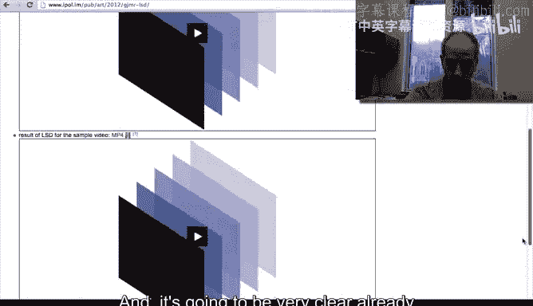
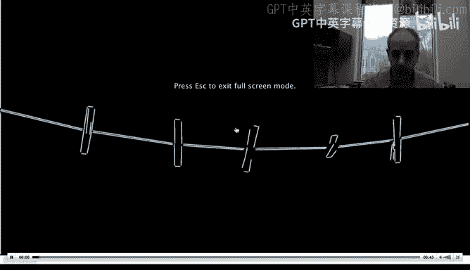
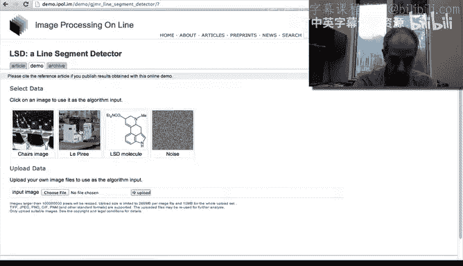

# 042：42_05_04_4-线段检测器与演示 📏

在本节课中，我们将学习一种用于检测图像中连贯线段的算法，即线段检测器。我们将通过在线演示直观地理解其工作原理，并与之前讨论的局部边缘检测方法进行对比。

上一节我们介绍了霍夫变换作为一种整合局部边缘计算的方法。本节中，我们来看看另一种技术：线段检测器。

## 线段检测器简介 🧠

线段检测器是作者描述的一种技术，其核心目标是生成图像中连贯的线段或曲线，而不是仅仅依赖像梯度这样的局部边缘检测器。其基本思想在于整合局部信息，以形成对场景中重要结构的全局理解。

## 在线演示观察 🎥

为了直观理解，我们可以使用图像处理在线网站的工具进行演示。以下是演示过程的观察结果。

首先，我们观看一段网站提供的视频。视频清晰地展示了算法的效果。

视频中，我们可以看到图像周围出现了边缘。

现在你看到的是边缘。基本上，图像周围都显示出了边缘。效果非常出色。你正在观看一段视频，视频中的曲线非常连贯。我们没有看到梯度在帧与帧之间跳跃，并且能够真正理解场景中发生的事情。这里有一个人在挂字母。我们甚至可以读出这些字母，效果非常清晰。这得益于贯穿场景的连贯曲线，我们得到了对场景的清晰描绘。

## 静态图像示例分析 🖼️

接下来，我们通过几个静态图像的示例来进一步说明。和以往一样，我们运行实时演示。

我们点击演示按钮，然后选择一张图片。这里有一张椅子的图片。

我让算法运行它。这是运行结果。我将画面向下滚动。然后我们看到了输出和输入图像。再次强调，输出结果清晰地展示了场景中的内容。

我们基本上可以看到描述场景中物体的非常清晰的曲线。

让我们再看一个例子。这非常有趣。我们再用一个额外的例子来说明发生了什么。

我们选择这张图片并运行算法。再次向下滚动。

然后我们可以看到输出和输入图像。从输出图像，基本上从这个算法找到的连贯线条中，我们可以看到建筑物，可以理解场景中的基本物体。这是因为算法整合了场景中重要的曲线信息。

## 总结与展望 🔮

本节课中我们一起学习了线段检测器。它是一种通过整合局部计算来生成图像中连贯曲线的方法，相比单纯的局部梯度检测，能提供更稳定、更具语义的结构信息。

在未来的视频中，我们将会看到其他基于“主动轮廓”的技术，它们同样通过整合局部行为来为图像提供连贯的曲线。

谢谢观看，我们下个视频再见。