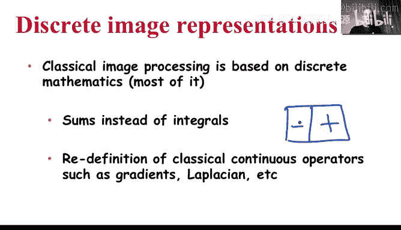
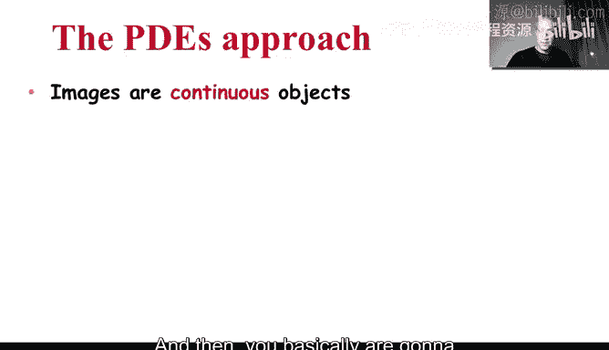
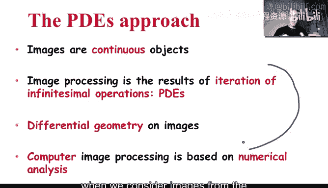
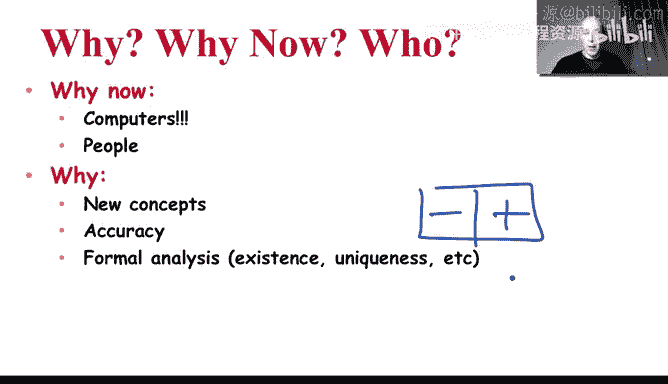
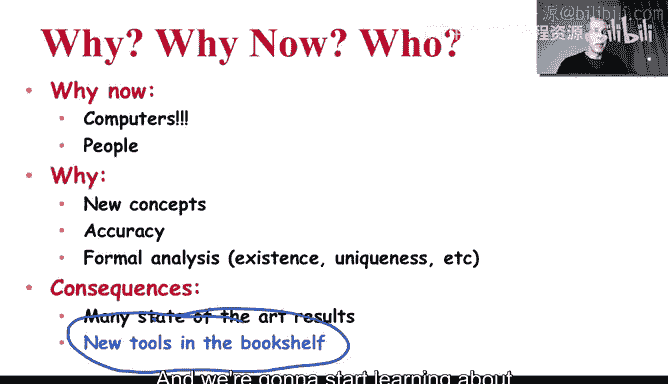

# 051：偏微分方程导论 🧮

在本节课中，我们将要学习图像与视频处理中一个相对新颖且强大的工具：偏微分方程。我们将探讨为何要转向连续域视角，以及这一转变带来的新概念和优势。

## 从离散到连续的范式转变

在前五周的学习中，我们一直将图像和视频视为计算机中的离散对象。例如，一幅图像实际上是一个由像素组成的二维离散数组，尽管它看起来是连续的。同样，电影也是由每秒24或30帧的离散帧构成的。

上一节我们介绍了图像在计算机中的离散本质，本节中我们来看看偏微分方程方法有何不同。

偏微分方程领域采用了一种完全不同的方法。它认为图像本质上是**连续对象**，计算机中的离散表示只是一种实现上的折衷。因此，我们应该在连续域中设计和分析算法，然后再通过数值分析的方法在计算机上实现。

这种范式转变带来了新的可能性。它允许我们使用来自连续数学（如微积分和微分几何）的强大工具。算法的精度不再受限于初始的离散化设计（例如，用 `[+1, -1]` 定义导数），而是取决于后续的数值实现，从而为高精度计算打开了大门。

## 为何采用偏微分方程方法？

为什么图像处理领域会转向这种连续方法呢？以下是几个关键原因：

*   **计算能力的提升**：强大的计算机使得实现复杂的连续数学数值算法成为可能。
*   **跨领域专家的贡献**：许多精通连续数学的研究者进入了图像处理领域，带来了他们的专业工具。
*   **理论分析的严谨性**：偏微分方程方法带来了严格的形式化分析，允许我们在实现算法之前证明其正确性。
*   **灵活性与高精度**：算法设计在连续域完成，其最终精度可通过更精细的数值实现来提升，而不受固有离散结构的限制。

## 本周学习内容概述

在接下来的课程中，我们将逐步深入这个领域。我们将学习理解图像处理中偏微分方程所需的基础工具和核心概念。我们会通过具体的滤波示例来阐明这些思想。此外，大家可能还记得上周讨论的**主动轮廓模型**，那就是偏微分方程在图像处理中的一个应用实例，我们将在后续视频中再次见到它。下周我们将探讨的图像修复技术，其中一些算法也基于偏微分方程。

虽然这是本课程九周中最具数学性的领域之一，但无需担心。我将引导大家学习理解该领域基本原理所必需的基础概念和工具。

本节课中我们一起学习了偏微分方程方法的核心思想：将图像视为连续对象，在连续域中利用强大的数学工具进行算法设计，再通过数值方法实现。这为我们解决图像处理问题提供了一套全新的、强有力的工具集。让我们在下一个视频中开始学习这些具体概念。