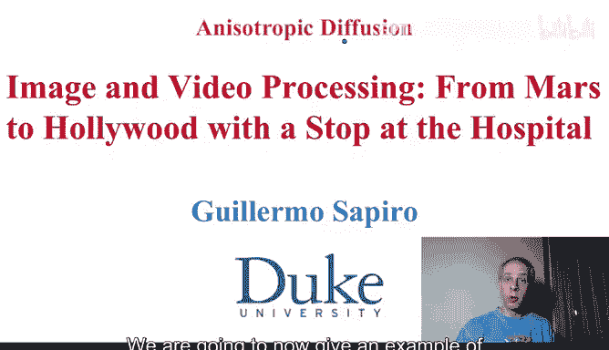
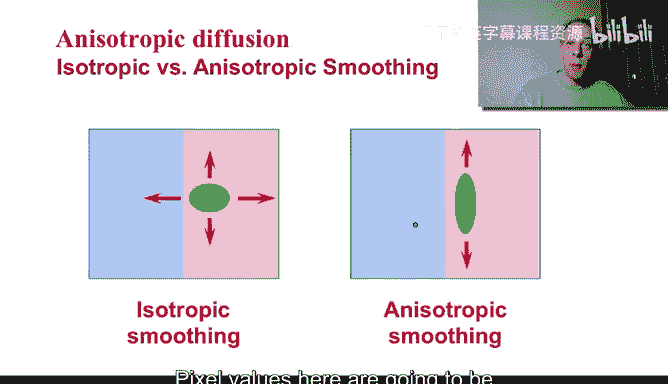
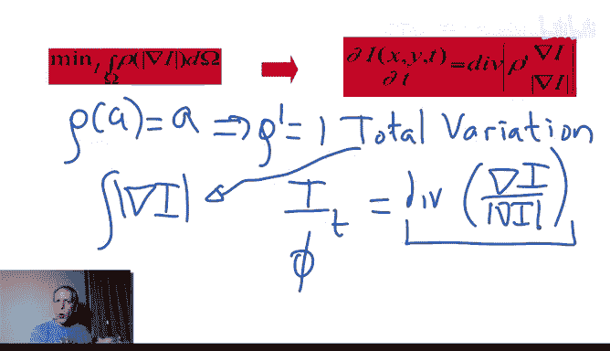

# 057：各向异性扩散



## 概述
在本节课中，我们将学习变分法在图像处理中的一个重要应用：各向异性扩散。我们将了解其基本原理、数学公式，并通过与各向同性扩散（如高斯平滑）的对比，理解它如何能在平滑图像内部噪声的同时，有效地保留物体边缘。

---

## 各向异性扩散简介
上一节我们介绍了变分法的基本概念。本节中，我们来看看如何将其应用于图像处理领域，具体来说，就是**各向异性扩散**。

什么是各向异性扩散？回想我们讨论高斯滤波和图像平均时，我们提到那就像像素值在整个图像中扩散。这导致了模糊，因为我们在跨越边缘进行平均，让不同物体的像素值混合在了一起。这是一种**各向同性平滑**，它不考虑边界，向所有方向均匀扩散。

而**各向异性扩散**的目标是：只对物体边缘的**同一侧**进行像素值平均。这样，物体内部的像素值在自身范围内混合，以达到去噪或增强的目的，同时避免跨越边缘的混合。



我们如何实现这一点？答案是使用偏微分方程。

在深入方程之前，我们先看一个图像示例。这是一幅原始图像。


如果我们进行高斯平滑或平均，我们知道图像会变模糊。这是因为不同物体的像素被混合了，结果如下所示。


另一方面，如果我们尝试不进行这种跨越边界的混合，只混合边界同一侧的像素，我们就能得到更清晰的结果。在这幅大脑MRI图像的灰质部分，我们仍然可以看到噪声被去除，内部变得平滑，但同时边界被非常完好地保留了下来。

这两种方法的区别在于：红色背景标记的是**各向同性扩散（热方程）**，我们将在下一张幻灯片中用变分法推导它。而这里，我们拥有的是**各向异性扩散**。

---

## 从变分法推导扩散方程
在介绍各向异性扩散的具体形式前，需要回顾一个概念：图像的拉普拉斯算子 `∇²I` 是梯度 `∇I` 的散度 `div(∇I)`。梯度和散度的定义已在之前的幻灯片中给出。

各向异性扩散的关键在于，在取散度之前，我们引入了一个函数 `c(·)`。这个函数类似于我们在活动轮廓模型中用到的函数（例如 `1/|∇I|`）。这个函数的作用是：当梯度很强时（即存在边缘），它会说“等一下，不要在这里扩散”，从而抑制或停止扩散。

因此，扩散只发生在梯度不强（非边缘区域）的方向上，而在强梯度（边缘）处则没有或只有很少的扩散。这样，我们就能在平滑物体内部的同时，保持边缘的锐利。

这些方程正是**变分法**的结果。

如果我们定义一个关于图像梯度模长 `|∇I|` 的任意函数 `ρ`，这里 `ρ` 扮演了之前泛函 `F` 的角色。

我们考虑最小化如下能量泛函：
```
E(I) = ∫ ρ(|∇I|) dx dy
```

通过计算该泛函的欧拉-拉格朗日方程（遵循上一视频中的公式），我们得到：
```
∂I/∂t = div( ρ'(|∇I|) * (∇I / |∇I|) )
```
其中 `ρ'` 是 `ρ` 的导数。当图像 `I` 不再随 `t` 变化时，我们就得到了该泛函的一个（可能是局部）极小值解。

---

## 函数 ρ 的选择示例
以下是几个不同的 `ρ` 函数选择及其对应的扩散行为：

**1. 各向同性扩散（热方程）**
选择 `ρ(a) = a²`，即最小化梯度模长的平方。
*   `ρ'(a) = 2a`
*   代入欧拉-拉格朗日方程，忽略常数因子 `2`，得到：
    ```
    ∂I/∂t = div(∇I) = ∇²I
    ```
    这正是**热方程**，它导致各向同性的、全方位的平滑。

**2. 各向异性扩散（全变分）**
选择一个非常有趣的函数：`ρ(a) = a`，即最小化梯度模长本身（全变分）。
*   `ρ'(a) = 1`
*   代入欧拉-拉格朗日方程，得到：
    ```
    ∂I/∂t = div( ∇I / |∇I| )
    ```
    这里没有直接得到热流，而是多了一个归一化因子 `1/|∇I|`。它的意义是：如果梯度 `|∇I|` 很大（边缘处），`1/|∇I|` 就很小，从而减慢扩散速度以保护边缘。这就是**各向异性扩散**的一个例子，它被称为**全变分（Total Variation）** 模型。

---

## 与曲线演化的深刻联系
现在思考一下，`div( ∇I / |∇I| )` 是什么？我们在几节课前学过，它表示图像 `I` 的**等高线的曲率**。

我们之前将其作为一个通用函数 `φ` 讨论过。现在，它代表图像每个等高线的曲率。这意味着我们将图像视为一个曲面，并以一种**各向异性**的方式对图像进行变形，其运动遵循其等高线的曲率。这就将我们引向了各向异性扩散。

这是一个极其有趣的连接：**曲线演化**、**水平集方法**和**变分法**在此交汇。图像根据其等高线的曲率运动，这一事实将曲线演化的曲率运动方程，与从全变分泛函推导出的欧拉-拉格朗日方程联系了起来。



这为我们提供了一个非常优美的各向异性扩散方程，也是变分法在图像处理中最著名的应用实例之一。

---


## 总结与预告
本节课中，我们一起学习了：
1.  **各向异性扩散**的目标：在平滑图像内部（去噪）的同时，保护物体边缘。
2.  如何通过**变分法**，通过选择不同的函数 `ρ`，推导出不同的扩散方程。
3.  当 `ρ(a)=a²` 时，得到**各向同性扩散（热方程）**。
4.  当 `ρ(a)=a` 时，得到**各向异性扩散（全变分模型）**，其方程与图像等高线的曲率直接相关。
5.  这揭示了**曲线演化**、**水平集方法**和**变分法**在图像处理中的深刻联系。

本周剩余的内容，我们将在下一个视频中通过继续讨论**活动轮廓模型**来结束。活动轮廓模型是曲线演化和变分法的主要应用之一，我们过去已经讨论过，并将在下个视频中进一步探讨。

谢谢大家，期待下次再见。😊