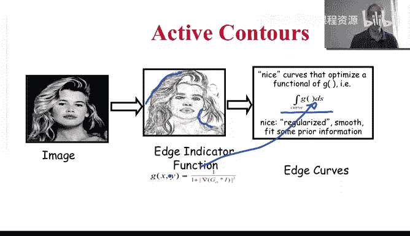
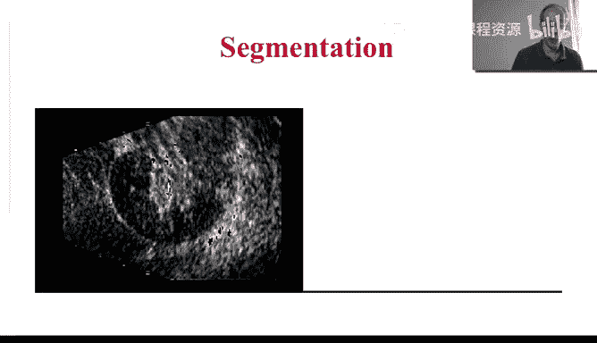
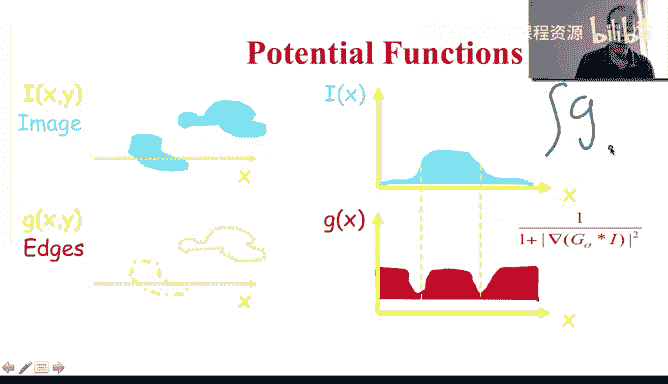
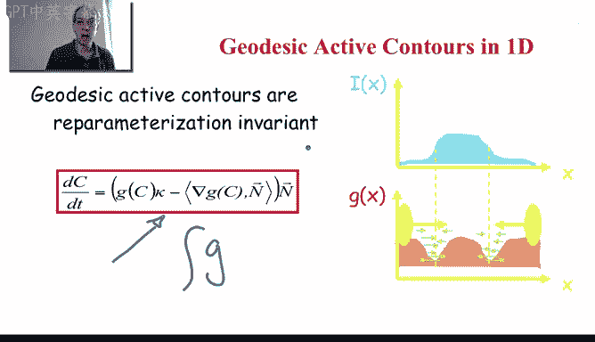
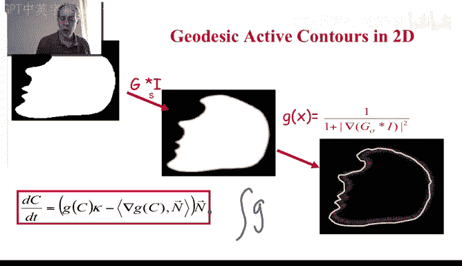

# 058：58_06_08_8-主动轮廓

## 概述

在本节课中，我们将深入学习主动轮廓技术。这是本周关于偏微分方程在图像处理中应用的一个核心示例。我们已经掌握了曲线演化、水平集、变分法和微分几何等背景知识，现在我们将把这些概念整合起来，详细探讨一种主动轮廓技术。

## 从边缘检测到轮廓整合

上一节我们介绍了边缘检测。边缘检测主要关注图像的局部变化，它能告诉我们图像中发生显著变化的位置。例如，通过计算图像的梯度 `∇I`，我们可以在每个位置获得边缘的强度（梯度的幅值 `|∇I|`）和方向（垂直于等值线的方向）。

然而，边缘检测提供的信息是局部的。如下图所示，虽然我们能检测到散布的边缘点，但仔细观察，可以发现这里似乎有一个物体，那里可能有另一个物体。这些局部边缘点之间存在着某种关系。

主动轮廓（以及其他技术，如图割）的目标，正是整合这些局部测量值，从而勾勒出完整的物体边界。

## 主动轮廓的基本流程

主动轮廓技术始于一张图像。以下是其基本步骤：

1.  **计算边缘**：首先需要对图像进行局部计算以检测边缘。如何计算这些边缘有很多技巧，但这始终是第一步。我们最终会得到一个描述图像局部特征的图像。
2.  **构建势函数**：通常，我们会先平滑图像以去除噪声（到第六周，我们已经知道图像通常是有噪声的）。然后，我们以梯度作为局部边缘的指示器。为了避免除以零，我们通常使用一个正则化后的梯度或其倒数。这就得到了一个势函数 `G`，它指示了边缘可能出现的位置。如果存在边缘，梯度值高，则 `1/|∇I|` 的值就小。因此，`G` 在边缘处取低值。
3.  **轮廓演化**：主动轮廓的目标是找到一条曲线，使其沿着 `G` 值较低的区域行进。数学上，这表示为最小化曲线 `C` 上的积分：`E(C) = ∫_C G ds`。我们希望这个积分值尽可能小，这意味着曲线应环绕在 `G` 值低的区域（即边缘）周围。

我们通过变分法来求解这个最小化问题。将 `G` 代入能量函数 `E(C)`，进行变分计算，就能得到主动轮廓演化的方程。本质上，我们是在这个加权空间（权重为 `G`）中寻找一条“最小努力”或“最短路径”曲线。

## 主动轮廓方程详解

通过变分法，我们得到了驱动曲线演化的方程。这个方程正是我们之前多次看到的曲线演化方程，它最小化了上述能量函数。

该方程如下：

`∂C/∂t = g * κ * N - (∇g · N) * N`

其中：
*   `C` 是曲线。
*   `t` 是时间。
*   `g` 是势函数 `G`（通常 `g = 1/(1 + |∇I|^2)` 或类似形式）。
*   `κ` 是曲线的曲率。
*   `N` 是曲线的单位法向量。
*   `∇g` 是势函数 `g` 的梯度。

这个方程自然地在水平集框架中用隐函数 `φ` 来实现。

让我们分析一下这个方程的两个部分：
1.  **`g * κ * N`（曲率项）**：这一项使曲线平滑并收缩。如果没有 `g`，就是纯粹的曲率运动，曲线会收缩成一个点。但这里乘以了 `g`，在边缘处（`g` 很小），这项的作用会减弱甚至停止，从而防止曲线越过边缘。
2.  **`- (∇g · N) * N`（梯度项）**：这一项将曲线拉向势函数 `g` 的梯度方向（即指向边缘）。它像一个“陷阱”，将曲线吸引并锁定在边缘位置。注意，我们只取梯度在法向上的投影分量，因为只有法向速度才能改变曲线的形状。

因此，主动轮廓（特别是这种形式，常被称为**测地线主动轮廓**或几何主动轮廓）的工作机制是：曲线在平滑（曲率项）的同时，被拉向边缘（梯度项），并在边缘处（`g` 值小）停止演化。

## 实例演示

下图展示了一个一维情况的示意图。在一个简单的二值图像中，边缘处的 `G` 函数值很低。主动轮廓的目标就是找到一条环绕这些低 `G` 值区域的曲线。

在实际的二维图像处理中，流程是相同的：
1.  对图像进行平滑并计算边缘，得到势函数 `G`。
2.  初始化一条或几条曲线（利用水平集方法，初始曲线的拓扑变化可以自由处理）。
3.  根据上述方程演化曲线。

曲线在演化过程中，会不断降低其路径上 `G` 的积分值。初始曲线的积分值较高，而最终停在物体边界上的曲线，其积分值要小得多。这就是曲线演化的目标。

以下是一个例子，我们从多个初始曲线开始，让它们根据 `G` 函数演化，最终贴合到数字“5”的边界上。

## 扩展与应用

主动轮廓技术已被扩展到三维，称为**主动曲面**或**最小曲面**。它在医学影像中应用广泛，例如下图展示的MRI图像中的灰质分割。

另一个例子是检测非常细小的管状结构。所有这些应用的关键之一在于设计合适的 `G` 函数。我们讨论的是 `1/|∇I|`，但根据具体的图像类型和问题，我们可以设计包含更多信息的 `G` 函数，以帮助轮廓或曲面更准确地被吸引到目标边界。

## 总结

本节课我们一起深入学习了主动轮廓技术。我们了解到，主动轮廓通过整合局部边缘信息（势函数 `G`），并利用变分法导出的演化方程，驱动曲线向目标边界演化。其核心方程 `∂C/∂t = g * κ * N - (∇g · N) * N` 结合了曲线的平滑收缩（曲率项）和对边缘的吸引锁定（梯度项）。这项技术是曲线演化、水平集和变分法等数学工具在图像分割中的完美结合，并已成功应用于二维轮廓提取和三维曲面分割等多个领域。

至此，我们结束了第六周——偏微分方程在图像处理中应用的学习。下周，我们将探讨图像修复这一有趣的主题，它同样会用到偏微分方程，但理解起来会更加直观。