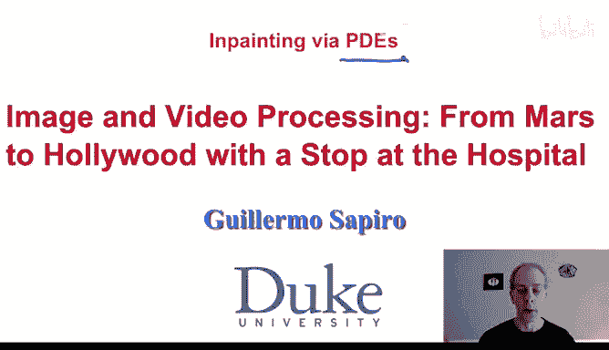
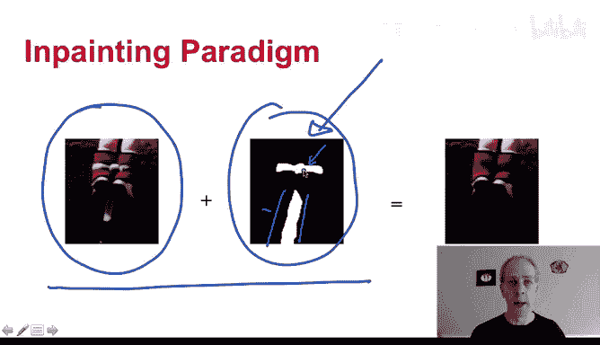
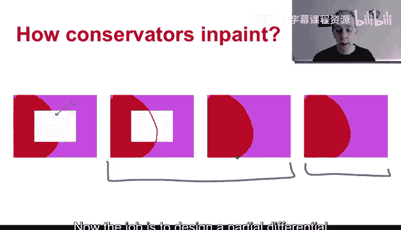
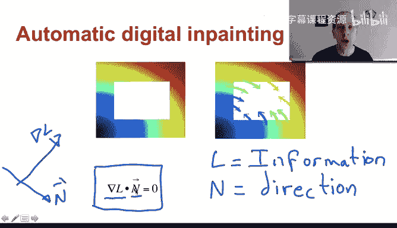
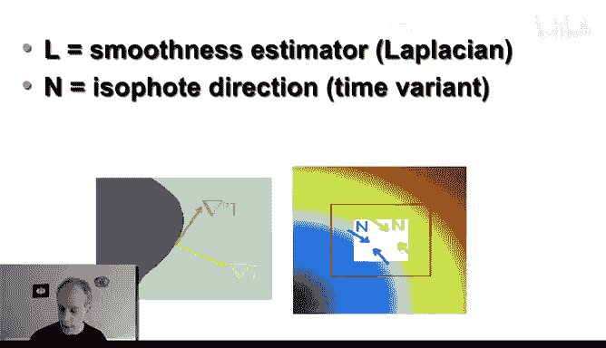
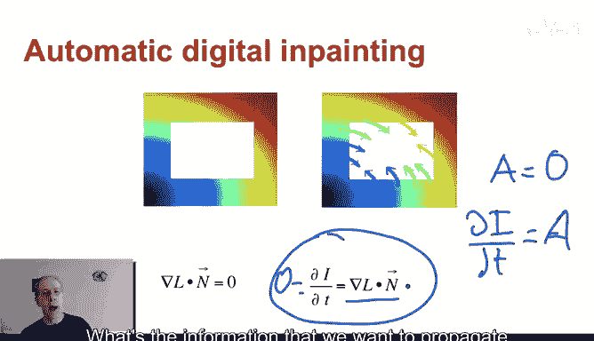
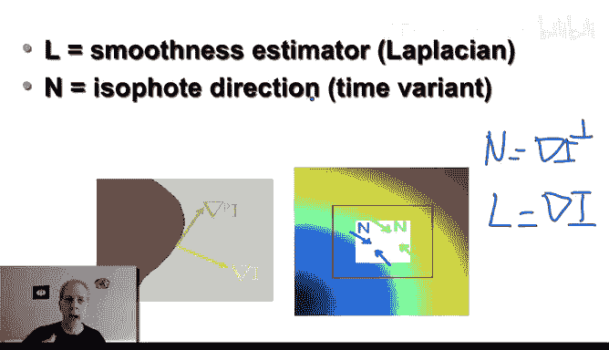
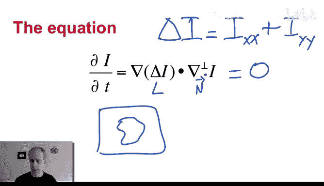
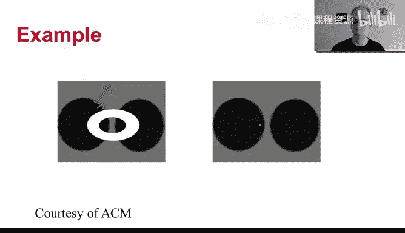

# 062：偏微分方程与修复

## 概述

在本节课中，我们将学习一种基于偏微分方程的图像修复模型。我们将了解如何利用图像边界周围的信息，通过数学方程来填充图像中的缺失区域，例如移除照片中的电线或划痕。

## 图像修复简介

图像修复是指我们有一幅图像，以及一个我们希望改变其内容的区域。例如，下图中的电缆。系统需要两个输入：原始图像和一个表示需要修复区域的二进制掩码图像。我们的目标是让电缆消失，即修复这些区域。

我们将讨论的第一个主题是：如何仅利用周围区域的信息进行修复，而不使用远处信息。

## 专业修复师的启发

当我开始研究图像修复时，我们拜访了明尼阿波利斯艺术学院的一位专业修复师，询问他们如何进行修复。他们的方法非常有趣，类似于儿童绘画的过程，以下是其步骤的说明：

我们有一个需要修复的区域和一幅图像。修复师首先会延续区域的边界。如果有边界进入待修复区域，他们会以同样的方式在内部延续这个边界，就像儿童先勾勒物体轮廓一样。

然后，他们填充颜色。所以，第一步是延续边界，第二步是将颜色传播到区域内。最后，他们通常会添加一些“噪点”，因为画作看起来不应该太“平”，需要增加颗粒感使其看起来更自然。

我们将重点讨论前两个步骤，第三个步骤也有很多技术可以实现。这个过程就像是：先延续几何结构（边界），然后填充颜色。就像水会流入区域，但因为有了边界，正确的“水”（信息）会流入正确的地方。

现在，我们的任务是设计一个能模拟这个过程的偏微分方程。

## 核心偏微分方程

方程如下。我们外部有图像信息，内部有缺失信息的区域。我们希望通过这个方程从外部传播信息。这是基于偏微分方程进行图像修复的第一个核心组件。

**公式：** `∇L · n = 0`

这里发生了什么？`L` 是我们想要传播的信息（稍后解释具体是什么）。`n` 是我们传播信息的方向。

`∇L` 是信息 `L` 的变化量（梯度）。它与方向 `n` 做内积，结果等于 0。这意味着信息 `L` 的变化量在传播方向 `n` 上的投影为 0。换句话说，信息 `L` 沿着传播方向 `n` 是恒定的。这正是“传播信息”的含义：沿着某个方向移动时，信息保持不变。

## 如何求解方程

假设图像是 `I`。我们希望通过偏微分方程来“变形”图像，最终使得 `∇L · n = 0` 成立。

我们上周在讨论欧拉-拉格朗日方程时学过类似的方法。做法很简单：我们让图像随时间变化，变化的方式是朝着我们期望的目标（即 `∇L · n = 0`）前进。

**公式：** `∂I/∂t = ∇L · n`

当图像不再变化时，就达到了稳态，此时 `∂I/∂t = 0`，也就意味着 `∇L · n = 0`，这正是我们想要的。所以，这是一个通用技巧：当你希望某个量 `A` 等于 0 时，就设 `∂I/∂t = A`，然后运行到稳态。

这就是此类图像修复的基本方程。但我们还没完成，还需要定义 `L`（传播什么信息）和 `n`（沿什么方向传播）。这里有很多设计空间，我将通过例子讲解概念，这些例子本身已经非常强大。

## 定义信息 `L` 和方向 `n`

首先，定义信息 `L`。我们希望修复区域内的传播是平滑的，不希望看到明显的跳跃。因此，`L` 需要代表图像的平滑度。图像拉普拉斯算子（二阶导数）是平滑度的一种度量。

那么，为什么不使用一阶导数（梯度）呢？原因有二。第一，从方向 `n` 的定义来看。我们回顾专业修复师的话：“延续边缘”。我们知道，图像的梯度方向与边缘垂直。因此，要沿着边缘传播，就需要沿着与梯度垂直的方向，即 `n` 是梯度的垂直方向。

**公式：** `n = ∇I⊥` （即与梯度垂直的方向）

如果我们设 `L` 为一阶导数（梯度），那么 `∇L`（即梯度的梯度）与 `n`（梯度的垂直方向）由于方向性，其内积可能不包含足够信息，甚至可能恒为0，导致方程无意义。

第二个原因是，我们不仅希望灰度值在区域内平滑，也希望边界本身平滑。因此需要更高阶的平滑度量。拉普拉斯算子是最简单的平滑度量之一，它能确保信息沿着等照度线（即边缘方向）平滑传播。

## 完整的修复方程

因此，我们得到完整的方程。其中 `L` 是图像的拉普拉斯算子 `∆I`，`n` 是梯度 `∇I` 的垂直方向。

**核心方程：** `∂I/∂t = ∇(∆I) · ∇I⊥`

在稳态时，`∂I/∂t = 0`，我们得到 `∇(∆I) · ∇I⊥ = 0`。这意味着图像的拉普拉斯值沿着边缘方向是恒定的，从而将边缘信息传播到了内部。

这个方程结合了灰度值和边缘信息。拉普拉斯是二阶导数，再对其取梯度就涉及三阶导数。边界条件通常设在待修复区域的边缘，信息从外部平滑地传播进来。

## 算法实例演示

进行图像处理时，最好从简单例子开始理解其行为。

**简单几何图形修复：**
白色是需要修复的区域。算法产生了非常平滑的延续，完美地补全了圆形。它并不知道那里有个圆，只是沿着边缘的法线方向（即与梯度垂直的方向）传播信息，结果非常出色。

**文字移除：**
这是一幅新奥尔良的风景图，上面写有文字。我们将文字区域标记为待修复区域。算法从周围区域传播信息，最终文字消失了，修复后的图像看起来非常自然。

**旧照片划痕修复：**
红色标记的是需要修复的退化区域。有时我们会标记得比实际缺失区域稍大一些，这有助于从更远的地方开始平滑传播。修复结果看起来很好，虽然靠近眼睛高光的部分可能因周围信息不足而有微小误差，但这为专业修复师提供了一个极佳的起点。

**移除蹦极电缆：**
原始图像中人物跳跃时有电缆。修复后电缆消失了。放大看，袜子的边缘和直线的延续都非常完美，这正是“延续边缘”算法所期望的效果。

**无线传输中的丢包恢复：**
图像在传输中（如JPEG分块传输）可能因信号丢失导致整块数据缺失。这些丢失的块很容易被检测到。本示例模拟了信号丢失，然后将丢失块区域进行修复，成功重建了图像。这甚至有助于压缩技术：可以故意丢弃一些易于修复的块，从而提高压缩率，代价是增加接收端重建的计算量。

## 扩展到彩色图像

我给出的方程是针对单通道图像的。对于彩色图像（三通道）该如何处理呢？

方程是：`∂I/∂t = ∇(∆I) · ∇I⊥`

有两种主要方法：
1.  **独立处理每个通道**：在RGB或其他颜色空间中，对红、绿、蓝每个通道分别应用上述方程。
2.  **使用矢量方法**：将图像视为矢量场，定义矢量形式的梯度和拉普拉斯算子，从而将方程扩展到矢量形式。

本节展示的所有例子都是采用第一种方法，即每个颜色通道独立处理。这就是基于偏微分方程的图像修复的一个实例。

## 总结

本节课我们一起学习了一种基于偏微分方程的图像修复技术。我们了解了其核心思想：通过设计一个数学方程（`∂I/∂t = ∇(∆I) · ∇I⊥`），将图像边缘的信息平滑地传播到待修复区域内部。这种方法模拟了专业修复师“先延续边界，再填充颜色”的过程，并在移除物体、修复划痕、恢复传输丢失数据等多种场景中取得了很好的效果。下一节课，我们将看到基于变分公式的图像修复技术。