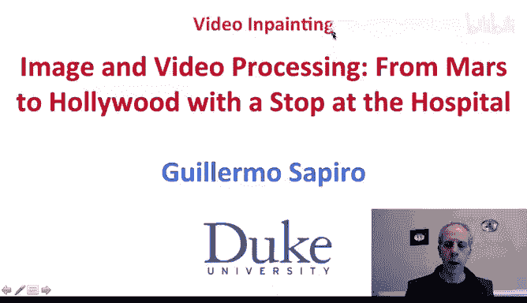
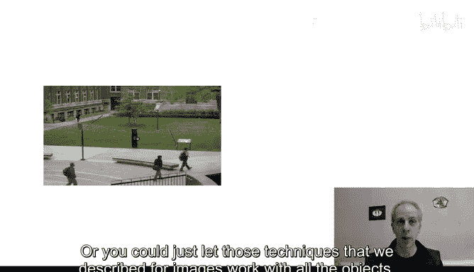
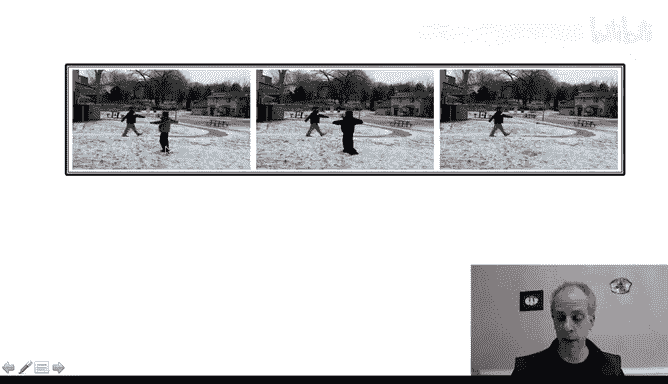
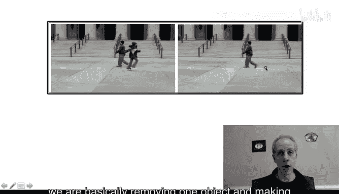
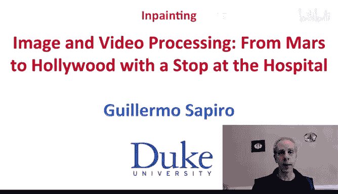

# 066：视频修复与总结 🎬

在本节课中，我们将要学习视频修复技术。视频修复是图像修复技术在时间维度上的扩展，其核心思想是利用视频序列中相邻帧的信息来填补或移除视频中的特定区域。

上一节我们介绍了图像修复的基本工具，本节中我们来看看如何将这些工具应用于视频修复。

## 视频修复的基本概念

视频本质上是一系列按时间顺序排列的图像帧。因此，我们可以将图像修复的工具扩展到视频领域。主要方法有两种：

*   **三维块匹配**：将图像修复中的二维图像块（X, Y）扩展为三维时空块（X, Y, T），在整个视频或视频片段中搜索最佳匹配块进行填充。
*   **三维变分法**：将基于偏微分方程或变分公式的图像修复方法扩展到三维。例如，我们可以计算包含时间维度的三维梯度，或将视频视为曲面并计算其平均曲率或高斯曲率。

以下是视频修复与图像修复的主要区别：
*   **静态物体**：在视频所有帧中都不移动的物体。其背景信息在视频中从未出现。
*   **动态物体**：在视频中移动的物体。其背景信息可能会在物体移动后的其他帧中显露出来。

## 动态与静态物体的修复策略

针对不同类型的物体，修复策略略有不同。

对于动态物体，修复相对简单。我们可以等待该物体在后续帧中移开，然后将那些帧中显露出的背景像素复制到当前帧需要修复的区域。例如，要移除一个移动的指针，只需从指针消失后的帧中复制背景信息即可。

对于静态物体，情况则不同。因为其背景在所有帧中都被遮挡，从未显露。此时，需要依赖我们之前介绍的图像修复技术（如切割-粘贴法或变分法）来生成合理的背景内容。

在实际操作中，我们可以选择区分处理动态和静态区域，也可以直接让图像修复技术处理整个视频，而不做明确区分。

## 视频修复实例演示

以下是几个视频修复的实际应用案例。

第一个例子展示了结合切割-粘贴法和信息传播技术的修复效果。视频中成功移除了多个物体，包括静态和动态对象，且并未对它们进行显式区分。

第二个例子展示了如何移除视频中的一个人物。操作前需要获得一个标记了待修复区域的视频蒙版（虽然手动制作视频蒙版比图像蒙版更耗时，但存在如Adobe After Effects中的“Roto笔刷”等自动化工具辅助完成）。修复后的视频看起来非常自然，难以察觉是经过修改的。

第三个例子是我们之前见过的，再次展示了移除一个物体并让观众相信这是原始视频的效果。

## 总结与应用

本节课中我们一起学习了视频修复技术。我们看到了将图像修复的强大工具扩展到视频领域的有效方法，并了解了处理动态与静态物体的不同考量。

视频修复技术不仅广泛应用于电影工业，用于移除拍摄现场的穿帮镜头或不需要的物体，也常用于改善我们自己的照片和视频，移除其中不喜欢的元素。这是一个非常有趣且实用的主题，希望你能从中获得启发。