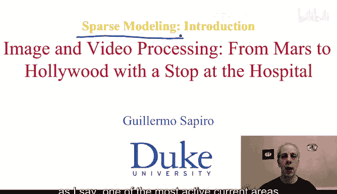
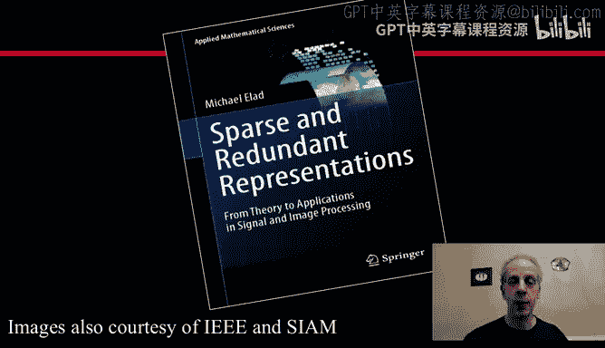
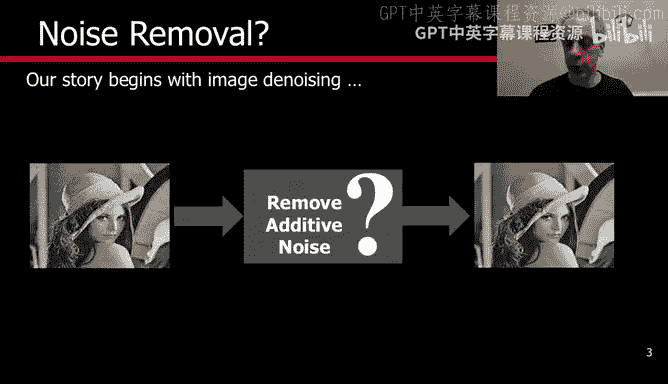
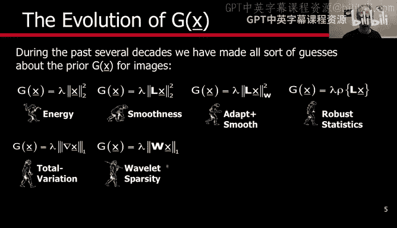
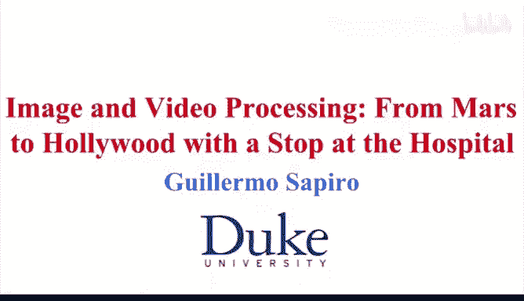

# 067：稀疏建模导论 - 第一部分

在本节课中，我们将要学习稀疏建模的基本概念。稀疏建模是当前图像处理领域最活跃的研究方向之一。我们将从图像去噪这个具体例子入手，介绍稀疏建模的核心思想、数学公式以及它在信号处理中的应用。课程内容将尽可能简单明了，确保初学者能够理解。

## 概述

欢迎回来。我们即将开始图像与视频处理新一周的学习。

本周的主题是稀疏建模。这是当前图像处理领域最活跃的领域之一，对我们来说非常重要。为了描述这个领域，我们将使用线性代数的一些基本工具，因此会涉及一些数学，但不会像之前学习偏微分方程、变分法和微分几何时那么多。和之前一样，所有内容都将自成体系，我会引导大家逐步学习，过程会非常简单，你们将能够掌握理解当前图像与视频处理领域最活跃方向之一所需的基础知识。

在开始之前，我需要说明，我将使用经过阿尔瓦雷斯教授许可后改编的幻灯片。我还想告诉大家，如果你想深入了解这个主题，他的书是一个极好的资源。当然，你不需要这本书，所有内容都是自包含的，你不需要购买这本书也能享受本周的学习。但如果你想进一步探索这个领域，这是一个很好的推荐资源。网络上以及本课程的网页上也有一些其他介绍。在本课程网页上，我们列出了几个可以获取免费软件来实践这个领域的地方。

那么，让我们开始介绍什么是稀疏建模。

## 稀疏建模的基本框架

我们将以图像去噪为例。稀疏建模在图像处理的许多其他领域都有应用，但图像去噪是介绍基本概念的一个好例子。

正如我们之前所见，基本思想是：我们有一幅带噪声的图像。为了简化介绍，我们再次假设噪声是加性的，即图像加上噪声。我们想使用稀疏建模来去除噪声，也就是从带噪声的图像中去除噪声。

现在，这可以用以下形式来表述，这是一种我们之前讨论过的变分公式，但现在我们在离散域中，所以稍微简单一些。它包含几个部分。

Y 是我们的图像，即我们测量到的带噪声图像，这是我们拥有的全部。我们想要恢复一个干净的图像 X。首先，我们不希望恢复的图像离噪声图像太远，这就是这里的惩罚项：我们观测到的图像 Y 与恢复的图像 X 之间的均方误差。对于更了解情况的同学，我们在这里假设的是加性高斯噪声，我们最小化的基本上就是噪声的方差。

现在，如果我们只有这个拟合测量值的项，那么这个问题的解是什么？最小化这个问题的图像不是别的，正是噪声图像本身。所以我们没做什么。

这时我们添加了另一个项。这个项根据学科不同有多个名称，被称为先验，也被称为正则化项。它基本上是说：是的，我知道我想要一个接近 Y 的图像，但我希望那个图像具有某些特性。让我举一个例子来说明。

假设这是你的数据，我只标记几个点。这是你的数据，这是 Y。如果我除了告诉你“找到接近 Y 的 X”之外什么都不说，你就会停留在那些点上。但如果我告诉你，通过这个函数，如果我说解是一条直线，我强迫你做一条直线，那么你会找到一个像这样的解，不是原始的点，而是像这样的东西。所以我给了你先验信息，我给了一个约束条件，说找到既接近数据点，又是一条直线的东西，然后你得到了那个解。

所以基本思想是，我们有两项：一项将解与测量值联系起来，另一项基本上给你一个先验、一个正则化、一个条件。这有点像我们将观测 Y 投影到这个先验上。

这就是所谓的贝叶斯观点，遵循托马斯·贝叶斯。基本思想是，我们计算所谓的最大后验概率。我们基本上要计算最大化或最小化这个函数的 X，取决于我们是否将函数本身视为最小化目标。如果我们看概率框架，这基本上是一个指数化过程。我们把这个取指数，那个也取指数，就会得到一个最大化问题。但别担心，我们做最大或最小取决于符号。我们总可以取负号，然后得到一个最大化问题。这就是所谓的最大后验概率估计。

我们可以为我们接下来要介绍的所有内容赋予一个概率框架、一个概率解释，从而使这一点更加清晰。但基本思想是，我们有一个先验，在贝叶斯语言中，这被称为似然、先验和似然。两者都可以有概率解释。

再次强调，这一项模拟噪声，在这个例子中是加性高斯噪声；另一项模拟信号。总的来说，信号处理领域投入了大量精力来设计什么是最好的先验，什么是最好的空间来定义图像、定义不同类型的信号。图像处理文献在这方面有很多工作。

我将描述几个例子。有人说一个好的先验是：给我一个能量不太高的图像。这就是这个例子。这里总有一个参数可以放大或缩小它。

还有其他先验说：给我一个平滑的图像。例如，我们在讨论修复时看到，衡量平滑度的一种方法是拉普拉斯算子。不说能量低，而是说它必须非常平滑，这意味着当我计算拉普拉斯算子时，能量必须低。

另一个先验是说：那是对的，但我们有边缘，所以我不希望我的边缘平滑，我想要非常锐利的边缘。然后我们做一个调整，说不是每个地方都必须平滑，我们允许某些跳跃。

另一个例子是基本上取函数，不仅仅是二次函数，而是更复杂的平滑度函数，这涉及到鲁棒统计学的主题。再举一个例子，我们可以讨论全变分。我们在学习各向异性扩散时看到，这是各向异性扩散的例子之一，我们基本上对梯度积分，不是梯度的平方，而是梯度本身，我们得到了各向异性扩散。

我们也可以做小波。我们在这门课中没有讨论小波，但你可能听说过小波是图像处理中一个非常重要的主题。当然，在九周内我们无法讨论所有内容，所以我们没有特别讨论小波。但人们已经使用了它，你可以想象基本上将图像乘以一个矩阵，然后对该乘积进行某种惩罚，例如我们这里的 L1 范数，即绝对值。

## 稀疏建模的先验

我们将在本周讨论的就是这个特定的先验。

我将在接下来的几张幻灯片中进一步解释它，我们将在接下来的视频中学习更多。但这就是我们要讨论的先验。基本上，它写在这里。但同样，我接下来会解释。

这基本上是演变过程，也可以说是历史演变，人们使用和提出了不同类型的先验。每一种都有其优点和缺点，我们将讨论这一种。现在文献中提出了更复杂的先验，其中一些非常好，但计算上极其昂贵和困难。许多这些先验的优点之一，正如我们也将看到的这个先验的优点，是计算上可行，我们可以实现它们，我们可以理解先验并进行计算。

那么让我们解释一下什么是稀疏建模的先验。

## 总结

本节课中，我们一起学习了稀疏建模的基本框架。我们了解到，稀疏建模通过结合测量拟合项和先验正则化项来解决问题，其中先验项引导解具有我们期望的特性。我们特别关注了基于 L1 范数的稀疏先验，并了解到它在计算上具有可行性，是当前图像处理中一个非常活跃且重要的研究方向。在接下来的课程中，我们将深入探讨这种稀疏先验的具体形式和计算方法。