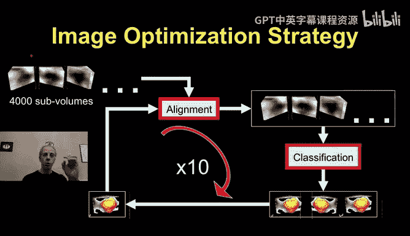
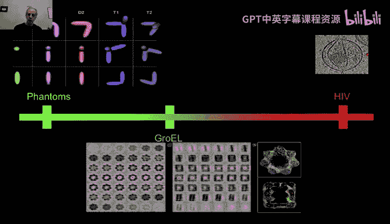
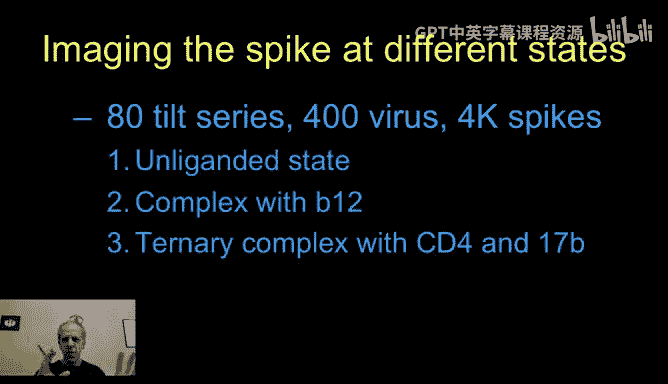
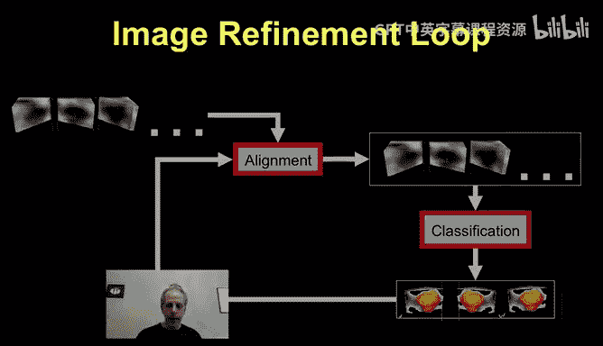
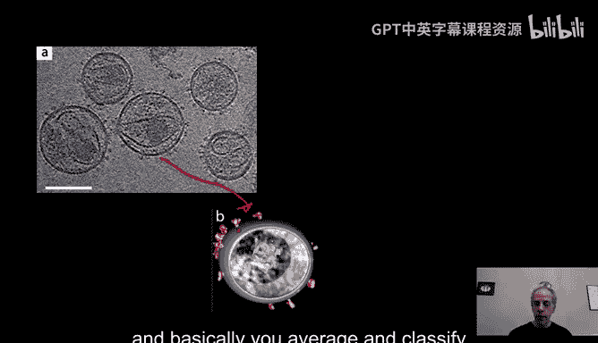
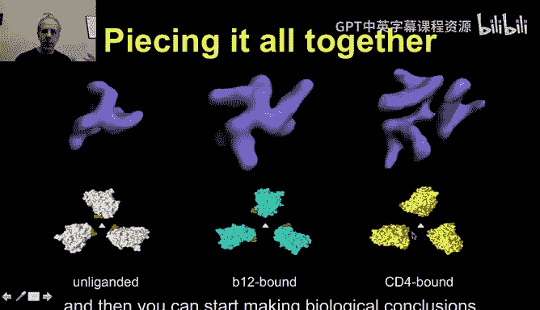
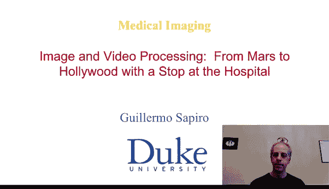

# 077：HIV病毒三维结构解析流程详解

在本节课中，我们将学习如何利用图像处理技术，从冷冻电子断层扫描数据中解析HIV病毒包膜蛋白的三维结构。这是一个从原始噪声数据中提取关键生物信息的完整流程。

## 概述

上一节我们介绍了获取HIV病毒原始三维数据的方法。本节中，我们来看看如何处理这些海量的、充满噪声的数据，通过**对齐**、**分类**和**平均**等步骤，最终重建出清晰的三维结构。

## 数据获取与初步分割

我们首先获得了来自断层扫描的三维数据。接下来，我们需要在其中寻找并分割出所有含有病毒的“尖峰”或“包膜”区域。

以下是分割的两种主要方式：
*   **手动分割**：由操作人员手动在每个目标区域周围绘制边界框。
*   **半自动分割**：如果对目标形状有大致预期模型，可以自动进行。此过程类似于非局部均值去噪中寻找相似图像块的方法，只不过这里的“图像块”是你预先设定的模型。你让这个模型在图像中滑动，计算每个位置的匹配距离。如果距离很小，就认为该处存在一个包膜结构。

无论采用哪种方式，我们最终会得到许多小体积数据块，例如尺寸为 `100 x 100 x 100` 像素，它们代表了单个病毒包膜。

## 核心处理流程：对齐与分类

记住，这些数据块不仅噪声很大，而且彼此形态不完全相同。我们需要对它们进行**对齐**和**分类**。

首先进行对齐。由于数据噪声极高，初始对齐效果可能不理想，因为你在尝试对齐非常模糊的东西。但这是一个必要的步骤。为了提高对齐的可信度，可以设定一个很高的阈值，只保留那些对齐后距离几乎为零、几乎完全一致的数据块，这样我们就更有信心认为对齐是成功的。

**对齐**操作本质上是旋转每个数据块，直到其与参考模型之间的差异距离（如前文所述的距离度量）达到最小。

完成初步对齐后，分类就变得相对容易。此时，所有数据块都处于一个共同的空间坐标系中。我们需要将它们分组，使得同一组内的包膜具有相似的三维形状。

以下是分类聚类的一种示例方法：
1.  选取一个数据块，找出所有与它距离非常小的“伙伴”，形成第一个组。
2.  选取另一个未被分组的数据块，重复此过程，形成第二个组。
3.  以此类推，直到所有数据块都被分组。

## 迭代优化与去噪

分组完成后，如果分组正确，我们可以对同一组内的数据块进行**平均**。我们知道，对相似信号进行平均可以有效**降低噪声**，这正是我们在图像去噪中讨论过的原理。

对数据块进行轻微去噪后，我们可以再次尝试对齐。此时图像更清晰，对齐效果会更好。然后，基于新的对齐结果再次进行分类。我们将“对齐 -> 分类 -> 平均去噪”这个过程重复多次，直到结果基本稳定，达到我们满意的程度。

因此，整个核心流程可以概括为：**使用最终的距离度量，循环进行对齐、聚类、再对齐、再聚类**。这里的关键点在于，我们拥有成千上万个这样的小数据块，计算量巨大。

## 计算挑战与加速策略

需要将所有数据块彼此对齐和比较，并且要重复多次，这带来了巨大的计算挑战。

为了加速计算，可以采用以下策略：
*   **变换到频域**：对于此类问题，通常在傅里叶域中进行对齐计算会更高效。
*   **利用GPU加速**：这些算法通常使用GPU进行高度优化的并行实现，将计算时间从数周缩短到数小时。

最具计算挑战性的部分是对齐，因为我们需要尝试所有可能的角度。正如之前提到的，由于存在“缺失楔”问题以及对速度的要求，这类计算通常在傅里叶域中进行。

## 算法验证流程

开发出图像处理算法后，如何验证它在解析未知HIV病毒结构时的有效性呢？这在医学成像中至关重要，因为计算错误可能导致整个疫苗研发方向被误导。

标准的验证流程遵循循序渐进的原则：
1.  **使用仿体**：首先，根据先验知识创建模拟病毒的三维模型（仿体）。人为添加噪声、模拟投影和缺失楔等显微镜成像效应，然后运行你的算法。由于你已知真实结构，可以验证算法能否正确重建。
2.  **使用已知结构的样本**：完全模拟显微镜下的所有物理过程几乎不可能。因此，下一步是使用已知结构的粒子（例如“GroEL”蛋白）进行实验。将其放入显微镜，运行你的算法，看能否重建出公认正确的三维结构。
3.  **内部交叉验证**：即使处理真实的HIV数据，也可以进行验证。例如，你可以从4000个样本中随机剔除500个进行计算，然后换另一组500个随机样本再计算，观察结果是否高度一致。

这是一个标准的验证进程：先处理仿体（已知数据），再处理已知样本，最后才处理未知的HIV数据。

## 生物学意义与应用实例

为什么解析HIV包膜结构如此重要？如图所示，当病毒试图附着到宿主细胞膜上时，其包膜蛋白（如Gp120和Gp41）会像花朵一样打开，并试图抓住宿主细胞上的CD4受体。理解这种构象变化、接触方式以及结合过程中的动态改变至关重要，但这一直难以实现。

通过与美国国立卫生研究院的合作，我们获得了处于不同状态下的病毒数据（例如，与抗体B12复合或与其他复合物结合的状态）。目标是利用图像处理技术，观察不同状态下包膜蛋白的三维形状差异。

处理流程如下：
1.  **输入原始数据**：从冷冻电子断层扫描得到的三维重建体，数据非常模糊。
2.  **运行算法**：应用之前开发的算法：寻找包膜 -> 对齐 -> 分类 -> 平均 -> 迭代优化。
3.  **观察进展**：初始时，平均未对齐的噪声数据只会得到模糊的团块。随着迭代进行，对齐和分类不断改进，平均去噪的效果显现，三维形状开始变得清晰。
4.  **得到结果**：最终，我们获得了清晰的包膜三维结构。可以通过与已知的片段结构进行拟合来验证结果。

一旦获得三维结构，生物学家就能开始他们的工作：观察HIV包膜在不同状态下的形状差异，得出生物学结论。例如，可以发现当包膜与CD4受体结合时，其构象会发生显著变化（如“手臂”张开）。这对于疫苗研发极为重要。

## 总结

本节课中我们一起学习了如何利用图像处理技术，从嘈杂的冷冻电子断层扫描数据中解析出HIV病毒包膜蛋白的高分辨率三维结构。我们深入探讨了**数据分割**、**迭代对齐与分类**、**平均去噪**的核心流程，以及至关重要的**算法验证步骤**。这个例子生动地展示了图像处理的力量：它让我们能够“看到”人眼无法直接从原始投影或重建数据中观察到的微观三维结构，从而推动像疫苗开发这样的重大实际进展。这仅仅是图像处理在病毒学和显微学领域研究的冰山一角，但足以说明其解决真实世界问题的强大能力。