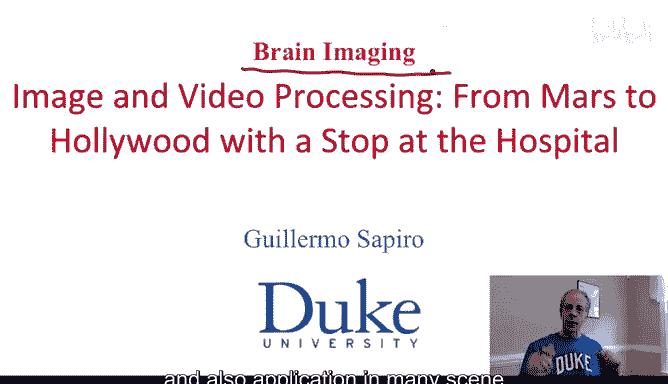
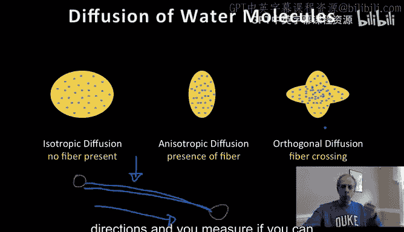
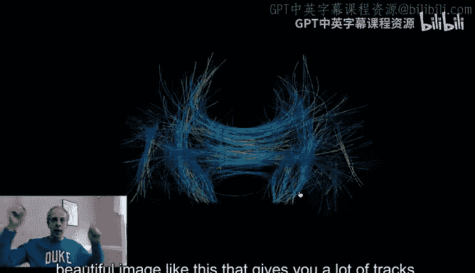
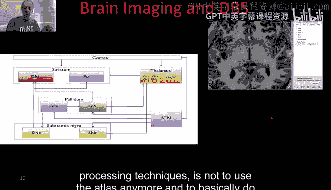
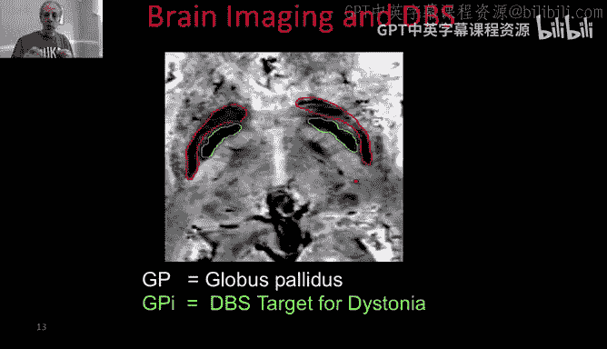
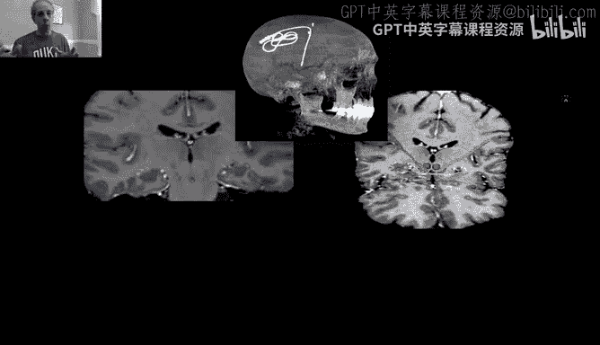
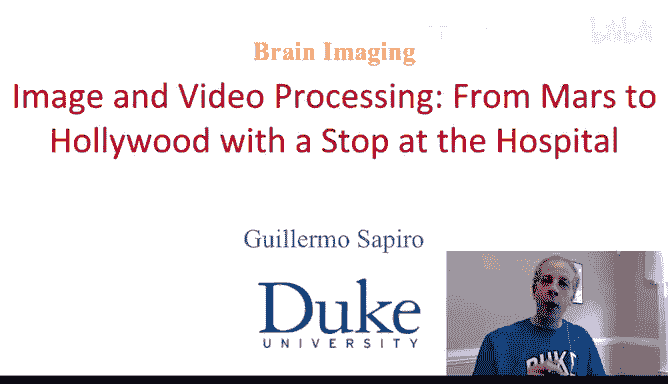

# 078：脑成像-扩散成像与深部脑刺激

## 概述
在本节课中，我们将学习脑成像领域中的两种重要技术：扩散加权磁共振成像（Diffusion Weighted MRI）和深部脑刺激（Deep Brain Stimulation）。我们将探讨扩散成像如何测量大脑连接性，以及如何利用图像处理技术（如霍夫变换）来追踪神经纤维束。接着，我们将了解深部脑刺激这一神经外科手术，并分析图像处理在精确定位手术靶点、整合多模态影像数据以及术后评估中所扮演的关键角色。

---

## 扩散加权成像：基本原理

上一节我们介绍了脑成像的广阔应用前景，本节中我们来看看一种相对较新的成像技术：扩散加权磁共振成像。

扩散加权成像的基本概念相对简单。其核心目标是测量大脑中水分子扩散的方向性，从而推断出大脑不同区域之间的连接性，即神经纤维束的走向。

其背后的物理原理如下：假设大脑中两个灰质区域由神经纤维束（可以想象成电缆）连接。如果我们试图让水分子沿着纤维束的方向扩散，由于纤维结构的限制，水分子在这个方向上运动会相对困难。反之，如果试图让水分子垂直于纤维束方向扩散，运动则会相对容易。

因此，通过在不同方向上施加磁场梯度来“推动”水分子，并根据水分子在各个方向上扩散的难易程度，我们可以推断出该位置是否存在纤维束以及其主要方向。如果水分子在所有方向上扩散都同样容易（各向同性），则表明该区域没有明显的纤维束。如果水分子在某个特定方向上扩散显著受阻（各向异性），则表明该方向存在纤维束。

以下是实现这一过程的关键步骤：
1.  受试者进入磁共振扫描仪。
2.  系统在多个不同方向（例如32、64或128个方向）施加磁场梯度。
3.  测量水分子在每个梯度方向上的扩散情况。
4.  对于三维大脑图像中的每个体素（Voxel），计算水分子沿各个方向扩散的概率分布，这等价于该点存在特定方向纤维束的概率。

最终，对于每个体素，我们得到一个表征扩散概率的椭球体。形状越圆，表示扩散越均匀（各向同性）；形状越扁长，表示在某个特定方向上存在强烈的扩散限制（各向异性）。

---

## 从局部测量到全局连接：霍夫变换的应用

上一节我们了解了如何获取每个体素局部的纤维方向信息，本节中我们来看看如何利用这些信息找出大脑中相距较远区域之间的连接路径。

我们面临的问题是：如何从这些局部的、基于体素的测量数据中，推断出大脑中两个特定区域是否相连？解决方案之一是使用我们在图像分割章节中学过的工具：**霍夫变换**。

我们使用霍夫变换来检测三维空间中的曲线（即神经纤维路径）。具体方法如下：
1.  从大脑中的一个起点开始。
2.  生成大量可能经过该点的曲线。这些曲线可以用参数方程描述，例如多项式函数：
    `P(t) = a0 + a1*t + a2*t^2 + ... + an*t^n`
    其中，`t` 是参数，`a0, a1, ..., an` 是系数向量（对应三维坐标X, Y, Z）。
3.  进行投票：对于每一条假设的曲线，我们让它穿过一系列体素。在每个体素处，我们查询之前扩散成像数据得出的、沿曲线切线方向的纤维存在概率。将整条曲线经过的所有体素对应的概率值相加，作为这条曲线的“得票”。
4.  选择得票最高的曲线，即那些与扩散数据指示的纤维方向最吻合的路径，作为最可能的连接纤维束。
5.  对大脑中的多个起点重复此过程，最终得到一幅描绘大脑内部大量连接路径的图像。

这种方法的美妙之处在于，它将为图像分割开发的经典算法（霍夫变换），创造性地应用于现代医学影像数据，以解决大脑连接性这一复杂问题。

---

## 深部脑刺激：图像处理的临床挑战

了解了扩散成像如何揭示大脑连接性后，我们来看一个重要的临床应用：深部脑刺激。这是一种用于治疗帕金森病、特发性震颤等神经系统疾病的外科手术。

深部脑刺激的基本原理是：将电极植入大脑的特定靶区，通过电脉冲刺激该区域，从而缓解症状。手术的关键挑战在于**精确找到并定位这个靶点**。

传统上，神经外科医生依靠大脑解剖模型和图谱（Atlas），并结合患者的影像来定位靶区。然而，借助先进的图像采集和处理技术，我们现在可以更少地依赖通用图谱，而是基于患者自身的影像数据进行个性化定位。

以下是图像处理在推进深部脑刺激手术中的核心作用：

**多模态影像融合**
现代磁共振设备可以在一次扫描中获取多种类型的图像，例如：
*   T1加权像
*   T2加权像
*  磁敏感加权成像
*  扩散加权成像（如前所述）

图像处理的第一步是**配准**，即将所有这些不同模态的图像对齐到同一个三维坐标空间中。

**精准靶区分割**
在融合后的多模态图像上，我们可以使用图像分割技术（例如**主动轮廓模型**）来自动或半自动地勾画出神经外科医生感兴趣的靶区结构。

由于我们拥有多模态数据，每个体素不再只有一个灰度值，而是有一组值（T1, T2, SWI等）。因此，我们可以计算**矢量梯度**，并开发相应的矢量主动轮廓模型，从而更准确地进行分割。

**连接性信息整合**
我们可以将扩散成像计算出的纤维束连接路径叠加到三维脑模型和分割出的靶区上。这使外科医生不仅能看清靶区的位置，还能了解：“如果刺激这里，由于它连接到那里，也会影响到那个区域。” 这实现了从静态解剖定位到动态网络影响的跨越。

**手术规划与术后验证**
术前，整合了多模态分割结果和纤维束示踪的影像为外科医生提供了详细的“虚拟现实”导航图。
术中，患者通常保持清醒，可以提供实时反馈（如震颤是否减轻），帮助医生微调电极位置。
术后，通过CT扫描可以显示植入电极的实际位置。通过将术后CT与术前多模态MRI进行配准，外科医生可以精确评估电极是否准确到达了计划靶点，并据此优化后续的电刺激程序参数。

---

## 总结
本节课中我们一起学习了脑成像领域的两项重要内容。

首先，我们探讨了**扩散加权磁共振成像**的原理。它通过测量水分子扩散的各向异性来揭示大脑白质纤维束的方向和连接性。我们进一步看到，经典的**霍夫变换**可以被创新性地用于从这些局部测量数据中追踪出全局的神经纤维路径。

其次，我们研究了**深部脑刺激**这一神经外科手术。图像处理技术在其中发挥着至关重要的作用，包括：多模态影像的**配准**与融合、靶区结构的**分割**、扩散连接性信息的整合，以及术后的效果验证。这些技术共同帮助神经外科医生进行更安全、更精准的手术规划和执行。

脑成像是一个充满活力且对人类社会有重大贡献的领域，它持续为图像处理技术提出激动人心的挑战，并带来改变生命的临床成果。