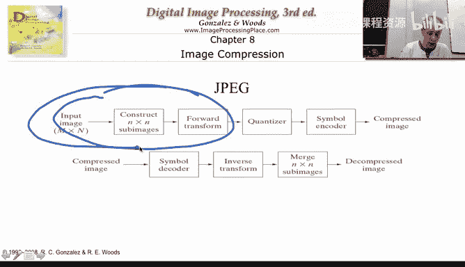
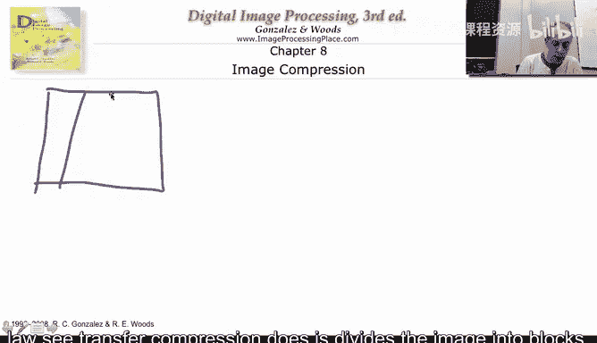
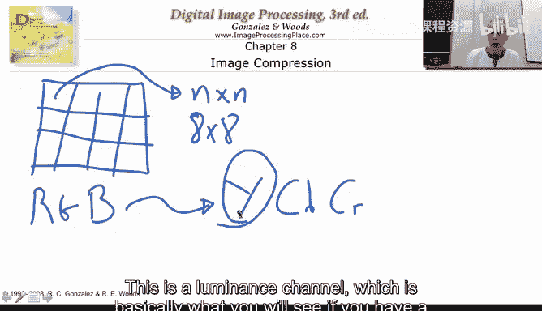
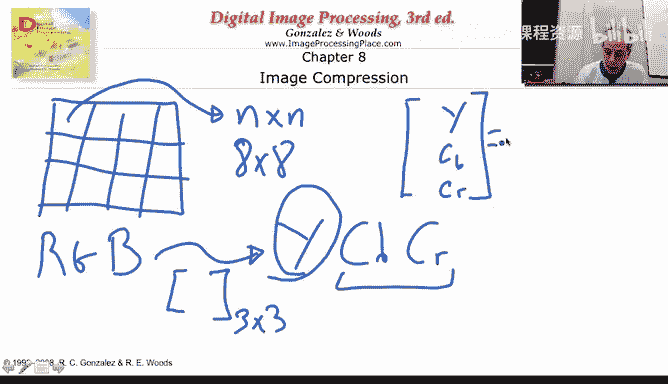

# 图像与视频处理：从火星到好莱坞，途中停靠医院｜P11：11_02_03_3-JPEG的8x8分块

## 概述 📋

在本节课中，我们将要学习JPEG图像压缩的前端处理过程，特别是其核心步骤——将图像分割成8x8像素块。我们将了解这一过程如何应用于彩色图像，以及为何要进行色彩空间转换。

## 从前端开始：图像分块 🧩

上一节我们介绍了图像压缩的后端，即通过哈夫曼编码进行的符号编码。本节中，我们来看看图像压缩的前端。我们将要描述的是压缩流程中的这一部分。

我们处理的是一幅图像。JPEG或有损变换压缩设备要做的第一件事，就是将图像分割成块。

以下是关于分块的关键点：
*   每个块的大小是 **n x n** 像素。
*   我们将举例说明n的值，但可以告诉你，JPEG使用的是 **8x8** 的块。
*   基本上，JPEG几乎独立地编码图像的每一个8x8块。
*   这些块是不重叠的。例如，这里是8个像素，然后又是8个，以此类推。
*   我们会处理完整幅图像。如果你的图像宽度不是8的倍数，也有相应的处理技术，目前无需担心这些技术细节。

我们取一个N x N的块，然后对每一个这样的8x8块进行编码。正如我所说，它们的编码几乎是独立的。

## 处理彩色图像：色彩空间转换 🎨

以上是针对单幅（黑白）图像的操作。但如果我有一幅RGB彩色图像呢？JPEG本身是“色盲”的，标准本身不知道如何处理颜色，但有一些预设的假设。

最初，你可以直接处理红色通道。记住，每个通道都是一个二维像素数组。红色通道看起来像这样。你把红色通道分成8x8块，然后编码红色通道。对绿色和蓝色通道进行同样的操作。这是完全可行的。

然而，通常各通道之间存在很强的相关性。因此，JPEG基本上不会直接编码RGB。它会转换到所谓的 **YCbCr** 色彩空间。我稍后会解释如何做到这一点。

YCbCr不是三个RGB通道，而是三个通道：**Y**、**Cb** 和 **Cr**。
*   **Y** 是亮度通道，基本上就是你在黑白电视或显示器上看到的图像分量。
*   **Cb** 和 **Cr** 是色度通道，代表颜色信息。

这是一个非常简单的变换，实际上是通过一个3x3矩阵完成的。

你基本上会得到一个由Y、Cb、Cr组成的列向量。

这里有一个3x3矩阵。你有你的RGB值。因此，Y是RGB的线性组合，Cb是一个线性组合，Cr是另一个线性组合。这个矩阵是可逆的。所以一旦你解码出YCbCr，乘以这个矩阵的逆矩阵，就可以得到RGB。

因此，JPEG要做的第一件事，就是获取你的彩色图像，并用一个矩阵乘以它。基本上，对于每个像素，例如（100， 150， 200），你乘以这里的系数。这是一个给定的、众所周知的常数矩阵。如果你搜索YCbCr，到处都能找到这个矩阵的值。

它对图像的每一个像素进行此操作，将其从红、绿、蓝数组转换为Y、Cb、Cr数组。再次强调，这是二维数组，其中每个像素不再是RGB值，而是YCbCr值。然后，JPEG将独立编码这些数组中的每一个。

## 编码独立通道 🔄

让我们看看具体过程。JPEG会处理Y通道，并将其分成8x8块。它会对每一个这样的8x8块进行编码。正如我所说，为了本次讲解的清晰，我们将认为它们是独立编码的。因此，JPEG将编码大量8x8的小图像。

编码的方式是使用离散余弦变换（一种变换），然后进行量化，接着是符号编码，正如我们在JPEG框图中多次看到的那样。

现在，我们有了一个8x8的块，我们现在只需要考虑的是，我们有一个小的8x8图像。

## 总结 ✨

本节课中我们一起学习了JPEG压缩前端处理的核心步骤。我们了解到，JPEG首先将图像分割成独立的8x8像素块。对于彩色图像，它会先将RGB色彩空间转换到YCbCr空间，再对亮度（Y）和色度（Cb， Cr）通道分别进行同样的分块操作。每个8x8块随后将经过离散余弦变换、量化和符号编码，最终完成压缩。这一分块策略是JPEG能够高效压缩图像的基础。