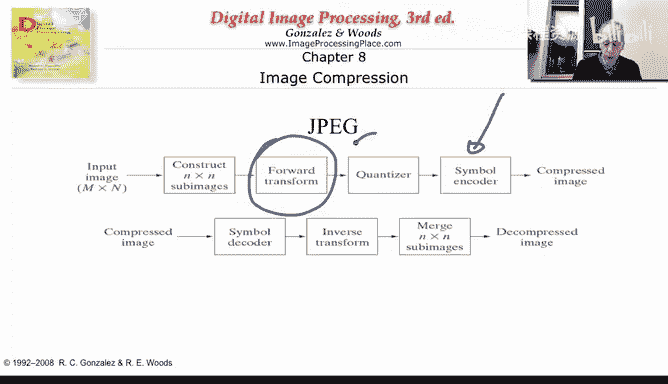
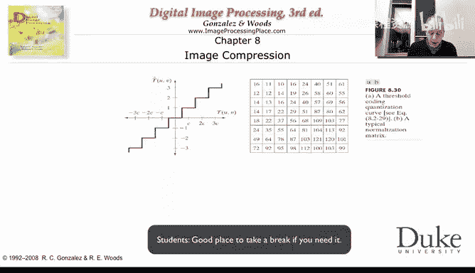
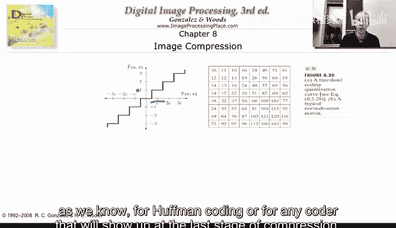
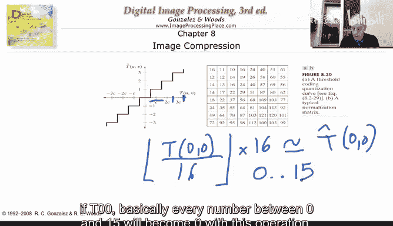
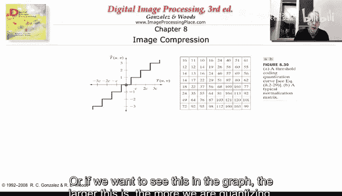
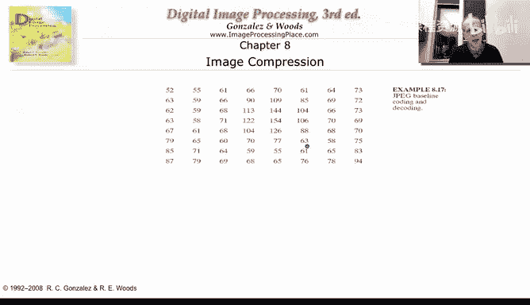
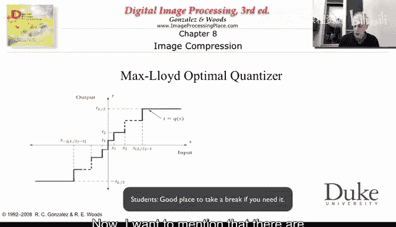
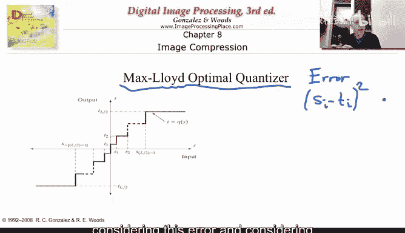
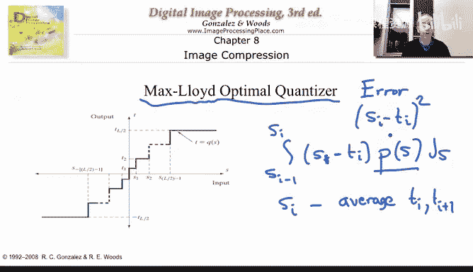

# 杜克大学《图像与视频处理：从火星到好莱坞，途中停靠医院｜Image and Video Processing： From Mars to Hollywood 》 - P13：13_02_05_5-量化-时长-24-02-可选休息点-08-48和17-18.zh_en - GPT中英字幕课程资源 - BV1KYBrBxEsH

We can now describe the main step that introduces error， meaning quantization。

 and is also the step that actually allow us to compress a lot Without quantization。

 we won't be able to compress too much。 We will be able to compress。

 but not as much as we see in our digital cameras。 So basically， we have the forward transform。

 which we have seen。

We have these we have seen earlier， but now we're going to describe the quantization。

 so let's talk about it。

we have actually already seen quantization when we started talking the very early weeks of this class。

 but let's just describe it in detail in the context of JPEC compression。So remember。

 we started from an 8 by8 image， and we have that and transform。

 And what I'm going to represent here are the transform coefficients， so just。In the previous video。

 we saw that we actually have the transfer coefficients。And we get them as a double sum。

 with some of our eggs。With some of the Y， with some of coordinates of the image。

 and we are basically summing the image。This is the image。 And we had。Bas隔。The cosine basis。

 So that's how we go to these coefficients that we represent here。

 We start from an8 by8 and we get8 by8 coefficients。

 So we have kind of an image in a different domain in the cosine domain。

So what we have here are different things that we could do to those coefficients。

 Now we are working with the coefficients。 So for example。

 we could say that we are only going to take the coefficients here and we ignore all these others coefficients。

We could that would be very， very simple， say go to the upper left corner and only use those coefficients。

 ignore everybody else， and I'm going to write in a second what that means。We could also do this。

 which says somehow I'm going to say which coefficients to take。

 Those that are shaded or says one are going to be coefficients I'm going to send those that say zero or unshaded coefficients。

 I'm not going to send or store。Now we can do something else and we can say， you know what？

And don' wantna include or discard coefficients。 I want you to take this coefficient up here and represent it with8 bits。

 so I'm going to let you to do quantization to 256 levels。 On the other hand。

 this coefficient that shows up here， so that will be the coefficient07 T 0，7。

 I want you to use only one bit。 So you're going to only be able to represent two different levels for that coefficient。

And we are going to talk about this in a second。 Now， what happens when we do quantization？

 Remember that F。His can be then reconstructed， as we saw in the previous。Video as the sum of T。

 the transform coefficients。And we can put R because you remember that the forward and inverse were basically the same。

So this is how we are going to reconstruct our image。 Now， if we quantize T。

 we're not going to reconstruct F because we are going to have an approximation of T。

 and then we are going to reconstruct an approximation of F。And remember， what's happening is this。

Our F is a linear combination of de coefficients。Either the original coefficients or the quant coefficients。

 a linear combination。Multiplying the basis and these are the basis。

So here I'm just drawing them in a4 by4， but we know that we are talking a by8。

 So this top coefficient basically says how much of this basis。We are going to be using。

 and you can say， you know what？Maybe our visual perception is such that if instead of what I wanted to use。

 which is 7。7 times this basis， maybe if I do 7。5， is not such a big deal and my visual assistant won't perceive the difference。

 So that's idea of quantization to basically round or say。

 if I put a slightly different number of this component。 whatever component T UV represents。

 it might not be such a big deal in the reconstruction。 And we' are going to see that now， remember。

 why are we doing quantization。We're doing quantization because we're going to do halfman coding after that。

 And remember in halfman coding， we want a non uniform distribution。 We want somes to appear a lot。

 so we're going to give a short code and somes to appear not much so we can give them a long code。

 and for example， if we quantize a lot。 we might find out that 7，8，9，10 all become0。

 And then we're going to be able。To basically compress a lot。

 And we' are going to see a bit more examples of that in the next transparencies。 Now。

 this is the basic idea。 As I say， we are going to quant。

 We are going to change the coefficients that hopefully we are not going to notice that。Now。

 there is something I want to call your attention， something which is very smartly done in JPEEC。

If we just do quantization， we still have to send an8 by8 matrix of quantized transform values。

Means I have to send 64 numbers。 Now， I started， let's say， from an image that has 8 bits per pixel。

256 gray levels。Then I need to send each one of these。Even if I'm going to use only one bit。

 as it says here。 So I started from 8 bits， and I can use。Wan。Then I can only compress 8 to 1。

 I have to basically send you that value。JP says something very smart。

As we are going to see in a second， the top region is going to use， as is represented here， morbis。

 the quantization is going to be more fine。In the lower。Coronner here， JP is going to say。

 you know what， I'm willing to do very， very drastic quant。

 So drastic that a lot of the T U V the coefficients will become0。So， Jpeg is not going to encode。

It's not gonna store this than this， than this。T U V is going to actually go in a zigzag fashion。

 It's going to say， okay， first。I'm going to just do a convention。

 The first coefficient you see is this， which is T00。The second coefficient you see is this one。

 which is t 0，1。 The third coefficient you see is this one， which is T 1，0。 Okay。

 so you're going to be basically be encoding the quants。0，0。

 Then you're gonna be encoding piantize 0，1。Then you're gonna to be encoding the quantities 1。0。

And then you keep going in this zigzag fashion。Now， why is that important， As I say， a lot of this。

Are going to become 0。 Their value is going to be 0 after we do a very strong quantization there。

 So when Jpe arrives to a certain coefficient and sees that everybody else that come after becomes 0。

 It just puts one signal that says end。And if the end is here， meaning everybody here is0。

 then I save a lot of bid instead of sending one bit。For each， let's say to say0，0，0。

 we basis in one end。 And that means to the end of my block to the end of my 8 by 8 transform coefficients。

 everybody became 0。And that's a very smart thing。 And that's what allow us to go beyond 8 to 1。

And to very， very high compression ratios。 And the more you quantize in this region。

 the earlier this end symbol will appear。 So that's a basic idea of quantization。

 But let's see how we do it。So a very simple form of quantization。

Is what we have here。 And that's called uniform quantization。 And this is basically what JP is doing。

 it's saying， okay， you take your coefficients。 I want to do uniform quantization in the sense that let's just speak。

 for example， this interval。It's in everything that falls in here。

Every coefficient that has values between this point and this point I'm going to represent with this。

So that's basically very important。 So now I'm going to help halfman coding no matter what you are。

 you're going to be represented by one number， so I'm basically going to increase the probability of that number appear instead having a lot of numbers appear very few times I have one number appears a lot of times and that's very important。

 as we know for halfman coding or for any code that will show up at the last stage of compression。

Now， everything， for example， in this interval from here to here will be represented by this value。

And the way JPEC does that， and many other coders。He saying， okay。

 I'm going to give you numbers that you're going to scale by that number。 Okay。

 and let's just so basically， it says that the T 0，0。Did。0，0。I's going be divided by 16。We saw that。

 early on。In one of the first videos。Is gonna to be rounded。And then it's going to be multiply。

By 16 again。And that。Basically， became。My new T 0，0。Very simple operation， but very efficient。

 maybe not ideal。 Maybe not the best I could do。 but JPEC is motivated as not only by doing good quality。

 but also by simplicity。And we have seen what these mixed coefficients do。 So as we see here， if t 0。

0， basically every number。Between0。And。15。

Will become0 with this operation。 So if I have 7。Divided by 16。It's a number that when I round down。

 it becomes 0。 I multiply by 16， and it becomes 0。 stay 0。 So basically， every number here。Bca 0。

Every soap， every number， then。B link 16。And 31。Become one。So， Im basically one。

And I'm helping Hafman to basically have less numbers to send and also more concentration。

 and the more we scale by。 So， for example， if we scale by 100 means every number between 0 and 99 will become 0。

 so my quantization is much more broad。 It's not as fine， but hopefully if I do it correct。

 I won't notice too much。 So that's a basic idea of JP quantization。

 So it's going to give and I'm going to show that basic the default table in JP in a second it's going to do this。

 And remember what I say in the previous line because you're going to quantize a lot the high ones a lot of these are going to become0。

 And then this end of block signal is going to be very powerful to compress a lot of symbols with a lot of coefficients。

 a lot of TV a lot of a transform coefficients which is one symbol。Extremely powerful。

So let's just give an example。 This is done actually with the previous matrix。 and the basic idea。

 And this is how JpeEC basically operates。 It's going to do the following。 It's going。

Take these matrix。 and I'm going show the matrix for JPg in a second， as I say， and say， okay。

Let's just do it， let's just divide by 16，11，12， 12 and so on。

 or I can tell you to divide by twice this matrix so by 32， 22， 24， 24 and so on。

 so let's see the effects of that。

So here we basically progressively are dividing by the same matrix but scale up and we see how the quality degrades。

 Of course we are not going to want to do this。 Well probably happen here is that we end up multiplying by 32 times z。

 so we end up basically destroying most of the coefficients。

 but if we basically don't multiply by too much that matrix so we can scale down divide by 16 divide by 11 multiply round multiply back and get very。

 very decent quality images， the more we divide the more we compress。

 So if we as we saw in the previous slide， if we are going to divide by2 we are only rounding basically if we are going to divide by 100。

 we're basically making these blocks of numbers become or equal or。

If we want to see this in the graph， the larger this is。The more we are quantizing。

And this is as promised， the default table that JPC is going to use or one of the possibilities for the default table。

 and the reason I'm showing it to you is because once again I to see I want to show you how numbers increase。

 there decrease back and there has been a lot of studies on this。

 but still the quantization is uniform。

And once again， you can basically。Do multiplications of that matrix。

 So this is what you're gonna get。With。😡，One scale of that matrix。 And then if you scale it more。

 you're gonna get。 and I hope you can see the quality。 And this is the error。

 just in case it's hard for you to see from the image。 But let's just concentrate on certain regions。

 We see here it looks very nice。 So probably we haven't scale the quantization matrix too much here we actually scale it too much。

 and doesn't look very good。 look at this zoom in region。 It really doesn't look very good。

 Also here if you zoom in， you can see some problems with the image， but not at this scale。

 So basically， what we have is a quantization matrix that says every one of the transform coefficients T U V。

 What do we want to do。 Do we want to divide and round and divided by five or divided by 100。

 and the larger the number we divide by the more error we are producing。But of course。

 the more compression were doing。 So it's interesting in some of the software packages that you have out there。

When you are saving an image， it asks you for the quality that you want to save your Jpeg image with。

 And what's asking you is basically how much to multiply this quantization matrix。

 So the quantization matrix is basically in that package is a fixed matrix。

 So how are you gonna basically compressed more or less by scaling up or down。

 that quantization matrix。 So when it says you want high quality is not going to scale by a lot when it says you want high compression or lower quality is going to scale it by a lot。

 And that's how Jpeg works with a very simple， basically uniform quantization that is done just by scaling and multiply back。

 Of course， the multiplication is done at the decoder。 So every number between 0 and 100。

 if you scale by 100 between 099。 sorry， If you scale by 100 is going to be coded at a0。

And then the decoder is going to multiply by 100 to get the number back。

 So that's what Jpeg does for quantization。 And that's where you get the compression。Now。

 I want to mention that。

There are techniques， and there are theories to try to basically adapt the quantization to the signal type。

 So Jpeg does a uniform quantization because it's very simple。

 We don't have to do a uniform quantization。 We can have intervals as shown here They have basically different width。

 So some regions will be basically scale more than other regions。

 That doesn't happen in JpeEC iss uniform， no matter what value is。提。U V。

 you always divide for a given coefficient position。 you always divide by exactly the same number。

 Now， here， depending on what your input， the value you are going to be dividing by。

 And that's very important that JPEC decided not to do that once again。

 in part because of simplicity by when to conclude this chapter on quantization by explaining to you that you could actually do better if you were willing to spend a bit more complexity in your algorithm。

 And basically， there is very nice theory on how to do better。 And that's called the max。Lloyd。

 optimal quantizer。 And the basic idea is relatively simple。

 although computations are not always straightforward。And what they have shown is， basically。

 remember。If you want to make the error。As the square difference。Between a given pixel。

And it representation。And we talk about a square。 So that's the way you decide you say。

 Im going to do the best possible quantizer considering this error。

And considering that I have certain allocations of bits。 Of course。

 if you say I don't care how many bits are used， then don't quantize at all。

 That will be basically zero error。 But if you come and tell me， I can only use， basically。

256 levels。 so I can only use A bits， so I can only have。256 of these intervals。

 because I need to represent each interval by one of my strings of bids。

And so you predeeffinine the number of levels that you' are willing to use， the number of intervals。

 and you predeefine this as your error。 So you can show that basically what we have to do and this is very intuitive。

 is say， okay， what's the error I'm making in every interval。

 So you're going in every one of these intervals， So I'm going to do S sub I minus-1 over S sub I。

 that's my integration。 and you can show that if this is the error that you care about。Then here。

You have to put S。Mus， basically， is only S。Because I'm going to do an integral。Mus t数倍。So。

 that's the error。You get S。You represent it with T。 So that's your error。

But you have to also multiply by the probability。Of that value appearing。

If it never appears in your input data， then you don't care about it because you're never going to make an error and then you integrate overs。

 So that's one equation looks how the unknowns， which is the borders of our interval that we are trying to find appear here。

In the integral part， and the representative appears here。 And so this is only one equation。

 but we can get a second equation。 You can actually show that the。S eyes。あで。Average。Of the T I。

And the T I。Plus one。 And that comes because you are trying to compute a means square error。

 And that leads to average。 And then from this， you're going to get a second equation。

 So you get basically two equations for every one of these concatenated intervals。

 and you have to solve them。 And that's not always easy。 And close solutions。

Do not exist for most of the probability distributions。

But they do exist if we assume that the probability distribution is uniform。

 and that's what basically JPEC is using is saying， okay， the probability distribution is uniform。

 So I'm going to just do the rounding， as I explained before。

 but there is good theory represented me here basic in this equations that if you knew the probability distribution。

 you can actually do better than just uniform quantization once again。

 JPEC decided to do uniform quantization and that both for simplicity and also what's called universality。

I don't need to know the probability distribution。 I'm going to make JP work。

Very good for basically almost any image。 Maybe I could have done it better for some distributions。

 but I'm going to just make it basically work for any distribution。

 And I should say to you that you can modify JPEC and that's still part of the standard and introduce your own quantization tables which might follow a distribution that you know。

 So if you are compressing a very particular class of images。

 you can basically tune your JPG to do that。

So with this， basically， we have concluded。The basic underlying concepts of JPEC。

 we start from a transform， which is this city。 we quantize uniform quantization。

 We do halfman coding。 very， very simple。 And you're going to have as one of your optional programming exercise to actually build JpeEC。

 and it's not going to take you long， if you use， for example， a software like Matlav。

You are going to do a densityity， which is a very simple command。 You' are going to do aquaation。

 remembers nothing else than divide round。 And if you are already playing the decoder。

 multiply back by the same number。 And then you can do a halfman coding。

 But even without a halfman coding， you will be able to see when you divide by larger numbers。

 you basically get more compression， but less quality。 Thank you。

