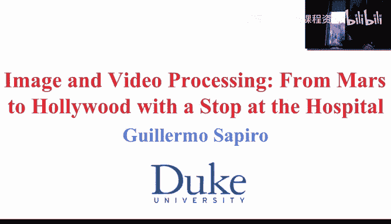
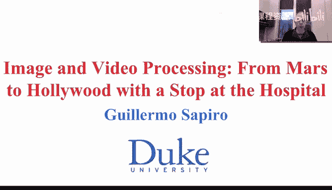
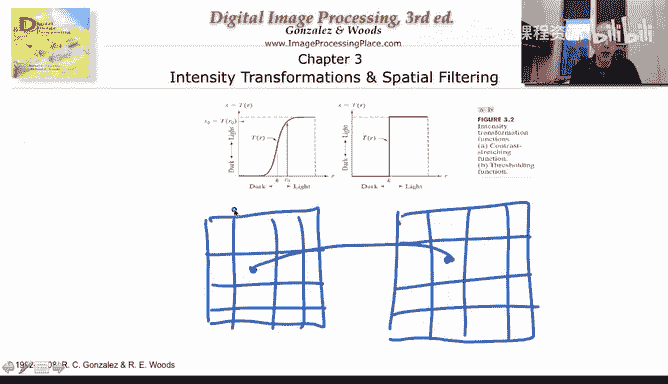
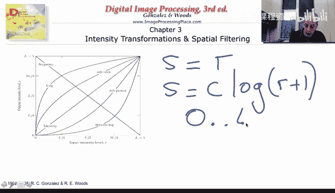
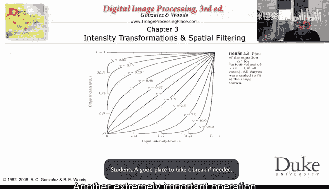
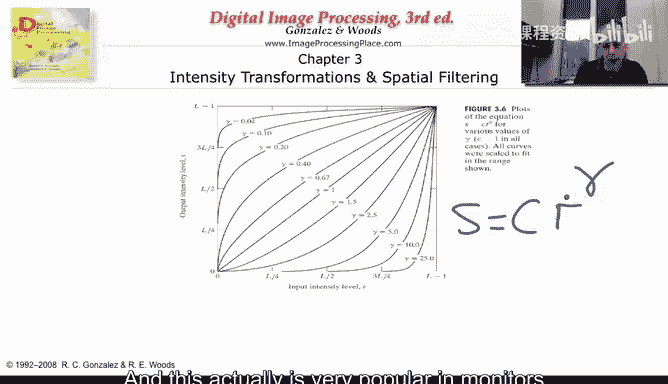
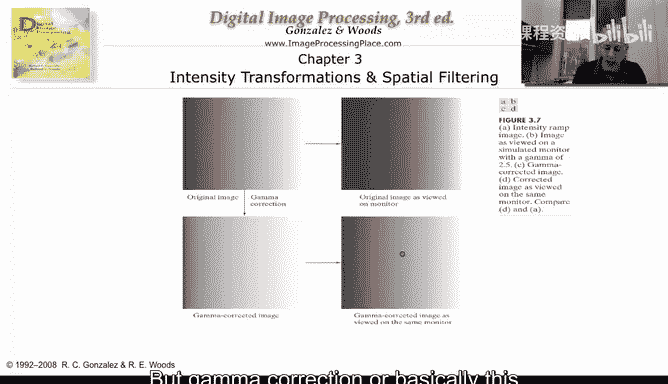
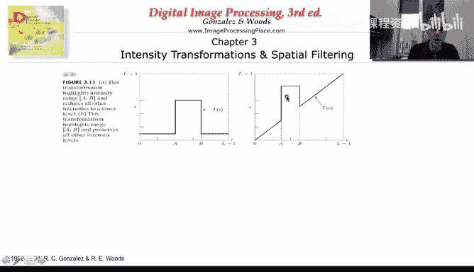

# 杜克大学《图像与视频处理：从火星到好莱坞，途中停靠医院｜Image and Video Processing： From Mars to Hollywood 》 - P16：16_03_01_1-图像增强导论-时长-19-11-可选休息点-08-33.zh_en - GPT中英字幕课程资源 - BV1KYBrBxEsH

Hello and welcome to week three of our class on I and video processing what you're seeing right now is me on a relatively dark room。

 you can probably see the Duke chapel behind me but you can see details about， for example。

 the color of the shirt I'm wearing or if you were to look at my desk is basically very dark and you can' see much。

What happened when we take an image like this， What happened when we have a video that is very dark。

 That happens to us all the time。 we take a picture at night。

ItDoesn't have the lighting that we want。 It's too dark or too bright， sometimes too noisy。

 What we are going to do during this week is to learn how to improve those images。

 how to enhance those images。 We're going to start with very simple manipulations。

That will basically help us to improve the contrast， remove the noise。

 And we're going to go towards the end of the week to more advanced techniques。

 which are basically leading to state of the art approaches today。

 And we're going to come back to some of these towards the end of the class to basically week7 week。

To really， really advanced techniques for image enhancement。

During this week and the following weeks we' are also going to do online and realtime demos so I'm going to basically teach you some of the material and then we're going run some different software platforms to basically do some of these operations right now on my PC and you're going to see them in practice how they are working We are also going to introduce some online video quizzes。

 so basically I'm going to post for a second and you're going to be able to think about a question that I will pose to you that won't basically affect your your certificate at the end。

 but's just to have you think for a while before I give you the answer to the question like in any regular class that I will basically post to have the students think for a minute before we continue let me turn on the lights so I can continue this and write and explain to you the basic principles of image enhancement and contrast enhancement and image noise。

So bear with me for a second， I'm going to turn on my lights。

And we will be right by it。 So now I'm。Turning the lights on， so you can see。A bit of the details。

And you can't see much in the background anymore， but you can see what's in the room and what I'm going to show you is how we turn the lights on digitally in the computer so you have taken your image you can all go back to the scene。

 I want to turn the lights on with image processing and video processing software。

 so let's start doing that。

And we basically are going to start from very simple operations。

 which are histogram modifications or pointwise operations。

 So the basic ideas illustrated in this figure。Every pixel of the image。It's going to change。

Its own value， following certain function。So the pixel here will move to a new image。

 will basically change its value， but it will change its value only based on its own value right now。

 It's not going to be influenced by anything that is happening in any other part of the image。

 That's the first part of this week3， we're going to see later。

 how we basically influenced the pixel value by other things that are happening in the image。

 but to start very simple what's called pointwise operations。

 There is a certain pixel value in the input， a certain pixel value in the output， Similarlyly here。

 for example， what's happening here is that everybody up to pixel value K becomes0 everybody above k becomes one or the maxim value。

In the image。 So this is basically a threshold link operation。

So what we need to specify is this one dimensional function that translates the input to the output。

And let just see a few examples of that。So here we see a few illustrations of these。

 several of these operations inverse log， of course， let's start from the identity， the input。

Is identical to the output。 So basically， this is the identity。 If we basically mark the output as S。

Identity S S equal R。 The output is identical to the input。 We have done nothing to the image。

 We also have a log operation， for example， the output。Is some constant。Times dead log。Of the input。

 And we normally are going to add， let's say one。Because if the input is0。

 we cannot take the logarithmic of0。 So we do it this。 So that's an our operation。

 whatever is the gray value of the input， we transform it to the output。There is also the inverse。

 which is written here， and I I want for you to think for a second what will be basically the function that will represent the inverse。

 considering that our image goes from0。To L。

So the minimum value is0， the maximum value is L。 What will be the function。 Basically。

 I want to write s。As a function of R。While will be that function that will basically do the neation of the image。

 the maximum value of the input will become 0 and the minimal value of the input meaning 0 will become L。

 So let's just think for a second， and it's a very simple exercise just to illustrate how simple and as we're going to see in a second how powerful at the same time。

 this type of operations are。So we know that basically， I ask you how to。Basically。

 construct this function， and it's very simple。 We want the output。To be the universeverse。

Of the input。 So S equal L， the maximum value minus R。 So when r is L。

S becomes 0 because it L minus L。When R is 0， then basically S becomes a L， which is the maximum。

 So a very， very simple operation that just inverts our。Gray values。

 And note that all what I care in all of these operations is the actual gray value。 I'm not asking。

 where is the pixel located in the image。 I'm just asking， what's the pixel value。

 What's the gray value of that image。So here is one example of this。Basically。

 this function that which is w as equal L minus R is basically taking every pixel and doing the inversion。

 So it's the negative image and some of the things that we see is that is basically easier for us to see just visually some of the things in the negative image than it is in the original image and why is this remember early on we talk about the properties of the visual system that there are certain contrast that we understand better that we perceive better at different levels of the background and we saw that there are some contrasts that are perceived better when we are in the dark regions。

 some contrasts are perceived differently when we are in the light regions。

 So this inversion basically might help us to perceive things that are difficult to notice in the original image。

Very simple illustration。 One other important thing of this type of operations。 is I can go back。

 So if I start from here， I have not destroyed the information。

 I can simply go back and reverse this operation。 That's not always possible。

 as we're going to see later this week， but。For this particular operation， that's doable。

Another extremely important operation is basically an exponential function。

 and I'm going to write it here as the output is going to be a constant the input to some exponent gamma。

And the basic idea here is that， depending on。Gamma， in particular， we get different functions。

That transforms the input to the output。 And this is very often called gamma correction。

 And this actually is very popular。

In monitors， because of some properties of the monitor。

 If you don't do a gamma correction to your image， your image is gonna to look relatively dark。

 So if this is my image， it's going to look dark。 And it's going to be hard to perceive exactly the details。

 And that's because of properties of the monitor。 So sometimes before you send the image to the display to the monitor。

 you do what's called a gamma correction。 So you gamma correct the image。

 and then you basically send it to the display。 And what's basically the gamma correction is doing is inverting this darkening operation that happens due to some properties in the monitor。

 So it's a very useful， very common operation， basically shows up。In virtually every monitor。

 there is a gamma correction before the image is basically display。 But gamma correction。

 or basically this exponential function is very useful in general to basically kind of stretch if you need the pixel values。

 Remember， we have histograms and。

Which are the distributions of the pixels。 And for example， if we look at this image。

 it looks like most of the pixels are concentrated on the bright values。

So if we were to draw and we're going to do these instograms very often basically starting in the next in the next video。

 but a lot in this week。 So probably if we were to plot the distribution of the pixel values of this image。

 they will occupy a lot this region because we look like the image is basically too much at the high values。

 very bright。 So with gamma corrections we can manage to actually stretch this isstogram。

 and these are just different values， but I think the simplest is just to look at this one。

And we see that we have basically a nicer image。 It looks better than this image， first of all。

 but it also helps us to better understand some of the details。

 and I hope that you can still in your own monitor that is doing its own gamma correction。

Then you can actually perceive better details here details here and in different regions in the image and sometimes it might become too much。

 so you might do a different type of gamma so you might say oh this region actually I'm not perceiving a lot of the details。

 so maybe I should do a different value of gamma as illustrate here。

 this are researchers with different values of gamma and you can actually do some of these operations not in the whole image but in some regions of the image so you could invert only some regions of the image。

 you could do a gamma correction or an exponential function in only some regions of the image。

 so you don't have to do them every place you can do them locally。So， that's。

A very simple operation and immediately gives us a much nicer perception of the image。

 Remember the video as we started this video was very dark。

 That means that the distribution basically of the pixel values were around here。

 if this is the isstogram， the distribution and this kind of operations help us to stretch to basically use better the resources that we have in the display to use the whole spectrum of values from0 to 255 instead of just using the dark part of the values or only the bright part of the values。

 Again， a very， very simple operation。😊，嗯。Here， there is a lot of art in designing these operations。

 but with experience we understand what we need to do。

 Here is yet another example of this stretching of the pixel values。 So once again。

 this is the input， this is R， this is S， this is the output。

 So if your pixel values are between this point。 and this point。 Not a lot is happening。Okay。

 so this is going to be the original image。 Ps values that are relatively dark。

 not a lot is going to happen to them。 Pixs values that are relatively bright。

 Not a lot is going to happen to them， but pixels value in between are going to be stretch。

 basically are going to。This has a slope， much larger than one。 If the slope was one。

 nothing will happen to them。 If the slope is less than one， it will be basically contracted。

 If the slope is larger than one， it will be stretched。 Okay， so if we have a slope larger than one。

0 stays0， but one basically goes up to the slope and gets stretched。 And then we see what happened。

 This is the original image， because the mid range of the pixel values gets stretched。

All of a suddenturn， I can see details that I couldn't see before。

Look at the points here are extremely difficult to notice。

 but here I can see that actually there were spots in this image。

 And then if you wish you can threshold that image， and that's what's happened here。

 so we can distinguish the different regions。 But notice the difference of going from here to here very hard to understand what's happening here。

 much nicer looking image here and not only much nicer looking。

 but I can also see the details in the image， and that's very important for image analysis。

 and I can do simple things like thresholding。 So everything that's happened here is extremely extremely simple operations。

 By the way， this is this going from here to here basically is also。

A very simple operation we actually saw it before， the operation of this tie。Okay， so this is S。

This is R the sum of the pixel values go to0。 If they are below this particular value and if they are above。

 they go to the maxim value that I can display in the image。

 So very simple operation can do drastic transformations in the image and very useful transformations in the image。

A couple of additional examples here。We have it's kind of a threshold but in the mid range so basically we say okay。

 everybody that goes from0 to a， I want it to be very low， everybody that is above B。

 I want it to be very low and everybody in between I want it to be very high and this is another example。

 basically everybody between0 and a don't touch。Everybody above we don't touch Everybody between A And B make it very。

 very bright。 or I could say make it very， very dark。 Okay。

 so let's assume that you have information that the pixel values of your original of interest are between A and B。

 and you want them to be highlighted in the image。 Then you do this type of operation or this type of operation。

 Let's just see the effects of that in the next slide。 This is the original image here。

And this is the first operation where we basically take a range of the image and that range of the image we make very brighter。

 very bright， everything else we make very dark。And this is another example。

 This is the second example where we take a region of the image。

 and we only change that region of the image。 Everything else basically stays the same。 Of course。

 you need information。 What's the region that I care of。 And that comes， as I say。

 from experience of information about the scene that you're capturing in this case。Basically。

 information about the biology and what kind of pixel values。This region of the image appears。

 and that's a region that I'm going to basically say I need it to make to make I need to make it brighter or to make it darker。

 and similarly here， the goal of this is to illustrate how very。

 very simple operations can get us basically what we want can get us to improve the visual appearance of images going from very dark or very bright to very uniform and nice looking images。

 or can help us to basically highlight the region of interest。

 If you want to do the analysis of this region in the image。

 maybe it's nice to basically make everything else dark， So I can concentrate my attention here。

 but maybe you say yes， but I lost details， because you made everything white。 okay。

 then let's do something else。 Let's just take the whole background basically and make it zero。

 but let's not change this range。Vues and this is the type of operation that appears here we make everything that we don't like just very dark or very bright。

 but everything that we care， we live and touchuch and then we can actually concentrate our visual observation will concentrate only on that region。

So these are very simple operations In the next video。

 we are going to start talking about Instagram equalization。 But before that。

 let's just make a short video that basically runs some of these operations in real time so we can see how simple they are。

 and we can actually observe how they are working on other images。 So see on the next video。

 Thank you。😊。