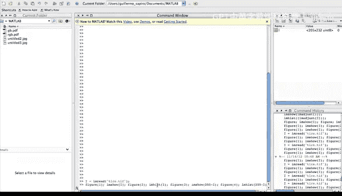
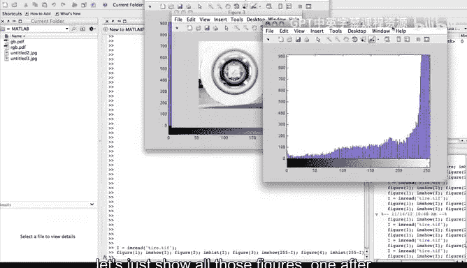
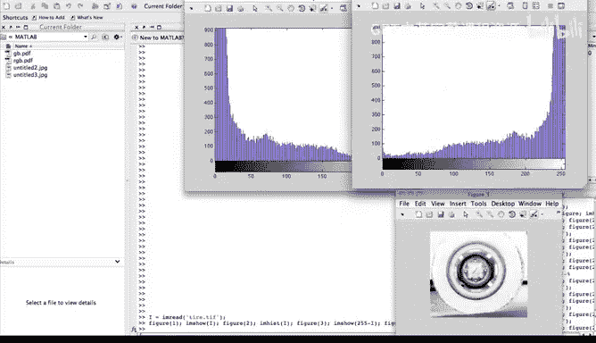
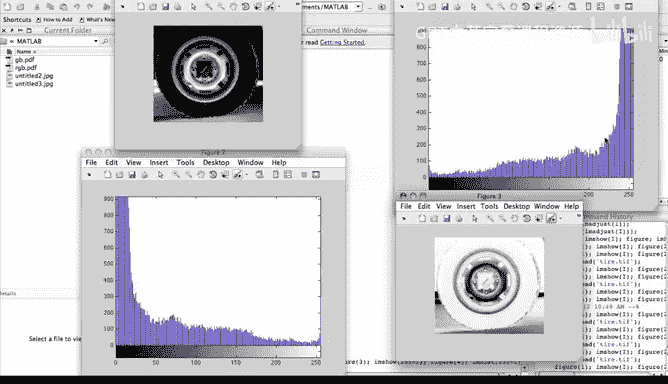
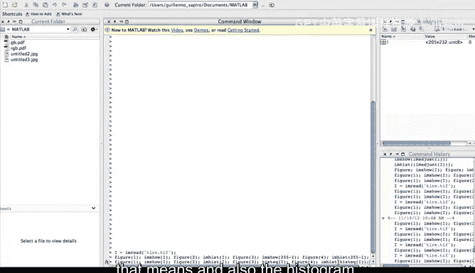
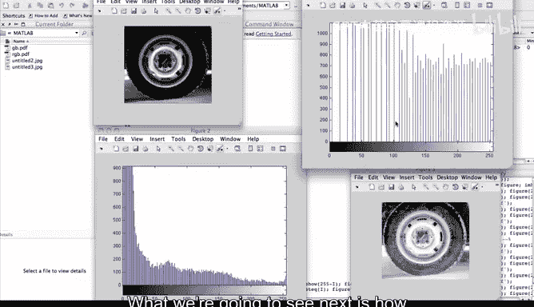

# 杜克大学《图像与视频处理：从火星到好莱坞，途中停靠医院｜Image and Video Processing： From Mars to Hollywood 》 - P17：17_03_02_2-演示：增强与直方图修改-时长-03-53.zh_en - GPT中英字幕课程资源 - BV1KYBrBxEsH

We're now inside the MALV environment and we're going to be using MADLav to illustrate some of these pixelix modification algorithms that we just described and also some of those that we're going to see in the next video。

Mlab is a great software to do image processing。 Of course you don't need to have Matlab to understand what I'm going to show you next。

 or you don't need to know how to program in Matlab。

 It's very intuitive and it's going to be very simple for us to understand the commands that I'm going to do。

The first command is basically reading an image， as we see here， we are ring the image。

The next command is going to have a number of steps， which I'm going to show you next。

I'm going to first create a figure and show the image on that figure， then I create a second figure。

 and I'm going to show you the intogram of that image。

And I'm going to keep creating figures to illustrate the other operations I want to show you。

 One of them is going to be the inversion of that image，2，55 minus I。

 And the last thing I want to show you is the insogram of that image。

 You can start thinking how the instogram of the inversion compares to the in of the original image。

 Let's see that Lets just show all those figures one after the other。 I'm going to move them。

 So it makes it easier for us to observe those images。 those figures。

And I'm going to tell you what each one of them is。

So here is the original image and this is its isstogram， and we see the image is pretty dark。

 so we see a large concentration of dark values。Here is the inversion of the image。

 We basically have flip all the image values and look what happened to the Instagram。

 The Instagram also has flip， basically what was here。I moved to here。

 as we have expected because we are just flipping the pixels。

 we're not making any other change but flipping the pixel values。

 so it's a very simple operation and we see what's happening to this to。

Let's now see another operation that we're going to describe in detail in the next video and it's going to be what's called is equalization and I'm going to look for the command to do the Instagram equalization and to show you that to you and that's going to be here once again I'm going to show you the image and its Instagram as before now I'm going to show you the equalize image and I'm going to illustrate what that means and also the Instagram so again we're going to have four figures。

And I think you're starting to guess what's happening here。As before， we have the original image。

It's Instagram。 We see the Instagram very concentrated on the left。

Here we have the result of what's called istogram equalization what we are trying to do here is to make this istogram looks more uniform。

 look at here how instead of being concentrated in the low values showing that this is a very dark image which spread the pixels values so there is better exploitation of all the gamut of values from0 to 256 instead of here that there was almost no pixels with this value that istogram equalization help us to see detailss that we couldn't see before like this region of the tire。

So it's a very powerful operation to be able to basically see details in the image that because of the bad use of the spectrum of gray values we couldn't see before what we are going to see next is how we actually mathematically do this operation so see you in the next video。

