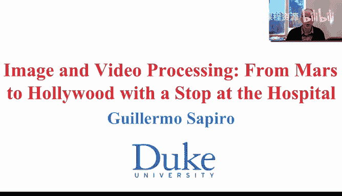
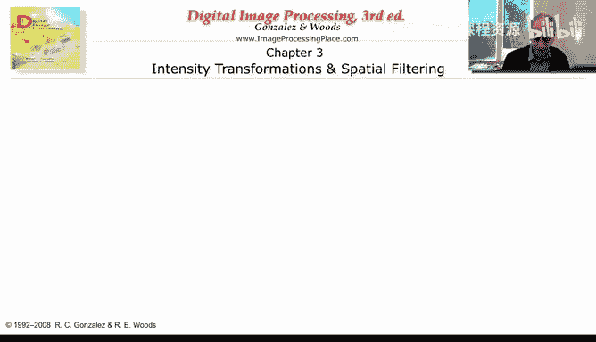
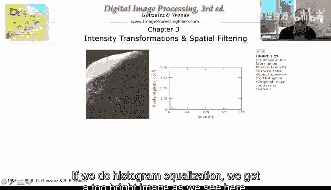
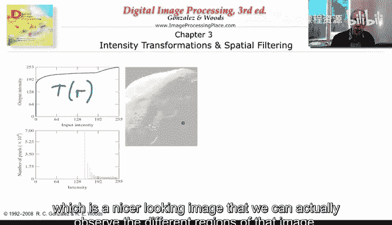
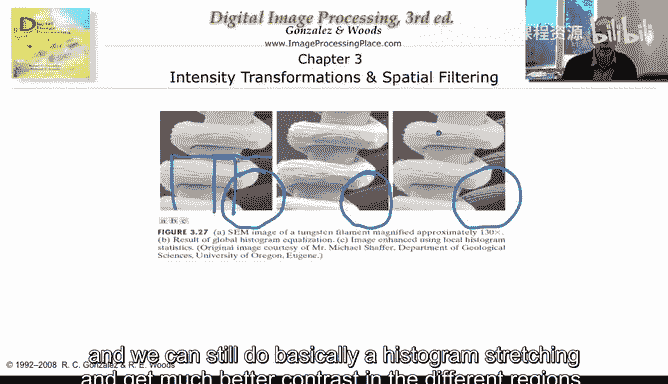
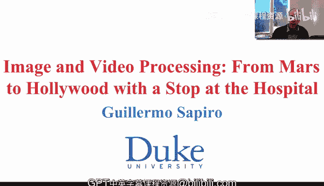

# 图像与视频处理：P19：19_03_04_4-直方图匹配 📊

在本节课中，我们将要学习直方图匹配。这是直方图均衡化的一种简单扩展，它允许我们将图像的像素分布映射到一个指定的目标分布，而不仅仅是均匀分布。

## 问题引入

上一节我们介绍了直方图均衡化，它将任意像素分布映射到尽可能均匀的分布。现在，我们面临一个新问题：假设我们有一个原始像素分布，而目标不是均匀分布，而是一个指定的目标分布。我们希望通过一个映射函数，将原始分布变换到与目标分布尽可能接近的结果。

## 核心原理与方法 🧠

直方图匹配的核心思想是，通过两次直方图均衡化操作来实现。以下是具体步骤：

1.  **对原始图像进行直方图均衡化**。这会将原始分布映射到一个均匀分布。我们得到第一个映射函数 **T(r)**。
2.  **对目标分布进行直方图均衡化**。这会将目标分布也映射到一个均匀分布。我们得到第二个映射函数 **G(z)**。
3.  **组合映射**。为了将原始像素值 `r` 映射到目标像素值 `z`，我们首先应用 `T(r)` 得到中间均匀值，然后应用 `G(z)` 的逆函数 `G^{-1}` 来找到对应的目标值。最终的映射关系为：**z = G^{-1}[ T(r) ]**。

以下是实现这一过程的关键步骤列表：

*   **步骤一**：计算原始图像的累积分布函数（CDF），得到映射 **T(r)**。
*   **步骤二**：计算目标分布的累积分布函数（CDF），得到映射 **G(z)**。
*   **步骤三**：对于原始图像中的每个像素值 `r`，计算 `s = T(r)`，然后找到满足 `G(z) ≈ s` 的 `z` 值，作为映射后的新像素值。

需要注意的是，由于映射可能不是一一对应的（即多个原始像素值可能映射到同一个目标值），在逆映射 `G^{-1}` 时可能出现歧义。最常见的解决方法是选择与原始值最接近的目标像素值，以最小化对图像的改变。

## 实例演示与对比 🖼️

让我们通过一个具体例子来理解直方图匹配的效果。

假设我们有一张非常暗的图像，其直方图显示大部分像素集中在低亮度区域。这导致图像细节难以辨认。

如果直接应用**全局直方图均衡化**，我们会得到一张非常亮的图像。虽然对比度整体提升，但可能在某些区域过曝，丢失细节，整体效果可能并不理想。

现在，如果我们进行**直方图匹配**。我们指定一个认为更适合的目标亮度分布。通过执行上述两步均衡化过程（一次正向，一次逆向），我们可以将原始图像的分布映射到接近这个目标分布。结果图像通常会获得更自然、更均衡的对比度，不同区域的细节也能得到更好的展现。

## 局部直方图处理 🔍

以上讨论的都是全局操作，即对整个图像的像素分布进行统一变换。然而，当图像不同区域具有非常不同的亮度特性时，全局处理可能是一种折衷，无法同时优化所有区域的对比度。

为了解决这个问题，我们可以引入**局部直方图处理**。其思想是将图像划分为多个区域（可以是重叠的），然后对每个区域独立进行直方图均衡化或匹配。

以下是局部处理的好处：

*   它允许在每个小区域内最大限度地拉伸对比度。
*   对于包含明亮和黑暗区域的高动态范围场景特别有效。
*   可以显著改善全局处理无法兼顾的局部细节。

例如，在一张同时包含天空（亮）和阴影（暗）的风景图中，全局均衡化可能使天空过曝或阴影过暗。而局部处理可以分别优化天空和阴影区域的对比度，从而在整张图像上获得更丰富的细节。

## 总结

本节课中我们一起学习了直方图匹配。我们了解到，直方图匹配是直方图均衡化的扩展，它通过组合两次均衡化操作（一次对原图，一次对目标分布）来实现将图像分布映射到任意指定分布的目的。我们还探讨了当映射非单射时的歧义处理方案，并介绍了局部直方图处理技术，该技术通过处理图像的子区域来克服全局处理的局限性，从而在复杂图像上获得更优的对比度增强效果。直方图均衡化与匹配是图像处理中简单而强大的基础工具。