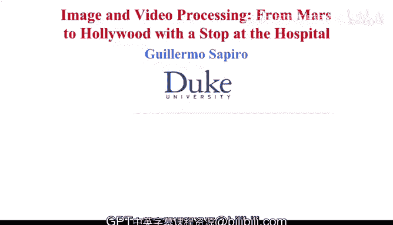

# 图像与视频处理：从火星到好莱坞，途中停靠医院｜P1：01_01_01_0-欢迎与入门指南 🎬

## 概述

在本节课中，我们将开启图像与视频处理的学习之旅。课程将持续九周，我们将从杜克大学美丽的校园出发，探索这一领域的核心知识与应用。

## 课程介绍

大家好，欢迎来到我们的图像与视频处理课程。在接下来的九周里，我们将共同学习大量新知识。

我们将借助图像与视频处理技术，踏上前往火星的旅程，探访好莱坞，并走进医院。

在介绍本课程的具体安排之前，让我们先走进位于这栋建筑后面的办公室。我将通过几个例子，向大家展示在这九周中我们将要学习的内容。

那么，让我们现在就进去看看吧。我们下一个视频再见。谢谢。