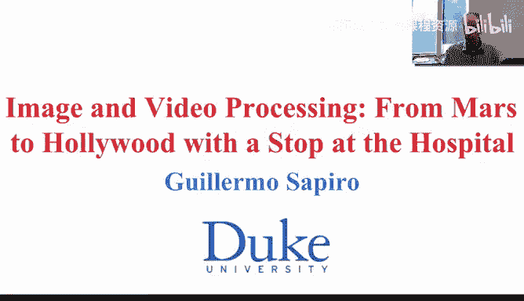
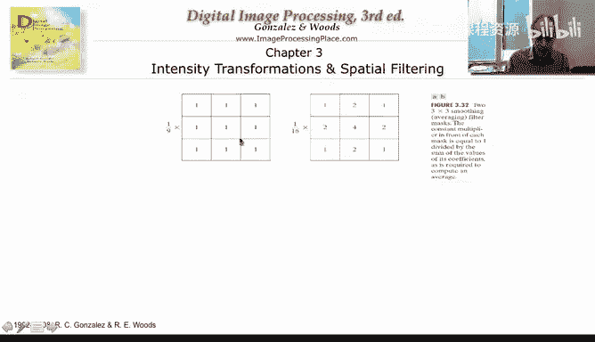
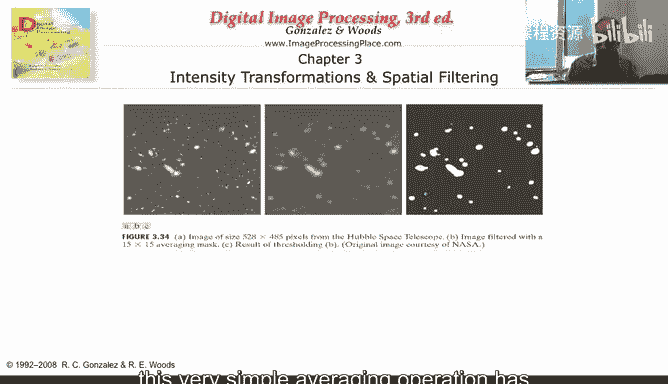
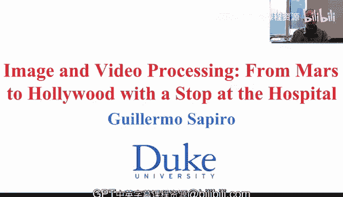

# 图像与视频处理：P20：局部邻域操作导论 🖼️

在本节课中，我们将要学习图像处理中的**局部邻域操作**。我们将了解如何根据像素周围区域的信息来修改像素值，并重点介绍最简单的邻域操作——**局部平均**。

## 从灰度变换到空间操作 🔄

上一节我们介绍了直方图修改（如均衡化或匹配），这些操作仅根据像素自身的灰度值进行替换，并未考虑图像的周围区域。本节中，我们来看看**空间操作**。

空间操作的核心是：根据像素**周围邻域**发生的情况，来决定如何替换该像素的值。这意味着，像素值的改变不再仅仅取决于其自身，而是受到其邻居像素的影响。

## 最简单的邻域操作：平均 🧮

最简单的邻域操作是**平均**。例如，我们可以用一个3x3的邻域内像素的平均值来替换中心像素的值。当然，我们需要进行归一化。如果平均9个像素，就需要除以9。

我们还可以进行**加权平均**。例如，可以让中心像素自身的权重为4，其四邻域（上、下、左、右）像素的权重为2，而对角线像素的权重为1。这样，总权重和为16（4 + 4*2 + 4*1 = 16），最终结果需要除以16进行归一化。

以下是加权平均的一个概念性公式表示：
`新像素值 = (4*中心像素 + 2*∑四邻域像素 + 1*∑对角像素) / 16`

## 邻域大小的影响 📐

让我们观察不同大小邻域的平均操作在实际图像上的效果。我们使用一个包含不同尺寸结构的图像，并分别用3x3、5x5、9x9、15x15和35x35的邻域进行局部平均。

以下是观察到的效果：
*   **小邻域（如3x3）**：图像变化不大，仅细微结构有所改变。
*   **大邻域（如35x35）**：图像变得非常模糊，许多结构细节丢失。
*   **中等邻域（如15x15）**：模糊效果介于两者之间。例如，图像中的条形结构在15x15邻域下比在35x35下更容易区分。

## 模糊效果的原理 🤔

为什么平均操作会导致模糊？让我们通过一个一维函数的例子来理解。

想象一个尖锐的黑白边界（例如一个像素是纯黑，下一个是纯白）。当我们用一个大窗口（比如35x35）对黑色像素进行平均时，我们会将其与周围许多较亮的灰色像素混合，导致其平均值上升，变得不那么黑。同样，对白色像素进行平均时，其周围的一些暗像素会拉低其平均值，使其变得不那么白。于是，原本尖锐的边界就变成了平缓的过渡，从而产生了模糊效果。

## 局部平均的应用 💡

你可能会问，这个会导致模糊的操作重要吗？答案是肯定的。

虽然我们通常不会使用像35x35这样大的窗口进行平均（因为它会过度模糊），但我们可以根据具体问题设计合适大小的窗口。例如：

*   **去除小物体或噪声**：假设我们有一幅图像，其中包含一些我们不想关心的小物体（如噪声点、小颗粒或星星）。我们可以使用一个适当大小的局部平均滤波器（例如15x15）对图像进行模糊。这样，一个小亮点会被周围大量的暗像素平均，其值会大幅降低，接近0。然后，我们再对图像进行阈值处理，就可以只保留那些较大、较亮的感兴趣区域，从而滤除噪声。

这个简单的“先模糊，再阈值”的操作，对于此类任务非常有效。

## 总结与预告 📚

本节课中，我们一起学习了：
1.  **局部邻域操作**的基本概念：根据像素周围区域的信息来修改像素值。
2.  **局部平均**作为最简单的邻域操作，其实现方式（简单平均与加权平均）。
3.  邻域**大小**对平均操作效果的影响：窗口越大，模糊效果越强。
4.  平均操作导致图像**模糊**的直观原理。
5.  局部平均的一个实际应用：通过模糊和阈值处理来**去除小物体或噪声**。

这个简单的平均操作还具有非常有趣的数学性质，这些性质至关重要，因为它们将帮助我们开发其他类型的平均操作——例如，能够**不模糊边缘**的操作。我们将在下一个视频中解释这些数学性质及其与其他结构的关系。