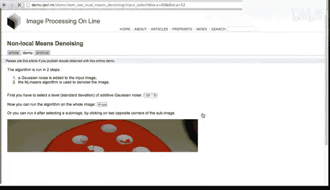
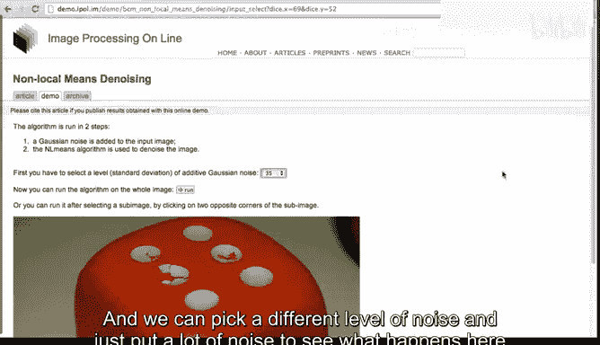
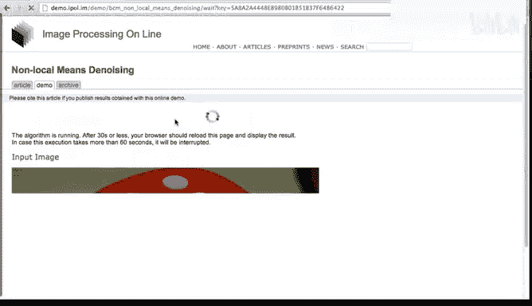
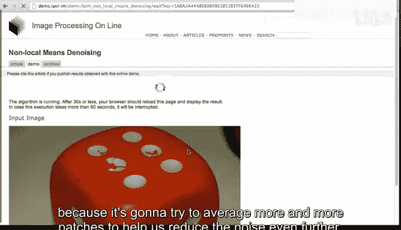
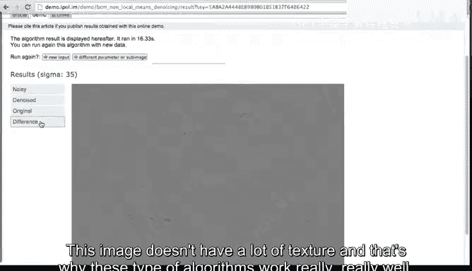

# 图像与视频处理：P23：IPOL演示：非局部均值去噪 🖼️➡️🧹

在本节课中，我们将通过一个在线演示，直观地了解非局部均值算法的实际去噪效果。我们将使用图像处理在线期刊（IPOL）提供的工具，上传或选择图像，添加噪声，并观察算法如何恢复图像细节。

上一节我们介绍了非局部均值算法的基本框架，本节中我们来看看它的实际运行效果。

## 访问IPOL期刊与工具

非局部均值去噪演示使用了图像处理在线期刊的资源。该期刊网址已在本课程网页中提供链接。

IPOL期刊收录了许多图像处理的前沿算法。强烈建议你访问该网站，以体验最新的图像处理技术。

该期刊对每个算法提供以下资源：
*   完整的算法描述。
*   可供下载并在自己计算机上运行的代码。
*   在线演示功能。接下来我们将使用此功能。

## 运行算法演示

你可以上传自己的图像，或直接使用网站上已有的示例图像来帮助理解算法。

以下是运行演示的步骤：
1.  选择示例图像。例如，我们选择这张图像。
2.  为图像添加一定程度的噪声，以观察非局部均值如何去除噪声。
3.  点击运行算法。

算法开始运行。虽然该算法可以优化得非常快，但当前服务器上的实现并未针对速度进行优化。运行完成后，我们得到结果。

## 分析去噪结果

结果页面会展示多幅图像进行对比。

我们来详细说明：
*   **噪声图像**：即添加了噪声的原始图像。
*   **去噪图像**：经过非局部均值算法处理后的图像。
*   **原始图像**：未经处理的干净原图。

可以看到它们之间存在差异，但去噪图像明显优于噪声图像。我们还可以查看去噪图像与原始图像之间的差异图。

## 尝试不同图像与噪声水平

现在，我们选择一张新的输入图像，例如这些骰子。

我们还可以选择不同的噪声水平。这次我们添加大量噪声，看看会发生什么。

再次运行算法。算法运行时请记住，非局部均值的目标是寻找相似区域：如果我想对某个区域去噪，我会在周围寻找相似的图像块并将它们平均。

噪声越大，算法耗时可能越长，因为它需要尝试平均更多的图像块来进一步抑制噪声。

算法再次运行完毕。

## 评估算法性能

结果再次显示：
*   噪声图像
*   去噪图像
*   原始图像
*   差异图

算法在这张图像的去噪上做得非常出色。这张图像纹理并不复杂，因此这类算法效果很好。

对于所有去噪算法而言，处理富含纹理的区域通常更具挑战性。当存在大量纹理时，非局部均值算法依然表现良好，但难度会增加。

## 总结与鼓励

最后，我们再次回顾对比：噪声图像、去噪图像、原始图像及差异图。

你可以随时访问 IPOL 网站，尝试此算法或任何其他可用算法。上传你自己的图像，观察其工作原理。

本节课中，我们一起通过IPOL的在线演示，直观地体验了非局部均值算法的去噪过程与效果。我们看到了它对不同噪声水平和图像内容的处理能力。希望你能亲自实践，加深理解。感谢观看，我们下个视频再见。