# 杜克大学《图像与视频处理：从火星到好莱坞，途中停靠医院｜Image and Video Processing： From Mars to Hollywood 》 - P28：28_03_13_13-标量与向量图像的梯度-时长-05-57.zh_en - GPT中英字幕课程资源 - BV1KYBrBxEsH

Hello and welcome back We are almost at the end of our week three and I want to conclude the technical content of this week with some brief comments about gradients and about edges and about gradients in high dimensions basically for color images so the topic of this relatively short video is gradients and we see here edge detection and color edge detection because that's what they are related to for image processing。

So the basic idea is very simple， and you have learned about gradients poorly in your calculus classes。

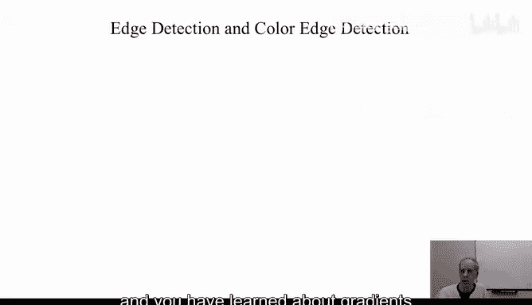

Maybey， maybe recently， maybe long time ago。 And what I want to talk with you is about gradients。

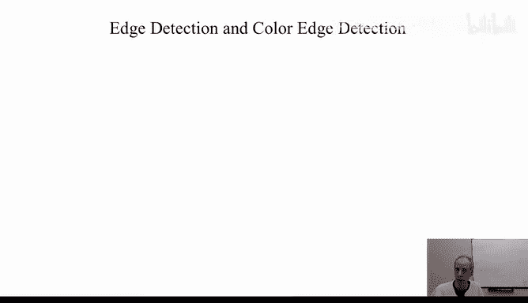

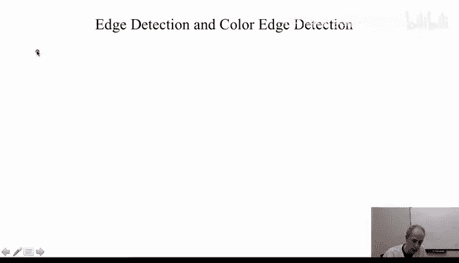

The gradient of an image， F。

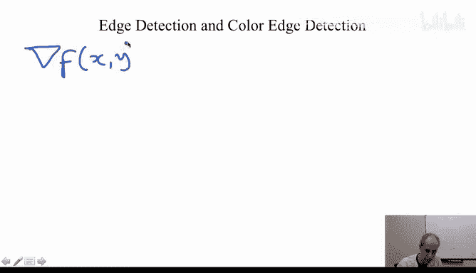

It's actually a vector。 an image is a scalar。 At every point we have a value。

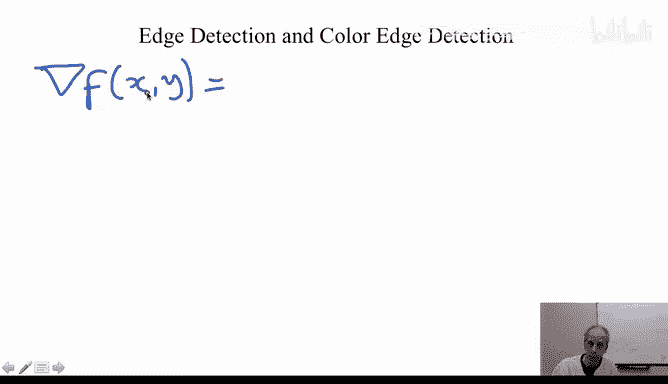

The gradient is actually a vector。 iss the derivative of F。

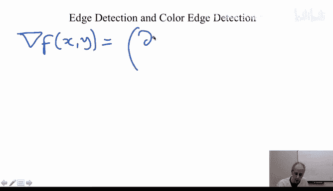

In the direction。That's one coordinate of the vector。

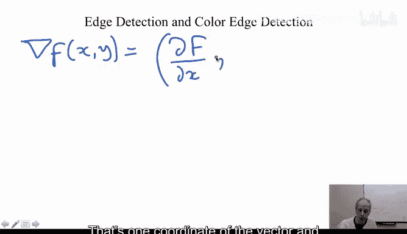

Under the reality of faith。In the wide direction， that's the other coordinate of the vector。

 We have already seen that derivatives are very important。 They actually LED us to detect edges。

 They LED us to detect big changes in images。 We have seen that。

 And we remember that as well from our early classes in calculus， If we have a step。

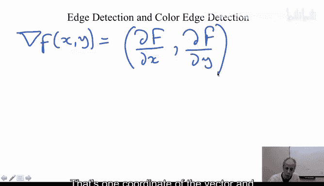

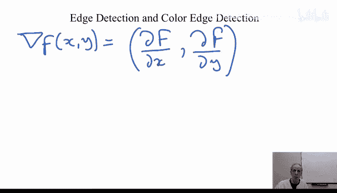

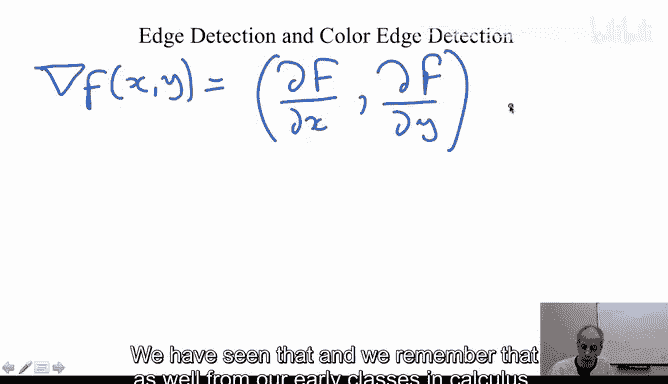

Basically， a sharp change， the derivative of that is a delta function。

 so it helps you to detect those edges and with uncharharp masking or other techniques。

 it help us to enhance images that maybe are blur， or maybe we just want to enhance their edges so we can observe them better。

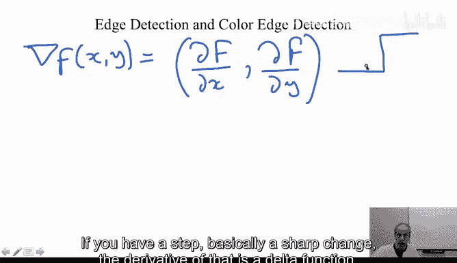

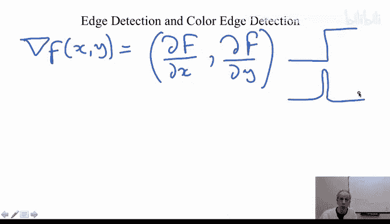

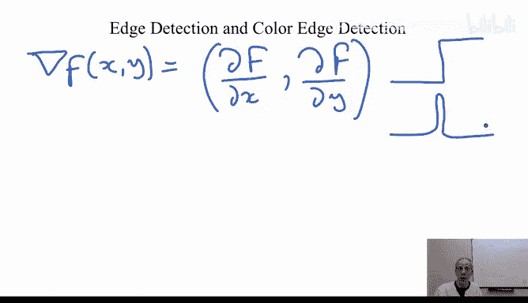

Now， the gradient is one important derivative， and one of the important characteristics in case you don't remember that from your early classes is that when you sit this at a certain pixel in the image and you ask yourself in which direction my image is changing the most。

 So in which direction should I make a walk a step and I get a big jump in the pixel values of my image。

 It turns out that that direction is the gradient。 So when you' are sitting for example。

 this is an object and you say which word should I go。

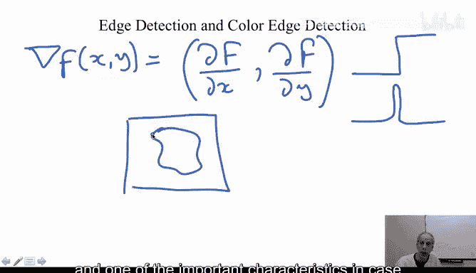

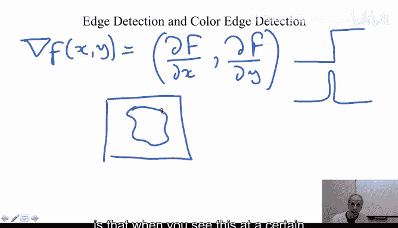

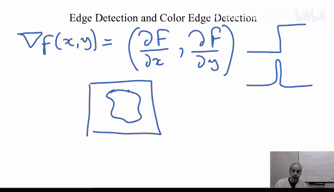

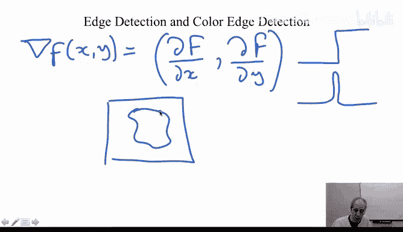

To have the maxim change in my pixel value， that is the gradient direction。

 This gives you the direction of the maximum change in your image。 So it's a very。

 very interesting object。

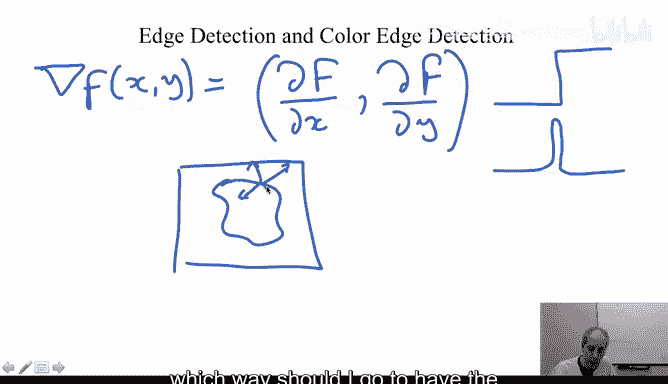

How much are you changing， That's what's called the absolute value of the gradient。

 so the absolute value of the gradient of a。

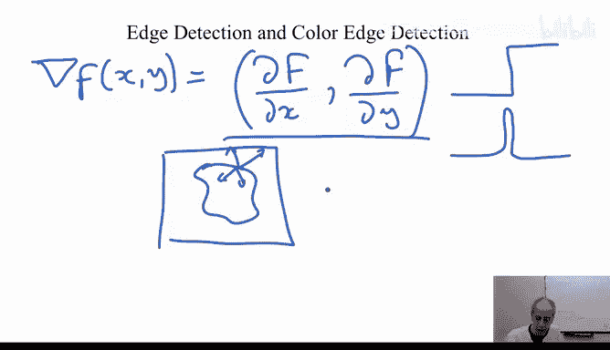

That's basically the definition of the absolute value or the magnitude of a vector。

 just a square root。

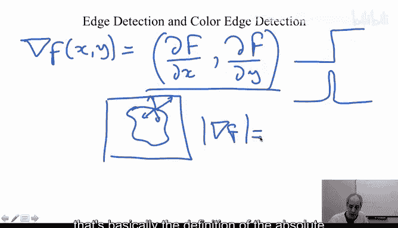

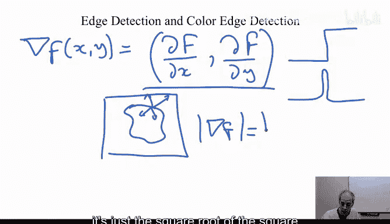

off。The square。

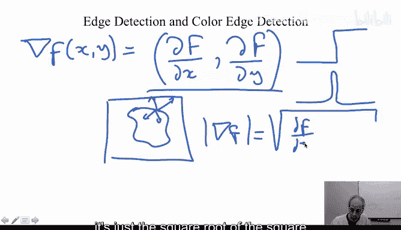

Of the derivative rivet in the direction。And the square。

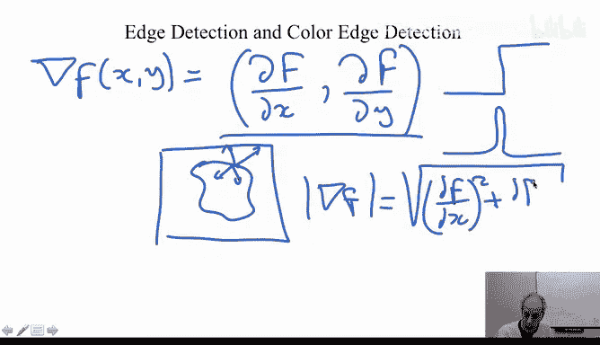

Of the derivative。In the y direction， That's how much you actually jumping。

 how much you are changing the gray value when you advance in the gradient direction in any other direction。

 you're going be changing equal or less than that value。 In particular。

 there is one direction that you're not going to be changing at all。

 And that's the direction perpendicular to the gradient。 If you move in the gradient direction。

 you have the highest jump。 If you move perpendicular to it。 You have the lowest jump。 actually 0。

 That's called the level sets。 And we're going to talk much more about that in a few weeks。

 So this is the concept of gradient。 You compute the derivatives， you compute the magnitude。

 and you're going to get basically the amount of jump when you go from one pixel to just the neighbor pixels。

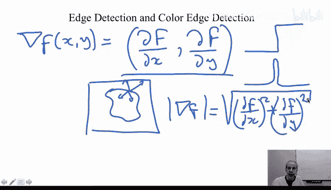

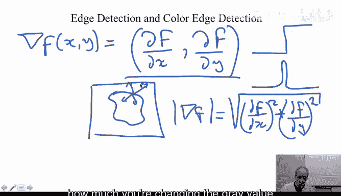

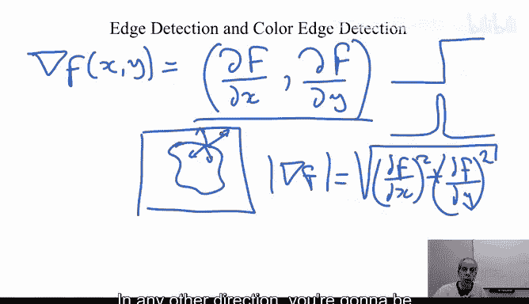

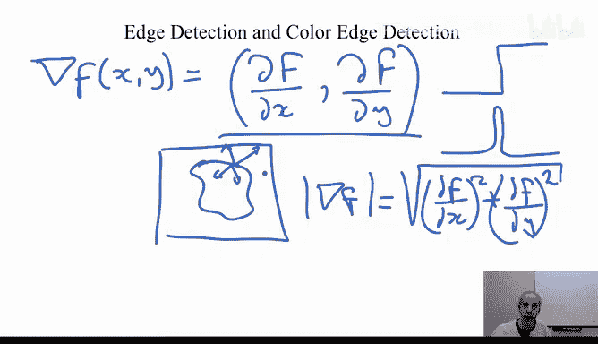

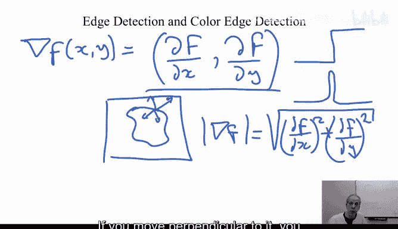

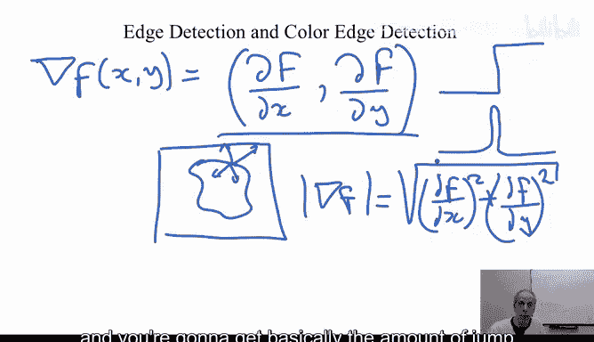

Now， this whole concept also exists for vector images。 So if instead of having just one image。

 I have an R。

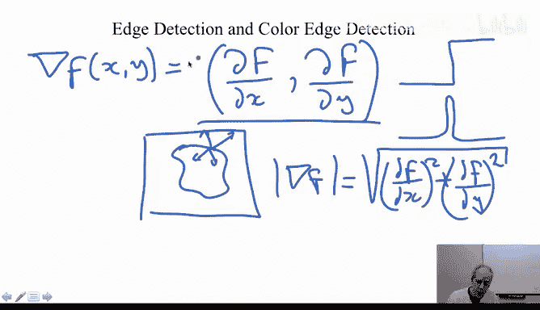

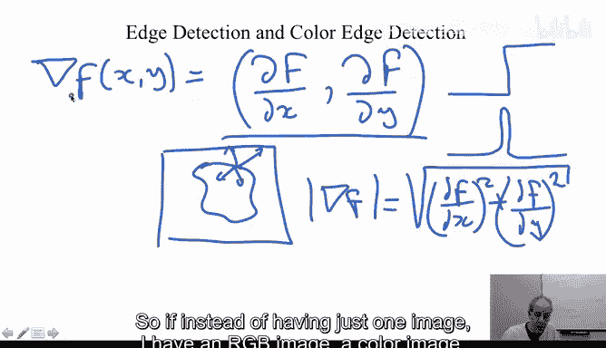

G B image。

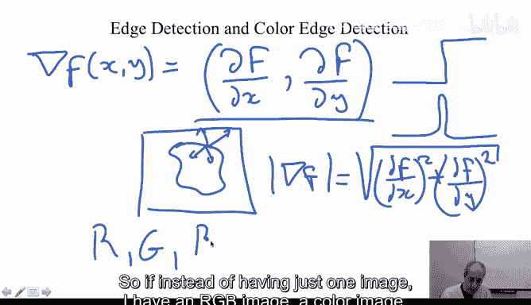

A color image。 Now， at every point， I have three values。

 And I can ask the same question in which direction do I have the maximal change of these three values at the same time。

 you could actually ask for each value independently。

 you could say in which direction does the red change the most in which direction the green in which direction。

 the blue。 And that's very， very simply three gradient directions。

 You are gonna to get three different directions sometimes or you could say。

 I want them to change at the same time。 in which one of the directions。

 I have the biggest change as a vector。 at the same time， red。

 green and blue when I basically accumulate the change is the maximumimal possible change。

 and that concept also exists is the concept of the gradient of vectorial images is not very hard to compute。

 But we're going skip that for now。 But you're also。

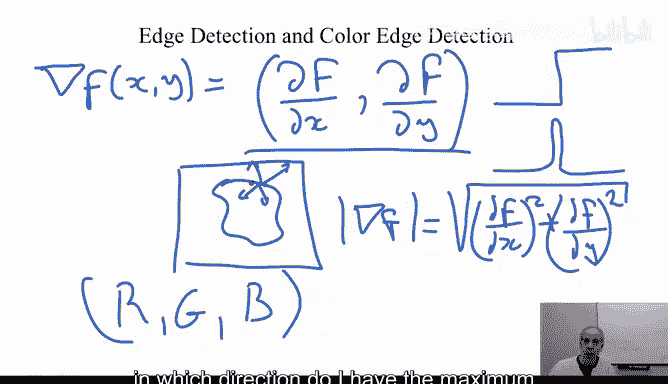

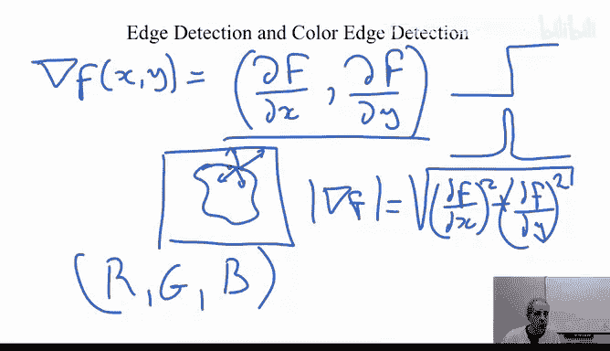

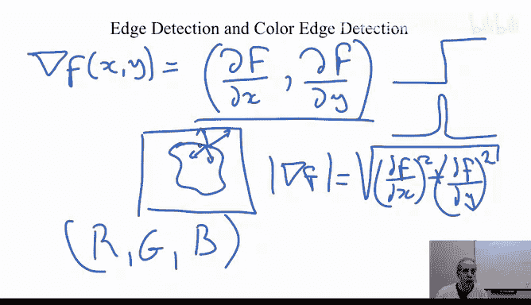

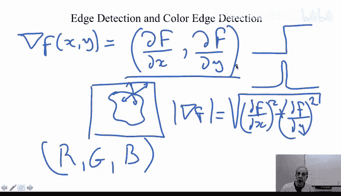

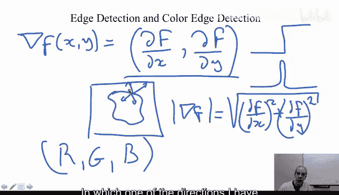

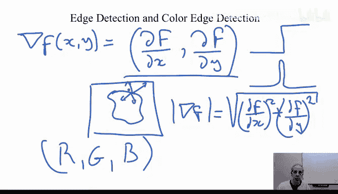

I get a direction and there's going to be a close formula like we have here that tells you in which direction you have the maximal change in the vector in the whole colors。

 you're going to have once again a direction and once again a maximal value that basically is an extension of the concept of gradient for vector images like RGB images So I wanted you to know about that concept I wanted you to know about the concept of gradients and the concept of vector gradients。

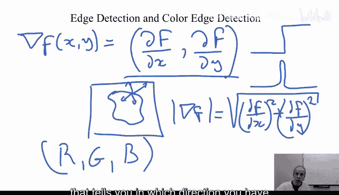

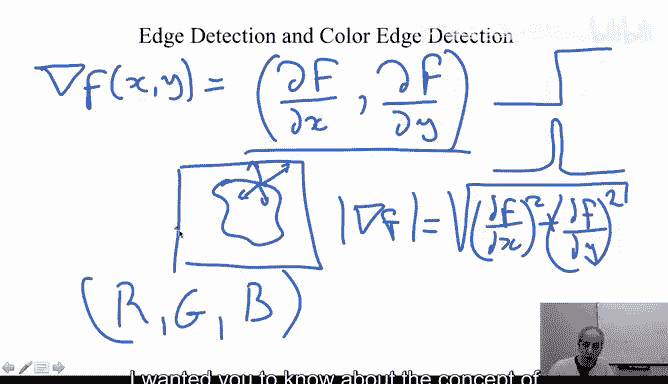

And what we are going to do is in the next video， we're going to conclude this very。

 very useful week that we have。 Thank you。

