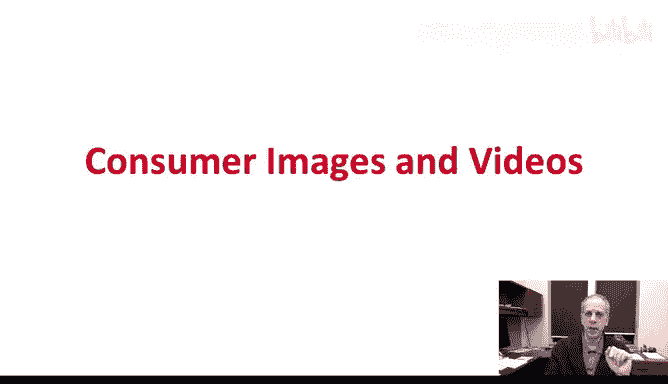
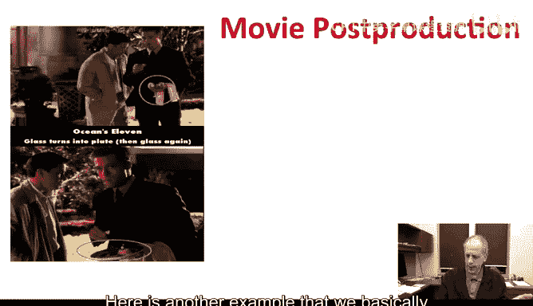
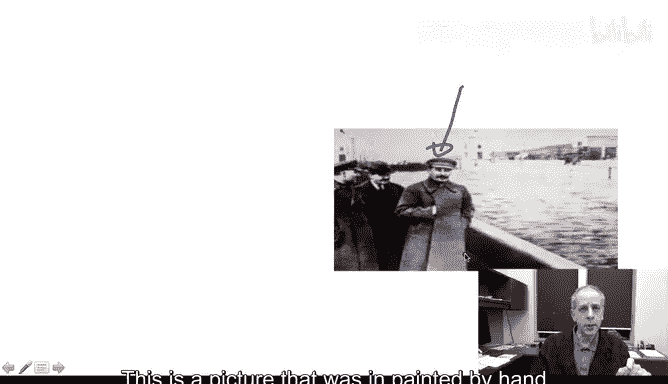
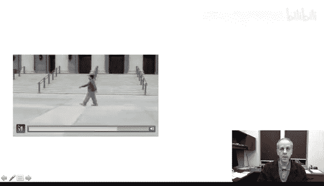

# 图像与视频处理：P2：02_01_02_1-什么是图像与视频处理-第一部分

## 概述
在本节课中，我们将通过一系列实例来了解什么是图像与视频处理。这些例子将帮助我们理解该领域的基本概念，并展示我们将在未来九周内学习的内容。

## 科学图像处理示例
上一节我们介绍了课程概述，本节中我们来看看图像处理在科学领域的应用。科学图像是指为科学研究目的而拍摄的图像。火星图像可能是最典型的例子。

当接收到NASA喷气推进实验室（JPL）火星探测任务传回的图像时，我们都非常兴奋。这些图像非常酷，让我们看到了前所未见的事物。然而，这些图像在火星车计算机中占据大量存储空间。由于图像文件非常庞大，它们需要很长时间才能传输回地球。

因此，NASA和JPL不得不在火星车内部实施一种称为**图像压缩**的技术。其目的是在保留信息的同时，减少数据所占用的空间，从而加快传输速度。我们将在课程中学习火星车内部实际实现的算法。我很幸运，我的一种算法曾被选中在火星车上实现。我们将非常详细地学习它。

当然，图像压缩并非仅此一例。如果你使用数码相机，如今大多数数码相机都使用图像压缩。如果你在网上浏览图片，你基本上也在使用图像压缩。实际上，你现在观看的这个视频在上传到网络之前也经过了压缩，以便你能流畅观看。因此，我们无时无刻不在进行图像和视频压缩。这是你在日常生活中已经接触到的图像与视频处理的一个例子。

## 电影中的图像处理
另一个非常重要的例子来自电影。如果你去看电影，你可能已经见过图像和视频压缩，只是没有意识到。

以下是几个例子。

这里有一张图像，它实际上是某著名电影视频的一帧。我们看到的是两个连续的帧，即一帧紧接着另一帧。我们看到演员手里拿着一个玻璃杯。

紧接着，他手里拿着一个盘子。他如何从玻璃杯切换到盘子，这非常令人惊讶。这实际上是电影中的一个错误。

这里是另一个例子，我们基本上可以看到摄影师出现在画面中。当然，导演并不希望摄影师出现在画面里，但他确实出现了。实际上，如果你在电影刚上映时观看并仔细观察，你可能已经能够看到摄影师或这些错误。几乎所有的电影都存在错误，有一个网站专门展示这些穿帮镜头。

基本上，之后当你观看DVD或不同版本的电影时，这些错误已经被修复了。修复这些错误所使用的技术被称为**图像与视频修复**，我们也将学习这项技术。

## 图像修复的应用
让我们看更多例子，因为有时我们需要修复图像和视频，不仅仅是为了电影。

例如，这里有一张看起来完全正常的照片。这实际上是一张斯大林的照片。

我们在这张照片中看不出任何问题。这张照片唯一的问题是，它并非原始照片。这是一张经过手工修复的照片，因为真实发生的情况是这样的。

这是真实的照片。这里原本有另一个人。这张照片被修饰过。在当时，这是很久以前的事了，是通过手工完成的。照片被修饰后，那个人就不再出现在画面中。但今天，我们将学习如何使用计算机技术来完成这项工作。

让我们看其他例子，因为这非常令人兴奋。此外，在课程网页上我们提供了一个网站链接，其中包含许多类似的例子。这确实是一个有趣的领域。

这里是一部多部电影中的一帧。如你所见，划痕正在消失。有时你有一张非常好的图像，但被人划伤了，你想让这些划痕消失。你现在看到的是真实图像处理算法的模拟，它正在使划痕慢慢消失。这也将是我们学习内容的一部分。

我们谈到了图像压缩，这将在本课程的第二周涉及。图像修复和视频修复将在课程的后半部分出现。

## 视频处理与特效
让我们看更多例子。

这里我们看到一段非常不错的视频。这是我以前的学生卡尔在明尼苏达大学图书馆前行走。

这段视频对我们来说没有任何奇怪之处。只是，这才是实际的视频。实际上，卡尔的妻子走在他前面，但我们应用了图像和视频处理算法，让她从视频中消失了。

有时我们想在视频中获得特殊效果。这是一个特效的例子。我们实际上是从一部黑白电影开始，这里我们看到那部黑白电影的几帧。我们提供了一些我们想添加到视频中的颜色提示。

以下是自动生成的结果，仅仅根据提示，在这个例子中，仅根据一帧提示，我们就得到了一部彩色电影。这就像我们在进行修复，但我们是把颜色“修复”到电影中。这只是另一个特效。特效无处不在，你需要大量的图像和视频处理技术来实现它们。

这里是另一个例子。让我先播放它，这样更容易解释这个特效。起初，你看到的是模糊的。这看起来像一段模糊的视频。但看看接下来会发生什么。实际上，球员是清晰的。视频背景是模糊的，但球员不是。让我再播放一次，以便我们能看得更清楚。视频是模糊的，但球员不是，我们必须进行视频处理才能获得这种特效。

这里是另一个特效的例子。我将播放它，你基本上会立刻明白我们指的是哪种特效。我们看到电影在播放，但基本上电影中的女孩被延迟并重复了。好的，所以很容易观察到，这里我们看到正在发生的事情的重复。这是一种非常特殊的特效，在电影工业中经常使用，有时用于营销和广告。

让我再展示一个非常非常有趣的特效例子。就是这个。这是一段电影。我们播放了那段电影，看起来真的很棒。但实际上，在我们完成那段电影后，我们可能真的想改变背景。所以这里是同一段电影，但背景不同。哇，这需要大量的工作。正如我们将要看到的，基本思路是我们必须能够分割出这个人。这是前景，是我们想在电影中保留的部分。我们必须找到它，必须从电影中提取出来，并将其放入新的背景中。这是一件非常非常有趣的事情。我将再播放一次。这是一段电影。同一段电影，不同的背景。我们将在第5周学习如何做到这一点，如何从静态图像或电影中提取物体。

实际上，这类技术出现在商业产品中。在这个例子中，我向你展示了一个名为After Effects的软件的截图，它是Adobe的产品之一。实际上，在与Adobe和我以前的一名学生合作中，我们开发了我刚才展示的技术，即提取物体的技术。这样我们就可以基本上将它们放入新的背景中。我将在相对较短的视频中，尽可能详细地向你解释这是如何完成的。我将向你展示这在Adobe After Effects内部是如何实现的，以及其中出现的一些底层技术。

## 总结
本节课中我们一起学习了图像与视频处理的一些示例。我们从NASA火星车必须使用的图像压缩开始，你的数码相机也必须使用图像压缩，你现在观看的视频在上传前也必须压缩。我们将在课程第一周了解为什么图像占用如此多的信息，在第二周学习如何压缩它们。我们还看到了像图像修复这样的特效，这将在课程后半部分学习。我们也看到了像分割和更换背景这样的特效，这将在第5周左右学习。这些都是非常令人兴奋的应用。其中一些你从电影和数码相机中非常熟悉。其中一些你实际上每天都能看到，但并没有真正意识到它们正在发生。我将帮助你理解它们实际上是在幕后发生的。

在下一个视频中，我们将提供更多例子，进一步激发你对图像与视频处理重要性的认识，并展示理解图像和视频幕后工作的乐趣。我们还将在下一个视频中讨论医学成像的几个例子，这是图像与视频处理中一个极其重要的领域。期待在下个视频中见到你。谢谢。