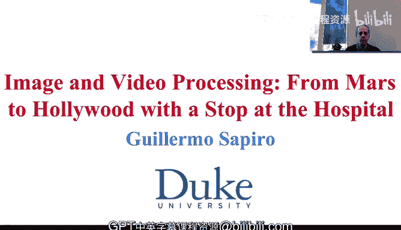
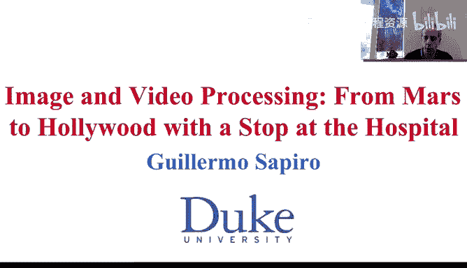
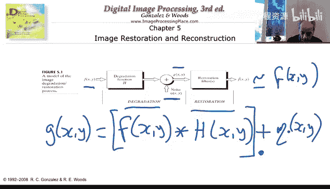
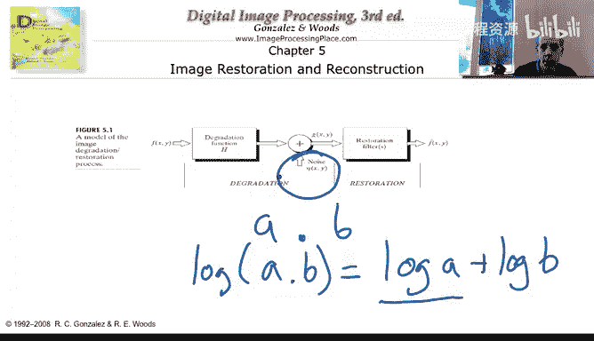

# 杜克大学《图像与视频处理：从火星到好莱坞，途中停靠医院｜Image and Video Processing： From Mars to Hollywood 》 - P30：30_04_01_1-什么是图像复原-时长-07-49.zh_en - GPT中英字幕课程资源 - BV1KYBrBxEsH

Hello and welcome to week4 of our image and video processing class。 For the last few weeks。

 we have been very busy learning a lot of new concepts in image and video processing。 This week。

 the materials can be a bit shorter。 I think we all deserve a shorter week about after learning so much new material。

 But also the main reason this week is gonna be a bit shorter in material is because we are going to come back to some important examples of image restoration later when we talk about more advanced topics in the class of image processing。

 But we still need to learn the basics of image restoration。

 And we need to understand what is image restoration。 So let's just go straight into that。

 But before that， just for a second， what background do you need for the topic of this week。

 If you have knowledge about signal processing and for analysis。

 there are some parts of the week that you might benefit a bit more。

 but as it happened in the previous weeks。

The material is going to be very self contained， so you should be able to understand the basic concepts with very limited background chi background in linear algebra mostly and but again。

 for your analysis will be very helpful if you know it。

 in particular for the topic of venner filtering that we are going to explain in in a few hours or actually in a few minutes。

 So let's just explain what is image restoration。

So in image restoration， in contrast with image enhancement。

 we are going to try to restore the image， we are going to have a model for the degradation。

 and that's what we see here， there is a degradation model， basically we start with an image。

 the image goes through some degradation， which is represented by this filter H。

Examples of degradation， and we're going to discuss them in detail later on， are， for example。

 blurlaring。 The focus。 when we take a picture that is out of focus， that's basically a degradation。

 and our example is what's called motion blur。 When we take pictures of something that goes very fast。

 we actually see that is kind of blurry in our picture。

 and that's basically another type of degradation。 After the image has gone through degradation。

 there is noise added to it。 For example， the sensors in cameras have noise。

 The sensors in magnetic resonance have noise。 So there is noise added to it。

 And this is what we actually observe G。😊，Now， from G， we need to go back to F。

As close as possible as the original F。 And that's why this is called restoration。

 we're going to try to invert this degradation and noise in order to be able to produce an image。

 which is as close as possible as the original image。 So this restore image。

 we want it to be as close as possible。 to the original image。 That's a goal of restoration。

 We didn't have the task in image enhancement， which I just wanted it to look better to look sharper to benefit。

 let's say our visual perception of the image。 The goal now is to actually restore the image。

 It's kind of a different goal they are related It kind of a different goal。

 and some of the things that we saw in the previous week are actually very useful for image restoration as well。

 For example， non localal means， you can show that under certain conditions restores the image。

So what's the model that we have here， How is G produced G。Basically。

 is the result of F going through the degradation。 So we have F x， Y。Convolution with age。X Y。

 that's a degradation model and normally assume that it's a linear operation。 So it's a convolution。

 and we add to it the noise。And most of the image and video processing literature。

 this with what's called additive noise， the noise is added to the image。

 That's not what happens in all real cameras， in all real acquisition devices。 for example。

 there is also multiplicative noise。Very often， we basically all these。Basically。

 the degradation gra gets multiply by some noise。 There are other types of noise that happens。

 But these are some two of the most common。 the most common of all is additive。 some literature。

 by much more limited addresses multiplicative noise。 one of the effects of multiplicative noise。

 is that the amount of noise depends on the signal itself。 So if the pixel values 3。

 we're multiplying 3， but the pixelix values is 10， we are multiplying in 10。

 and then the amount of noise much might be much larger。 And with additive noise that doesn't happen。

 So it's basic kind of image independent the noise。Now。

 there is a way to transform multiupplicative noise into additive noise so we can enjoy all the literature in additive noise and also work。

😊，Kind of with a small trick applied also to multiplicative noise。

 And I wonder if you know what trick can we use to do that。

 Maybe think for a second before I give you the answer。 So the question is very simple。

 Think for yourself if you know what to do with multiplicative noise。

 So you transform it to additive noise。 And let's think and I give you the answer。Very soon。Okay。

 you just spend some time thinking maybe you go to the answer very fast。

 maybe you go to the answer after a while or maybe you're waiting for me to give you the answer and idea is very simple if you have multiplicative noise instead of add noise let me erase here so I have everything to write down so if you are multiplying two numbers。

A times B。 I can take the log aiththmic。Of those。Of the product of those two numbers。

And that's equal to the logarithmic of a。Plus， the log。Of B。 So I have if B was my noise。

 I basically transform it into additive noise。 So instead of working with the image。

 I'm going to work with the logarithmic version of the image。

 and I'm going to work with the logarithmic component of the noise。 So basically。

 you give me the degradation G。 I take the log of G。

And I treat everything else now from now on as it was additive noise。When I finish recovering it。

 I basically have to invert this operation。 And that's an exponential function。

 So that's one of the reasons that a lot of the literature has basically concentrated on additive noise because of this trick。

 Now， this trick has its own problems， in particular。

 because if you don't really remove all the noise， the exponent can make it much， much larger。

 but it's an important trick that basically makes our additive noise， restoration techniques。Also。

 applicable to multiupplicative noise， wisdom caveats and some limitations。

So having now a concept of what's image restoration， Let's just talk in the next video about noise。

 What type of noise can we have in an image， Where do they come from？

 So see you in the next video to deal with that topic。 Thank you。

